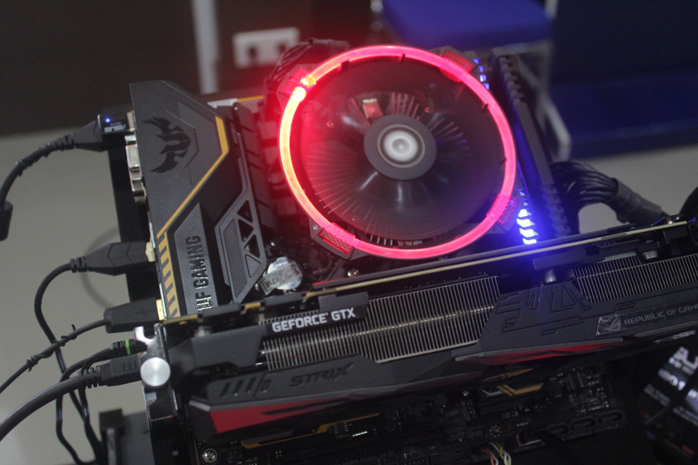
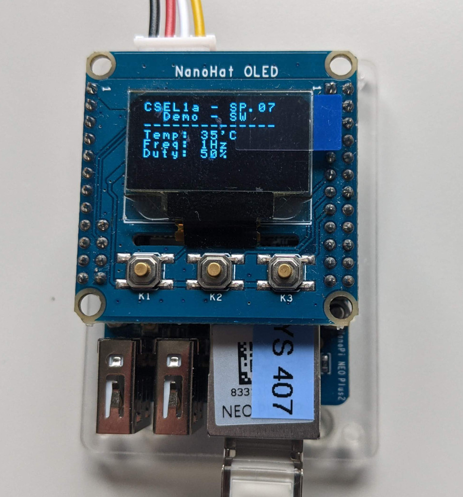

# Mini Projet – Programmation noyau et système



## Objectifs

Ce mini-projet vise à mettre en œuvre les notions étudiées durant le semestre, soit :

- Mise en œuvre d'un système embarqué sous Linux
- Développement de modules noyaux
- Développement de pilotes de périphériques
- Traitement des fichiers ordinaires et spéciaux
- Développement d'applications multitâches
- Gestion des ressources du CPU
- Optimisation

## Contexte

L'évacuation de la chaleur produite par le processeur et ses périphériques est un aspect essentiel à considérer lors de la conception de systèmes embarqués. Un refroidissement par convection naturelle est idéal. Cependant, il n'est pas toujours suffisant. Dans de tels cas, un système de refroidissement forcé (_forced cooling_) complétera et garantira le bon fonctionnement de l'équipement. Un refroidissement forcé passe par la mise en place d'un ou plusieurs ventilateurs. Leur vitesse est généralement contrôlée par un PWM (_Pulser-Width Modulation_) en agissant soit sur la fréquence (_frequency_), soit sur le rapport de cycle (_duty cycle_).

Notre cible ne dispose pas de ventilateur. Quant au PWM, il n'est pas disponible, car son signal de sortie est multiplexé avec le signal RX de l'interface série de la console système. Afin de simuler cette infrastructure, nous allons simplement utiliser le clignotement de la LED _Status_ en guise de ventilateur et un timer pour la génération de la fréquence de clignotement de cette LED.

## Travail à réaliser

Concevez une application permettant de simuler la gestion de la vitesse
de rotation d'un ventilateur en fonction de la température du
processeur. On permettra une gestion automatique et manuelle.

Cette application réalisera la fonctionnalité minimale suivante :

1.  La supervision de la température du microprocesseur et la gestion
    automatique de la vitesse de clignotement de la LED _Status_ devront
    être réalisées par un **module noyau**. Ce module offrira, via le **sysfs**,
    une interface permettant de choisir
   
    1. le mode de fonctionnement automatique ou manuel
    2. la fréquence de clignotement de la LED _Status_

    En mode automatique, la fréquence de clignotement dépendra de la température du CPU, soit :
    
    - Température $< 35 °C$ --> fréquence de 2Hz
    - Température $< 40 °C$ --> fréquence de 5Hz
    - Température $< 45 °C$ --> fréquence de 10Hz
    - Température $\geq 45 °C$ --> fréquence de 20Hz

2.  Un **daemon** en espace utilisateur offrira les services pour une gestion manuelle.
    Ce daemon proposera deux interfaces de gestion distinctes, soit :

    1. Interface physique via les boutons poussoir et LED _Power_ de la carte d'extension
        1. S1 pour augmenter la vitesse de rotation du ventilateur, la pression du S1
           devra être signalisée sur la LED _Power_
        2. S2 pour diminuer la vitesse de rotation du ventilateur, la pression du S2
           devra être signalisée sur la LED _Power_
        3. S3 pour changer du mode automatique au mode manuel et vice versa.
    2. **Interface IPC**, au choix du développeur, permettant de dialoguer
       avec une application pour choisir le mode de fonctionnement et
       spécifier la fréquence de clignotement

    Le daemon utilisera l'écran OLED pour indiquer le mode de
    fonctionnement, la température actuelle du microprocesseur ainsi que
    la fréquence de clignotement de la LED _Status_.

3.  Une application fournira une **interface utilisateur**, une ligne de
    commande, pour piloter le système via l'interface IPC choisie.

## Bibliothèques

1.  Le module `linux/thermal.h` du noyau Linux fournit des services pour
    lire la température des différentes zones du microprocesseur. Avec
    les deux méthodes ci-dessous, il est possible d'obtenir la
    température en millième de degré des zones du μP, soit :

    - `struct thermal_zone_device* thermal_zone_get_zone_by_name (const char* name);`
    - `int thermal_zone_get_temp(struct thermal_zone_device*, int* temp);`

    Dans sa configuration actuelle, le μP implémente deux zones, la zone « cpu-thermal » et la zone
    « gpu_thermal ».

2.  Le module `linux/gpio.h` du noyau Linux fournit les services nécessaires au pilotage d'une broche d'entrée/sortie, soit :

    - `int gpio_request(unsigned gpio, const char* label);`
    - `void gpio_free(unsigned gpio);`
    - `int gpio_direction_output(unsigned gpio, int value);`
    - `void gpio_set_value(unsigned gpio, int value);`

3.  Le module `linux/timer.h` du noyau Linux fournit les services nécessaires à la gestion de timers, soit :

    - `#define timer_setup(timer, callback, flags);`
    - `int del_timer(struct timer_list * timer);`
    - `int mod_timer(struct timer_list *timer, unsigned long expires);`

4.  Pour la gestion de l'écran OLED de la carte d'extension, un pilote
    basic est disponible sur [github](https://github.com/mse-csel/csel-workspace/tree/main/src/07_miniproj/oled).
    Il met à disposition principalement une méthode pour l'écriture de strings.
    <figure markdown>
    {width=500}
    <figcaption>Demo de l'écran OLED</figcaption>
    </figure>
    La documentation du contrôleur de l'écran OLED est disponible
    sur [le site du cours](https://mse-csel.github.io/website/documentation/nanopi/).
    Il est important de noter que l'écran est interfacé au
    μP via un bus I^2^C. Dans la configuration actuelle du noyau,
    effectuée par le _Device Tree_, les bus I^2^C ne sont pas
    disponibles. Il est donc nécessaire d'étendre cette configuration et
    de mettre le statut du bus `i2c0` à `okay` comme ci-dessous :

    ```text
    /dts-v1/;

    #include "allwinner/sun50i-h5-nanopi-neo-plus2.dts"
    
    /{
        /delete-node/ leds;
    };

    &i2c0 {
        status = "okay";
    };
    ```

---

!!! note "Archives 2021/2022"
    - [Donnée](mini-projet/assets/sp.08.1_mas_csel_mini_projet.pdf)
    - [OLED Driver Sample Code](mini-projet/assets/oled.tar)