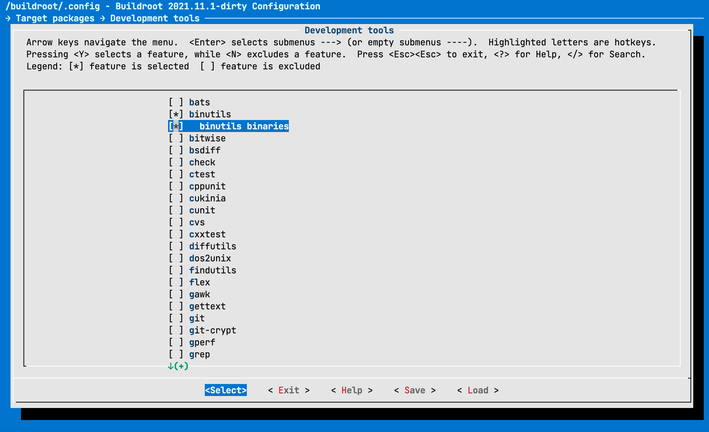
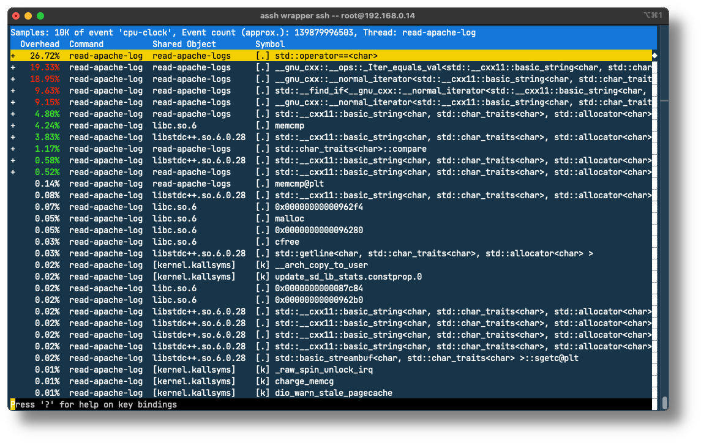




**Exercice #{{ exno.no }}**


**Exercice #{{ exno.no }}.{{ subno.no }}**


## Prise en main de `perf`

Le but de cet exercice est de se familiariser avec l'outil `perf` et
d'en utiliser quelques fonctionnalités de base. _Perf_ est un ensemble
d'outils très complet, mais complexe. Chaque outil est une sous-commande
de `perf` que l'on invoque de la manière suivante :

```
perf <sub-command>
```

La liste des commandes disponibles avec une description peut être obtenue en invoquant `perf` sans
argument :

```text
# perf

 usage: perf [--version] [--help] [OPTIONS] COMMAND [ARGS]

 The most commonly used perf commands are:
   annotate       Read perf.data (created by perf record) and display annotated code
   archive        Create archive with object files with build-ids found in perf.data file
   bench          General framework for benchmark suites
   buildid-cache  Manage build-id cache.
   buildid-list   List the buildids in a perf.data file
   c2c            Shared Data C2C/HITM Analyzer.
   config         Get and set variables in a configuration file.
   daemon         Run record sessions on background
   data           Data file related processing
   diff           Read perf.data files and display the differential profile
   evlist         List the event names in a perf.data file
   ftrace         simple wrapper for kernel's ftrace functionality
   inject         Filter to augment the events stream with additional information
   iostat         Show I/O performance metrics
   kallsyms       Searches running kernel for symbols
   kmem           Tool to trace/measure kernel memory properties
   kvm            Tool to trace/measure kvm guest os
   list           List all symbolic event types
   lock           Analyze lock events
   mem            Profile memory accesses
   record         Run a command and record its profile into perf.data
   report         Read perf.data (created by perf record) and display the profile
   sched          Tool to trace/measure scheduler properties (latencies)
   script         Read perf.data (created by perf record) and display trace output
   stat           Run a command and gather performance counter statistics
   test           Runs sanity tests.
   timechart      Tool to visualize total system behavior during a workload
   top            System profiling tool.
   version        display the version of perf binary
   probe          Define new dynamic tracepoints
   trace          strace inspired tool

 See 'perf help COMMAND' for more information on a specific command.
```

### Installation de `perf`

La version de `perf` que vous avez générée avec Buildroot n'est pas totalement satisfaisante.

Commencez par reconfigurer Buildroot pour inclure les _binutils_ :



Reconstruisez votre système avec la commande `make` comme vous l'avez fait
au début du semestre.

Mettez ensuite votre _rootfs_ à jour en prenant soin de ne pas effacer
vos configurations (principalement `/etc/fstab`). Vous pouvez utiliser
le script ci-dessous :

```bash
#!/usr/bin/env bash
mkdir /rootfs_new/
tar xf /buildroot/output/images/rootfs.tar -C /rootfs_new/
rsync -acO --progress --exclude=/etc/fstab /rootfs_new/ /rootfs
rm -Rf /rootfs_new/
```

Générez ensuite une nouvelle version de `perf` avec les commandes suivantes :

```bash
$ cd /buildroot/output/build/linux-5.15.21/tools/perf/
$ make clean
$ make ARCH=arm64 CROSS_COMPILE=/buildroot/output/host/bin/aarch64-linux-
```

et remplacez l'ancien binaire de `perf` par le nouveau (si vous le souhaitez,
vous pouvez faire une copie de la version originale) :

```bash
$ cp perf /rootfs/usr/bin/perf
```

### Validation de l'installation

Vérifier que `perf` fonctionne et que les compteurs matériels sont bien reconnus avec la commande :

```
# perf list
```

Si tout fonctionne correctement, une liste de compteurs avec la mention `[Hardware event]`, par
exemple les compteurs `cpu-cycles`, `instructions`, etc.

```text
List of pre-defined events (to be used in -e):

  branch-instructions OR branches                    [Hardware event]
  branch-misses                                      [Hardware event]
  bus-cycles                                         [Hardware event]
  cache-misses                                       [Hardware event]
  cache-references                                   [Hardware event]
  cpu-cycles OR cycles                               [Hardware event]
  instructions                                       [Hardware event]
```

La liste retournée dépend de la machine et du processeur utilisé. En effet, tous les processeurs ne
fournissent pas tous les mêmes compteurs. Les évènements les plus communs au début, identifié par
`[Hardware event]`, tel que : `cpu-cycles`, `instructions`, `cache-misses`, `branch-misses`, etc. Les évènements
suivants, identifiés par `[Software event]` ne sont pas des évènements venant du processeur, mais des
_tracepoints_ du noyau Linux que `perf` est également capable d'utiliser.

```text
  alignment-faults                                   [Software event]
  bpf-output                                         [Software event]
  cgroup-switches                                    [Software event]
  context-switches OR cs                             [Software event]
  cpu-clock                                          [Software event]
  cpu-migrations OR migrations                       [Software event]
  dummy                                              [Software event]
  emulation-faults                                   [Software event]
  major-faults                                       [Software event]
  minor-faults                                       [Software event]
  page-faults OR faults                              [Software event]
  task-clock                                         [Software event]
```

### Comilation d'un exemple et utilisation de `perf`

La deuxième commande intéressante est `perf stat`. Elle permet d'obtenir différentes valeurs de
compteurs lors de l'exécution d'un programme. Elle mesure également le temps d'exécution du
programme.

Compilez (en utilisant le `Makefile` fourni) et exécutez le programme situé dans le dossier
[src/06_optimization/ex01](https://github.com/mse-csel/csel-workspace/tree/main/src/06_optimization/ex01) en
utilisant la commande `perf stat`

```
# perf stat ./ex1
```

_Sans options spécifiques, la commande mesure par défaut un certain nombre de compteurs. Relevez
par exemple les compteurs du nombre de context-switches et d'instructions ainsi que le temps
d'exécution._

### Etude du code source

Ouvrez maintenant le fichier `main.c` et analysez le code.

_Ce programme contient une erreur triviale qui empêche une utilisation optimale du cache. De quelle
erreur s'agit-il ?_

Si vous ne voyez pas l'erreur, essayez encore une fois, mais avec la commande

```
# perf stat -e cache-misses ./ex1
```

### Correction de bug

_Corrigez "l'erreur", recompilez et mesurez à nouveau le temps d'exécution (soit avec perf stat, soit
avec la commande time). Quelle amélioration constatez-vous ?_

### Validation

Grâce à `perf`, nous pouvons mesurer l'effet de notre modification, en utilisant le compteur
L1-dcache-load-misses. Celui-ci peut s'activer en passant le paramètre `-e L1-dcache-load-misses`
à la commande `perf stat`.

Relevez les valeurs du compteur _L1-dcache-load-misses_ pour les deux versions de l'application. Quel
facteur constatez-vous entre les deux valeurs ?

```
# perf stat -e L1-dcache-load-misses ./ex1
```

### Analyse des évènements "capturables"

_Décrivez brièvement ce que sont les évènements suivants :_

- instructions
- cache-misses
- branch-misses
- L1-dcache-load-misses
- cpu-migrations
- context-switches

### Mesure de l'impact sur la performance

_Lors de la présentation de l'outil `perf`, on a vu que celui-ci permettait de profiler une application avec
très peu d'impacts sur les performances. En utilisant la commande time, mesurez le temps d'exécution
de notre application ex1 avec et sans la commande `perf stat`._


## Analyse et optimisation d'un programme

Sur la base du programme situé dans le dossier
[src/06_optimization/ex02](https://github.com/mse-csel/csel-workspace/tree/main/src/06_optimization/ex02) 

### Analyse du code source

_Décrivez en quelques mots ce que fait ce programme._

### Mesure du temps d'exécution

Compilez le programme à l'aide du `Makefile` joint.

_Mesurez le temps d'exécution_

### Optimisation

Nous allons apporter une toute petite modification au code, qui ne change pas la sémantique et ne
devrait à priori avoir aucun effet sur le temps d'exécution : trier le tableau d'éléments.

Avant la fonction `int main()`, ajoutez la méthode suivante :

```c
static int compare (const void* a, const void* b)
{
    return *(short*)a - *(short*)b;
}
```

Avant `long long sum = 0;`, ajoutez le code suivant :

```c
qsort(data, SIZE, sizeof(data[0]), compare);
```

_Compilez et mesurez le temps d'exécution de la version modifiée._

### Mesures

Vous observez sans doute une nette amélioration sur le temps d'exécution.
À l'aide de l'outil `perf` et de sa sous-commande `stat`, en utilisant différents compteurs déterminez
pourquoi le programme modifié s'exécute plus rapidement.

## Parsing de logs apache

Vous trouverez dans le dossier
[src/06_optimization/ex03](https://github.com/mse-csel/csel-workspace/tree/main/src/06_optimization/ex03)
une application C++ qui parcourt un fichier de `access logs`
Apache pour en compter les _IPs _/ _Hostnames_ uniques qui s'y trouvent.

Deux fichiers de logs sont donnés en exemple :

- [access_log_NASA_Jul95](optimisations/access_log_NASA_Jul95.gz) contient les logs du mois de juillet 1995 d'un serveur de la NASA
  (~2mios d'entrées)
- [access_log_NASA_Jul95_samples](optimisations/access_log_NASA_Jul95_samples.gz) contient les 200'000 premières entrées du fichier
  précédent.

Les fichiers de logs NASA ont été trouvés à cette addresse : ftp://ita.ee.lbl.gov/traces/
Une fois décompressés, ils sont assez volumineux; pensez à les exclure de votre dépôt git!

L'application peut être optimisée de façon considérable avec de toutes petites modifications. Nous
allons à nouveau utiliser les outils de `perf` pour analyser cette application afin d'identifier où le
programme passe le plus de temps. Pour ceci nous allons utiliser la sous-commande `perf record` et
son option d'enregistrement du `call graph`.

Conseil : pour exécuter l'application non optimisée, utilisez le fichier `access_log_NASA_Jul95_samples`.

### Compilation et instrumentalisation du programme

Compilez l'application et profilez l'application avec `perf record` :

```
# perf record --call-graph dwarf -e cpu-clock -F 75 ./read-apache-logs access_log_NASA_Jul95_samples
```

L'exécution de cette commande doit produire un fichier de résultat perf, nommé `perf.data`. Si l'on
exécute une nouvelle fois la commande, ce fichier sera copié vers `perf.data.old` et un nouveau
`perf.data` correspondant à la dernière exécution sera créé.

### Analyse des résultats

Nous pouvons maintenant analyser les données collectées par `perf` avec la commande `perf report`.

```
# perf report --no-children --demangle
```

L'interface se présente sous la forme suivante :



### Recherche de la cause de la lenteur

Sur la capture ci-dessus, on voit par exemple que la majorité des cycles de l'application sont passés
dans la fonction `std::operator==<char>` qui est contenue dans la librairie standard. Il nous manque
cependant une information capitale : quelle fonction de notre application fait appel à cette fonction ?

_Avec les instructions précédentes, déterminez quelle fonction de notre application fait (indirectement)
appel à `std::operator==<char>`._

### Optimisation algorithmique

Maintenant que vous savez quelle fonction utilise le plus de ressources CPU, trouvez une optimisation
du code permettant de réduire drastiquement le temps d'exécution (vous devriez arriver à quelques
dixièmes de secondes pour le fichier sample).

Indice : rappelez-vous vos cours d'algorithmique...

### Implémentation de l'optimisation

Une partie de la solution... Il faut remplacer le `std::vector` par une structure de données de la librairie
standard plus efficace pour faire des _finds_. Par exemple un `std::set`. Ceci implique quelques petites
modifications :

#### Fichier : `HostCounter.h`

- Remplacer la ligne
  ```cpp
  #include <vector>
  ```
  par
  ```cpp
  #include <set>
  ```
- Remplacer la ligne
  ```cpp
  std::vector< std::string > myHosts;
  ```
  par
  ```cpp
  std::set< std::string > myHosts; 
  ```

#### Fichier : `HostCounter.cpp`

- Remplacer la ligne
  ```cpp
  return std::find(myHosts.begin(), myHosts.end(), hostname) == myHosts.end();
  ```
  par
  ```cpp
  return myHosts.find(hostname) == myHosts.end();
  ```

- Remplacer la ligne
  ```cpp
  myHosts.push_back(hostname);
  ```
  par
  ```cpp
  myHosts.insert(hostname); 
  ```

## Mesure de la latence et de la gigue (_jitter_)

Décrivez comment devrait-on procéder pour mesurer la latence et la gigue d'interruption, ceci aussi
bien au niveau du noyau (_kernel space_) que de l'application (_user space_).


---

!!! note "Archives 2021/2022"
    - [Exercices](optimisations/sp.07.2_mas_csel_optimization_exercices.pdf)
