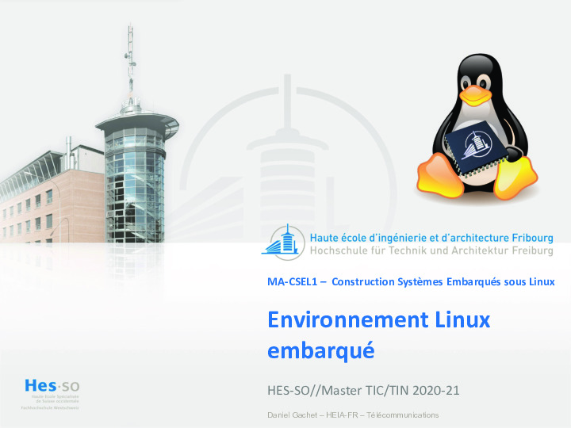

# Environnement Linux embarqué / Leçon

<a markdown href="../assets/sp.02.1_mas_csel_environnement_linux_embarque.pdf" target="_blank"">
{style="border-style: dashed;"}
</a>

## Documentation

- [Bootargs: Linux kernel boot command-line](assets/sp.02.4_mas_cesl_linux_boot_commands_arguments.pdf)
- [Filesystems for embedded systems](assets/sp.02.5_mas_csel_filesystem_considerations_for_embedded_devices.pdf)
