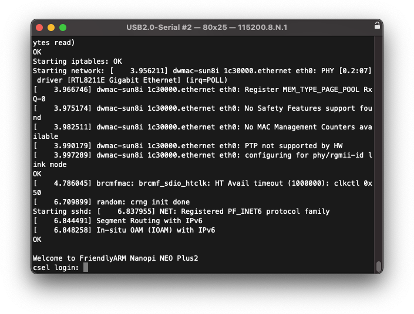

## Slides

[02 Environnement Linux embarqué](assets/sp.02.1_mas_csel_environnement_linux_embarque.pdf)

## Exercices / Travaux pratiques

### Objectifs

Ce travail pratique vise les objectifs suivants :

- Mise en œuvre d'un système embarqué sous Linux
- Mise en œuvre de l'environnement de développement de systèmes embarqués sous Linux avec Docker
- Debugging d'applications sous Linux embarqué
- Mise en production d'un système embarqué sous Linux

### Activités

Il comprendra les activités suivantes :

1. Mise œuvre de l'environnement de développement sous Linux (avec Docker)
    1. Installation de la machine hôte
    1. Création de l'espace de travail sur la machine hôte
    1. Génération de l'environnement de développement (toolchain, U-Boot, Linux kernel, rootfs)
1. Mise en œuvre de l'infrastructure (cible, machine hôte)
    1. Mise en place de l'infrastructure
    1. Gravure (burning) de la carte SD pour la cible
    1. Test de l'environnement de production sous carte SD
    1. Test de l'environnement de développement sous cifs (smb)
1. Debugging d'une application simple depuis la machine hôte
    1. Génération d'une application sur la machine hôte
    1. Lancement de l'application sur la cible
    2. Debugging de l'application avec VS-Code et SSH
2. Mise en production
    1. Génération d'une application
    2. Génération du rootfs avec l'application
    3. Test et validation du produit

### Informations pratiques

Ce paragraphe donne quelques informations utiles pour la réalisation de ce travail pratique.

#### Installation de la machine	hôte (votre PC)

Pour les exercices, nous utilisons des conteneurs Docker. Si vous n'avez pas encore installé Docker Desktop,
téléchargez-le depuis le [site officiel de Docker](https://www.docker.com/products/docker-desktop) et installez-le.

Installez [git](https://git-scm.com/downloads) sur votre machine si ce n'est pas déjà fait. Configurez aussi l'utilisateur
de git:

```plain
git config --global user.name "User Name"
git config --global user.email user.name@master.hes-so.ch
```

!!! note "Note :material-microsoft-windows:"
    Sur les machines Windows, il est encore nécessaire de configurer Git pour qqu'il utilise le "line ending" de Linux (`\n`),
    car les scripts "bash" n'autorisant pas le "line ending" DOS (`\r\n`).

    ```plain
    git config --global core.autocrlf false
    ```

Installez aussi [Visual Studio Code](https://code.visualstudio.com/) si ce n'est pas déjà fait.

### Création de l'espace de travail (workspace) sur la machine hôte personnelle

Avec notre browser, rendez vous sur le dépôt [csel-workspace](https://github.com/supcik/csel-workspace)
et faites un _fork_ dans l'espace de travail personnel de github d'un membre du groupe.

Ajoutez les autres membres du groupe avec le rôle "Write", "Maintain" ou "Admin". Ajouter aussi
le(s) professeur(s) avec au minimum le rôle "Triage".

Chaque membre de l'équipe peut maintenant faire un "Clone" du projet _csel-workspace_ sur son ordinateur. 

#### Configuration de l'environnement de développement

Ouvrez le projet avec VSCode. Le système vous demandera probablement si vous faites confiance
aux auteurs de ce dossier et vous pouvez cliquer sur le bouton correspondant.

Si le système vous propose de ré-ouvrir le dossier dans un container, acceptez cette
proposition en cliquant sur "Reopen in Container"

Lorsque vous ouvrez le projet avec VSCode, le système vous proposera probablement d'installer des extensions.
Acceptez-les toutes et cliquez sur le bouton "Install".

Ouvrez maintenant un terminal dans VSCode et téléchargez "buildroot" avec la commande suivante:

```bash
get-buildroot.sh 
```

Pour votre culture génlrale, étudiez le script `get-buildroot.sh` dans `/usr/local/bin/`.

#### Génération et installation de l'environnement

Vous pouvez modifier la configuration du noyau ou du rootfs avec la commande suivante :

``` bash
cd /buildroot
make menuconfig
```
Générez ensuite les différents packages et créez les images. 

``` bash
cd /buildroot
make
```

!!! attention "Attention"
    La construction du système prend entre 30 et 60 minutes selon la
    performance de votre PC. Assurez-vous aussi d'avoir au moins **20GiB
    de libre** sur votre disque dur (ou ssd).

Actualisez maintenant le "root filesystem":

``` bash
rm -Rf /rootfs/*
tar xf /buildroot/output/images/rootfs.tar -C /rootfs
```

!!! note "Note"
    Vous pouvez aussi utiliser les script `/usr/local/bin/delete-rootfs.sh` 
    et `/usr/local/bin/extract-rootfs.sh` présents dans l'image Docker.

#### Gravure de la carte SD

Avant de pouvoir graver la carte SD, vous devez copier les images dans le répertoire synchronisé avec votre ordinateur.
Vous pouvez utiliser la commande `rsync` :

```bash
rsync -rlt --progress --delete /buildroot/output/images/ /workspace/buildroot-images
```

!!! note "Note"
    Vous pouvez aussi utiliser le script `/usr/local/bin/sync-images.sh` présent dans l'image Docker.

Pour graver la carte SD, utilisez le logiciel [Balena Etcher](https://www.balena.io/etcher/).
Insérez la carte SD dans votre ordinateur, sélectionnez l'image `buildroot-images/sdcard.img`, sélectionnez le disque qui correspond
à votre carte SD et cliquez sur "Flash!".

<figure markdown>

<figcaption>Ecriture de la carte SD</figcaption>
</figure>

Pour tester la bonne gravure de la carte SD, il suffira de l'installer sur la cible et de la redémarrer.
On pourra voir la séquence de lancement (boot sequence) sur la console avec un client "terminal série" installé sur l'hôte. Vous pouvez
utiliser par exemple:

- [Coolterm](https://freeware.the-meiers.org/){target=_blank} :material-apple: :material-microsoft-windows: :material-linux:
- [Tera Term](https://ttssh2.osdn.jp/index.html.en){target=_blank} :material-microsoft-windows:
- [Putty](https://www.chiark.greenend.org.uk/~sgtatham/putty/){target=_blank} :material-apple: :material-microsoft-windows: :material-linux:
- [GNU screen](https://www.gnu.org/software/screen/){target=_blank} :material-apple: :material-linux:
- [minicom](https://salsa.debian.org/minicom-team/minicom){target=_blank} :material-apple: :material-linux:

Voici ce que vous devriez voir sur la console :

<figure markdown>

<figcaption>Début de la séquence de boot</figcaption>
</figure>

Lorsque la séquece de boot termine, vous pouvez vous connecter avec le login `root` :

<figure markdown>

<figcaption>Fin de la séquence de boot</figcaption>
</figure>

### Mise en place de l'infrastructure réseau

Pour simplifier le développement et la réalisation des différents travaux pratiques de ce cours, il est recommandé de configurer l'ensemble de l'infrastructure réseau avec des adresses IP statiques.
On utilisera de préférence, l'adresse IP _192.168.0.14_ pour la cible et l'adresse IP _192.168.0.4_ pour la machine hôte de développement.

L'image de la cible est déjà configurée avec l'adresse _192.168.0.14_. Configurez maintenant l'adaptateur Ethernet de votre PC (ou un adaptateur Ethernet/USB) avec l'adresse IP fixe _192.168.0.4_ :

<figure markdown>

<figcaption>Configuration de l'adresse IP statique</figcaption>
</figure>

!!! note "Note :material-microsoft-windows:"
    Si vous travaillez avec Windows, vous devez encore configurer le firewall pour permettre les connexions provenant
    du réseau _192.168.0.0/24_.

Reliez l'adaptateur Ethernet de votre PC avec la cible à l'aide du câble Ethernet et, depuis une console de votre PC, testez la connexion :

``` plain
ping 192.168.0.14
```

Vous devriez obtenir quelque chose comme ça:

``` plain
PING 192.168.0.14 (192.168.0.14): 56 data bytes
64 bytes from 192.168.0.14: icmp_seq=0 ttl=64 time=2.933 ms
64 bytes from 192.168.0.14: icmp_seq=1 ttl=64 time=0.832 ms
64 bytes from 192.168.0.14: icmp_seq=2 ttl=64 time=0.783 ms
64 bytes from 192.168.0.14: icmp_seq=3 ttl=64 time=0.751 ms
64 bytes from 192.168.0.14: icmp_seq=4 ttl=64 time=0.845 ms
```

Si vous obtenez le résultat ci-dessous, c'est que la connexion ne passe pas :

``` plain
PING 192.168.0.14 (192.168.0.14): 56 data bytes
ping: sendto: Host is down
Request timeout for icmp_seq 0
ping: sendto: Host is down
Request timeout for icmp_seq 1
ping: sendto: Host is down
Request timeout for icmp_seq 2
ping: sendto: Host is down
Request timeout for icmp_seq 3
```

Connectez-vous maintenant à la cible depuis votre PC par SSH:

``` plain
ssh root@192.168.0.14
```

!!! Note "Note"
    Si la clé SSH de la cible a changé, vous verrez quelque chose comme ça:

    ``` plain
    @@@@@@@@@@@@@@@@@@@@@@@@@@@@@@@@@@@@@@@@@@@@@@@@@@@@@@@@@@@
    @    WARNING: REMOTE HOST IDENTIFICATION HAS CHANGED!     @
    @@@@@@@@@@@@@@@@@@@@@@@@@@@@@@@@@@@@@@@@@@@@@@@@@@@@@@@@@@@
    IT IS POSSIBLE THAT SOMEONE IS DOING SOMETHING NASTY!
    Someone could be eavesdropping on you right now (man-in-the-middle attack)!
    It is also possible that a host key has just been changed.
    ...
    ```

    Dans ce cas, effacez les entrées dans votre fichier `known_hosts` avec
    la commande suivante:

    ``` plain
    ssh-keygen -R  192.168.0.14
    ```

    et essayez à nouveau.

Si tout va bien, vous verrez un message du genre :

``` plain
The authenticity of host '192.168.0.14' can't be established.
ED25519 key fingerprint is SHA256:...
This key is not known by any other names
Are you sure you want to continue connecting (yes/no/[fingerprint])?
```

Entrez `yes` et pressez ++return++

Vous êtes maintenant connecté! Tapez la commande `uname -a` pour voir le système d'exploitation de la cible :

``` plain
# uname -a
Linux csel 5.15.21 #1 SMP PREEMPT Sat Feb 12 19:26:27 UTC 2022 aarch64 GNU/Linux
```

### Mise en place de l'espace de travail (_workspace_) sous CIFS/SMB

Il est possible d'augmenter le confort de travail et l'efficacité en attachant l'espace de travail de la machine de développement hôte directement sur la cible.
Ceci permet en effet d'accéder directement depuis la cible les fichiers et applications générés sur la machine hôte, évitant ainsi des copies inutiles de fichiers.
Il est possible d'attacher l'espace de travail soit manuellement soit automatiquement. 

Pour attacher manuellement l'espace de travail de la machine hôte sur la cible via CIFS/SMB, il faut :

- Se logger sur la cible (username : « root » et password : lasser vide)
- Créer la première fois un point d'attachement sur la cible :
  ```
  mkdir -p /workspace
  ```
- Attacher le workspace de la machine hôte sur la cible :
  ```plain
  mount -t cifs -o username=root,password=toor,port=1445,noserverino //192.168.0.4/workspace /workspace
  ```
- Détacher le workspace de la cible :
  ``` plain
  umount /workspace
  ```

Pour attacher automatiquement l'espace de travail de la machine hôte sur la cible via CIFS/SMB, il suffit d'effectuer une seule fois les instructions ci-dessous :

- Créer la première fois un point d'attachement sur la cible, p. ex. :
  ``` plain
  mkdir -p /workspace
  ```
- Editer le ficher "/etc/fstab" (avec vi) et ajouter la ligne ci-dessous :
  ``` plain
  //192.168.0.4/workspace /workspace cifs username=root,password=toor,port=1445,noserverino
  ```
- Activer la configuration :
  ```plain
  mount -a
  ```

### Génération d'applications sur la machine de développement hôte

Pour la génération d'applications sur la machine hôte (compilation croisée),
il est recommandé de développer ces propres `Makefile`.
Quelques infos utiles pour trouver la _toolchain_ et éditer le `Makefile` :

``` makefile
# Makefile toolchain part
TOOLCHAIN_PATH=/buildroot/output/host/usr/bin/
TOOLCHAIN=$(TOOLCHAIN_PATH)aarch64-linux-

# Makefile common part
CC=$(TOOLCHAIN)gcc
LD=$(TOOLCHAIN)gcc
AR=$(TOOLCHAIN)ar
CFLAGS+=-Wall -Wextra -g -c -mcpu=cortex-a53 -O0 -MD -std=gnu11
```

### Debugging de l'application sur la cible (VS-Code)

Le debugging d'application peut être effectué de deux manières :

- directement sur la cible avec "gdb"
- à distance en utilisant un "gdbserver" sur la cible et "gdb" sur la machine hôte

Cette dernière option offre l'avantage de pouvoir utiliser VS-Code.

Visual Studio Code avec ses extensions et les "multi-root workspaces" offre une interface très simple
et un debugger de qualité pour le debugging de vos applications. Pour configurer VS-Code, il suffit trois fichiers:

- Un fichier "workspace"
- Un fichier "task"
- Un fichier "launcher"

Ces fichiers sont déjà configurés dans votre workspace.


Les fichiers “task” (task.json) et “launcher” (launch.json) se trouvent du répertoire .vscode de chaque projet, soit dans les répertoires /workspace/src/samples/tp.01/debug/.vscode et /workspace/src/samples/tp.01/coredump/.vscode.

### Mise en place de l'environnement pour le développement du noyau sous CIFS/SMB

Pour le développement de modules et de pilotes de périphériques devant fonctionner dans le noyau Linux, il est généralement plus commode de charger le noyau de la machine hôte sur la cible et d'accéder le _rootfs_ fraîchement généré ou modifié directement via le réseau. 

Pour ce faire, il faut créer un nouveau fichier de configuration (p.ex. `boot.cifs`) pour l'U-Boot, et le copier sur la carte SD dans la partition vfat `boot`. Pour créer ce fichier, il faut tout d'abord éditer un fichier avec les variables et commandes nécessaire à l'U-Boot :

- Créer un dossier `boot-scripts` dans le _workspace_
- Ouvrir/créer le fichier de commandes `boot_cifs.cmd` et l'ouvrir avec VS-Code
- Entrer le contenu suivant :
  ``` plain
  {!docs/environnement/inc/boot_cifs.cmd!>}
  ```
- Ecrire aussi le `Makefile` suivant:
  ``` makefile
  {!docs/environnement/inc/makefile!>}
  ```
- Dans un terminal, entrer dans le dossier `boot-scripts` et taper la command `make`
  Vous devriez obtenir le fichier `boot.cifs` dans le dossier `boot-scripts`
- Copier le fichier `boot.cifs` sur la partition vfat `boot` de la carte SD
- Redémarer la cible et l'arrêter dans l'U-Boot (en pressant une touche au démarrage) et changer le script de démarrage de la cible
  avec la commande `setenv boot_scripts boot.cifs`. Si vous souhaitez conserver cette configuration, taper également la commande `saveenv`
  
- Relancer le système / redémarrer la cible (avec la commande `boot`)

Lors du premier démarrage sur le réseau, la cible va générer de nouvelles clés SSH et c'est possible que les
permissions de ces clés soient mal configurées. Vous verrez alors des messages de ce genre sur la console:

``` plain
@@@@@@@@@@@@@@@@@@@@@@@@@@@@@@@@@@@@@@@@@@@@@@@@@@@@@@@@@@@
@         WARNING: UNPROTECTED PRIVATE KEY FILE!          @
@@@@@@@@@@@@@@@@@@@@@@@@@@@@@@@@@@@@@@@@@@@@@@@@@@@@@@@@@@@
Permissions 0666 for '/etc/ssh/ssh_host_<NAME>_key' are too open.
It is required that your private key files are NOT accessible by others.
This private key will be ignored.
```

Connectez-vous alors sur la console (`root`) et tapez la commande suivante:

```
chmod go= /etc/ssh/*_key
```

Redémarrez avec un `reboot` et vérifiez que vous pouvez maintenant vous connecter avec SSH.

### Travail
1. Installez l'environnement de développement sur la machine hôte, selon les instructions ci-dessus, et configurez la cible en mode de développement avec CIFS/SMB.
1. Installez/configurez SSH pour un accès à distance.
1. Créez un script permettant de générer la carte SD.
1. Testez les différentes méthodes et techniques de débogage proposées par l'environnement Linux. Pour cela, générez les exemples fournis dans le répertoire
   "~/workspace/csel1/environment" en suivant les indications des slides. Ces fichiers se trouvent également sous Moodle.
1. Créez une partition _ext4_ avec l'espace restant sur la carte SD (avec les commandes `fdisk /dev/mmcblk2` et `mkfs.ext4`) et montez ce répertoire sous `/opt`.
  Démarrez ensuite automatiquement (mode production) un petit programme que vous aurez préalablement placé dans `/opt`.
1. Répondez aux questions 

### Questions

1. Comment faut-il procéder pour générer l'U-Boot ?
1. Comment peut-on ajouter et générer un package supplémentaire dans le Buildroot ?
1. Comment doit-on procéder pour modifier la configuration du noyau Linux ?
1. Comment faut-il faire pour générer son propre rootfs ?
1. Comment faudrait-il procéder pour utiliser la carte eMMC en lieu et place de la carte SD ?
1. Dans le support de cours, on trouve différentes configurations de l'environnement de développement. Qu'elle serait la configuration optimale pour le développement uniquement d'applications en espace utilisateur ?

## Documentation

- [Bootargs: Linux kernel boot command-line](assets/sp.02.4_mas_cesl_linux_boot_commands_arguments.pdf)
- [Filesystems for embedded systems](assets/sp.02.5_mas_csel_filesystem_considerations_for_embedded_devices.pdf)

---

!!! note "Archives 2021/2022"
    - [Exercices](assets/sp.02.2_mas_csel_environnement_linux_embarque_exercices.pdf)
    - [Code](assets/sp.02.3_mas_csel_examples.tar)
