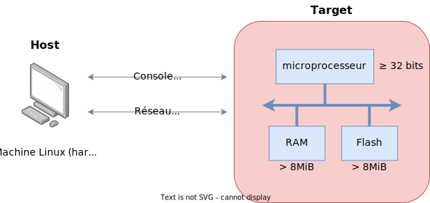

<figure markdown>

</figure>

## Composants du système Linux embarqué

- **Applications**
    - Applications logicielles implémentant la fonctionnalité spécifique du système
- **Bibliothèques**
    - Boîtes à outils logiciels propriétaires ou libres (open-source) offrant toute une
    gamme de fonctions facilitant le développement d'applications
- **Bibliothèques standard (C, Posix, ...)**
    - Interface standardisée entre les services du noyau Linux et les applications
    fonctionnant dans l'espace utilisateur
- **Noyau Linux**
    - Système d'exploitation contenant des fonctions de gestion des processus, de mémoire, suites de piles de protocoles réseau, pilotes de périphériques et fournissant une large palette de services pour les applications logicielles dans l'espace utilisateur
- **Boot-loader**
    - Logiciel démarré par le processeur, responsable d'initialiser le matériel et
    d'amorcer le système d'exploitation Linux
- **Hardware**
    - Infrastructure électronique générique ou spécifique du système embarqué
 
## Infrastructure hardware minimale d'un système Linux embarqué

<figure markdown>

</figure>

## Structure d'un système Linux embarqué

Un système embarqué sous Linux est constitué de trois éléments principaux stockés dans la mémoire Flash de la carte:

<figure markdown>

</figure>

- **Boot-loader (par exemple U-Boot)**
    - Application en charge d'initialiser le système (horloges, mémoires, chip select logic, ...)
    - Application permettant de gérer et de booter le système d'exploitation Linux et ses applications
    - Quelques secteurs de la flash sont réservés pour stocker des variables d'environnement/de configuration du boot-loader
- **Linux Kernel**
    - Noyau Linux exécutable souvent sous une forme compressée (zImage --> uImage pour l'U-Boot)
    - Configuration du noyau Linux (Flattened Device Tree / FDT)
- **Linux root file system (rootfs)**
    - Système de fichiers principal (root _file system_) contenant les répertoires et logiciels de base du système Linux ainsi que les logiciels d'applications.
- **Linux user file system (usrfs)**
    - Suivant les applications, le rootfs peut être étendu avec d'autres partitions (usrfs)
