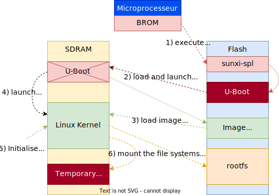
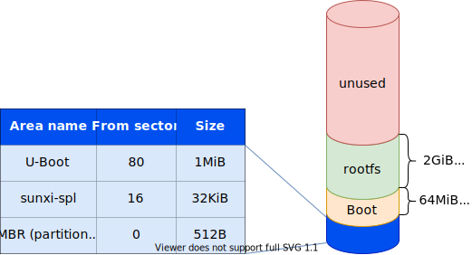
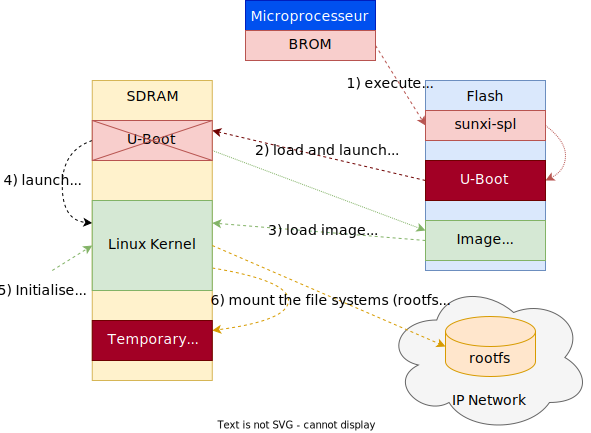

## Rôle d'un bootloader

Les bootloaders ont généralement trois fonctions principales:

- Initialisation du processeur
    - Après la mise sous tension du processeur, certaines composantes
      matérielles doivent impérativement être initialisées avant qu'un
      programme, même élémentaire, puisse s'exécuter. Les horloges, la
      RAM et son contrôleur en sont des exemples typiques.
    - Cette initialisation est toujours dépendante du type de processeur
      et de ses périphériques. Elle est généralement développée en
      assembleur. On n'initialisera naturellement que les périphériques
      nécessaires au fonctionnement du bootloader.
- Lancement de l'application
    - Sur les systèmes embarqués, les applications sont généralement
      stockées dans des mémoires non volatiles de type flash. Cependant,
      pour être exécutées celles-ci doivent souvent être chargées dans
      la RAM.
- Mise à jour de l'application
    - Certains bootloader offrent la possibilité de mettre à jour les
      applications chargées sur le système. Celle-ci peut s'effectuer
      soit localement (carte SD, interface série, ...) ou à distance par
      l'intermédiaire de réseaux de communication (Ethernet, WiFi, ... )

## Les bootloaders

Sur le marché, il existe un grand nombre de bootloaders commerciaux ou
open source. Ces boot-loader sont souvent spécialisés soit pour un type
de processeur, par exemple en open source :

- Architecture Intel / PC
    - GRUB (GRand Unified Bootloader)
    - LILO (Linux loader)
    - RedBoot (Red Hat Embedded Debug and Bootstrap firmware)
    - U-Boot (Universal Bootloader)
    -...
- Architecture MIPS
    - RedBoot
    - U-Boot
    - ...
- Architecture ARM 
    - RedBoot
    - U-Boot
    - ...
 
## Choix d'un bootloader

Le choix d'un bootloader adapté à vos besoins est une tâche ardue.
Ci-dessous quelques facteurs à considérer lors du choix :

- Est-ce qu'il supporte mon choix de processeur ?
- A-t-il déjà été porté sur une carte similaire à la mienne ?
- Est-ce qu'il supporte les fonctions dont j'ai besoin ?
- Est-ce qu'il supporte les périphériques que j'ai prévu d'utiliser ?
- Existe-t-il une large communauté d'utilisateurs d'où je pourrai obtenir de l'aide ?
- Existe-t-il des fournisseurs commerciaux dont je pourrai acheter du support ?

## Das U-Boot

Dans les systèmes embarqués, «Das U-Boot» est probablement l'un des
bootloaders des plus populaires.

Il est développé et maintenu par la maison DENX Software Engineering à
Munich (https://www.denx.de).

La première version a été libérée en juillet 2000 pour des processeurs
PowerPPC. Aujourd'hui, il supporte une très large palette de processeurs
et offre une grande fonctionnalité .

Quelques caractéristiques :

- Processeurs: PPC, ARM, MIPS, x86, m68k, ...
- Systèmes opératifs: Linux, VxWorks, FreeBSD, LynxOS, ...
- Interfaces: série, Ethernet, flash card
- Protocoles: tftp, bootp/tftp, rarp/tftp, dhcp
- Systèmes de fichiers: JFFS2, UBI/UBIFS, ext4, ...

Source code :

- Licence GPLv2
- Langage: développé en C (sans OS ni interruptions) 
- Taille de l'exécutable: ~300KiB
- Release: tous les 2 à 3 mois

## Séquence de démarrage du NanoPi NEO Plus2 – Carte SD / eMMC

<figure markdown>

</figure>

Le démarrage du NanoPi NEO Plus2 se décompose en 6 phases:

1. Lorsque le μP est mis sous tension, le code stocké dans son BROM
   charge dans ses 32KiB de SRAM interne le firmware « sunxi-spl »
   stocké dans le secteur no 16 de la carte SD / eMMC et l'exécuter.
2. Le firmware « sunxi-spl » (Secondary Program Loader) initialise les
   couches basses du μP, puis charge l'U-Boot dans la RAM du μP avant de
   le lancer.
3. L'U-Boot effectue les initialisations hardware nécessaires
   (horloges, contrôleurs, ...) avant de charger l'image non compressées
   du noyau Linux dans la RAM, le fichier «Image», ainsi que le fichier
   de configuration FDT (flattened device tree).
4. L'U-Boot lance le noyau Linux en lui passant les arguments de boot
   (bootargs).
5. Le noyau Linux procéde à son initialisation sur la base des
   bootargs et des éléments de configuration contenus dans le fichier
   FDT (sun50i-h5-nanopi-neo- plus2.dtb).
6. Le noyau Linux attache les systèmes de fichiers (rootfs, tmpfs,
   usrfs, ...) et poursuit son exécution.

Ref. documentation sur les bootargs:

- fichier `./Documentation/kernel-parameters.txt` dans les sources du noyau Linux
- [linux_boot_commands_arguments](assets/sp.02.4_mas_cesl_linux_boot_commands_arguments.pdf)

## Structure de la carte SD du NanoPI NEO Plus2

<figure markdown>

</figure>

## Séquence de démarrage du NanoPi NEO Plus2 – Réseau

<figure markdown>

</figure>