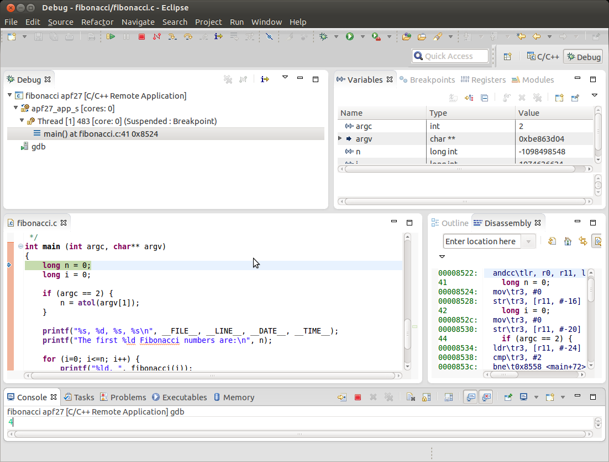

## Technique de debugging

Il existe une multitude de chemins pour debugger une application:

- Try and Error
- Revue de code (code walk through)
- Traçage (_Tracing_: `printf`, `syslog`, 7-segment, ...)
- Debugging à l'aide d'un debugger
    - Ligne de commande, par exemple _GDB_ (_GNU Debugger_)
    - Graphique, par exemple _DDD_ (Data Display Debugger) ou VSCode

Il est important de choisir le bon outil, en fonction du problème à analyser.
Le traçage est probablement le plus simple et le plus facile à mettre en œuvre.
Les debuggers apportent un grand confort lors du développement, mais il faut
savoir qu'ils peuvent perturber le comportement du code et qu'il est souvent
difficile de les utiliser lorsque les cibles ont été déployées chez les clients.

## Tracing

Technique très simple, il suffit d'ajouter des `printf` à l'intérieur du code aux
endroits sensibles. Il permet d'afficher l'état de variables (`.../fibonacci`)

``` C
int value = 100;
if (/*condition*/) {
    value++;
    printf ("if statement\n");
} else {
    printf ("else statement\n");
}
printf ("Value decimal:%d, hex:0x%x\n", value, value);
```

Cette technique peut être amélioré avec une compilation conditionnelle (`.../tracing`)

``` C
#ifdef DEBUG
#define TRACE(x) printf x
#else
#define TRACE(X)
#endif

TRACE(("Value decimal:%d, hex:0x%x\n", value, value));
```

D'autres améliorations sont encore possible: _log-file_, exécution conditionnelle,
_syslog_, etc.

## Debugging avec GDB

Le debugger GNU, généralement appelée simplement GDB, est le debugger
standard pour le système GNU, et par conséquent pour Linux. Il s'agit d'un
debugger portable qui fonctionne sur de nombreux systèmes similaires à Unix
et fonctionne pour de nombreux langages de programmation, tel qu'Ada,
C/C++, FreeBasic ou Fortran.

Démarrer le programme avec GDB

``` bash
gdb <program_with_symbols>
```

Ce type de debugging peut être exécuté indifféremment sur la cible ou sur la
machine hôte.

!!! note "Note"
    le programme doit être compilé avec l'option de debugging (`gcc -g`).

## Debugging avec GDB - quelques commandes

Commandes de base:

``` text
list       - show the program code
break      - set breakpoint (to address or source-line no)
del break  - delete a breakpoint
run        - start program
continue   - continue execution after breakpoint
step       - step (into) instruction
next       - step over instruction
print      - show variable contents
x/i        - display memory content as instruction
bt         - backtrace: show execution stack
frame      - select a stack frame
quit       - leave the debugger
```

Quelques guides :

- http://visualgdb.com/gdbreference/commands/
- https://cs.baylor.edu/~donahoo/tools/gdb/tutorial.html

## Debugging à distance avec GDB / GDB Server

GDB propose un mode distance (remote), utilisé principalement lors de
debugging de systèmes embarqués. On parle de debugging à distance, lorsque
GDB fonctionne sur la machine hôte et le programme étant debuggé sur la
cible. Dans ce cas, GDB communiquera avec la cible soit par une interface
série, soit par une interface Ethernet/IP via le protocole série ou TCP/IP.

Démarrer une session de debugging à distance est également simple

- Sur la machine cible
  ``` text
  gdbserver <[hostname]:port> <program_without_symbols>
  ```

- Sur la machine hôte
  ``` text
  <path>/<target>-gdb <program_with_symbols>
  > set sysroot <shared_library_path>
  > target remote <targetname:port>
  > break main
  > continue
  ```

Pour le NanoPi NEO Plus2

- path (toolchain) --> `/buildroot/output/host/usr/bin`
- target --> `aarch64-buildroot-linux-gnu`
- shared_library_path -->  `/buildroot/output/staging`

## Debugging avec DDD

Étant donné que GDB ne dispose pas d'interface graphique telle que les IDE,
l'utilisation d'un front-end externe est utile. Il en existe beaucoup. DDD en est
un, simple et pratique.

Appeler DDD:

``` text
ddd <program_with_symbols>
```

<figure markdown>

</figure>

Au démarrage, DDD affiche plusieurs fenêtres différentes, pa exemple :

- Data window
- Source window
- GDB console

Les commandes GDB peuvent être invoquées soit en pressant sur les
boutons dans la fenêtre de commandes, soit en tapant la commande
l'intérieur de la console GDB.

## Debugging à distance avec DDD

Le debugging à distance avec DDD est réalisé de manière similaire au debugging
à distance avec GDB utilisant le GDB Server sur la cible.

Démarrer une session de debugging à distance est également simple :

- Sur la cible
  ``` text
  gdbserver <[hostname]:port> <program_without_symbols>
  ```

- Sur la machine hôte
  ``` text
  ddd --debugger <path>/<target>-gdb <program_with_symbols>
  > set sysroot <shared library path>
  > target remote <targetname:port>
  > break main
  > continue
  ```

Pour le NanoPi NEO Plus2

- path (toolchain) --> `/buildroot/output/host/usr/bin`
- target --> `aarch64-buildroot-linux-gnu`
- shared_library_path -->  `/buildroot/output/staging`

## Debugging avec Eclipse

Eclipse est un environnement de développement intégré Il propose toute une
série d'outils très puissants pour le développement d'applications. Il offre entre
autres une interface graphique très performante pour le debugging d'applications
native et distante. 

<figure markdown>

</figure>

## Debugging avec VS-Code

VS-Code est un éditeur très puissant. Il propose toute une série d'extensions
pour le développement de logiciels. Dans ce catalogue, l'extension «C/C++»
offre des services pour le debugging d'applications à distance via GDB,
laquelle s'intègre avec le GUI de VS-Code.

<figure markdown>

</figure>

## Configuration de l'infrastructure de debugging

<figure markdown>

</figure>

## Core dumps

Un _core dump_ est un fichier contenant une image de la mémoire du
processus à l'instant du crash. Il est généré par le noyau Linux lorsque
l'exécution d'un programme lève un signal pour lequel aucune routine de
traitement n'a préalablement été enregistrée.

Le core dump est enregistré dans le répertoire et sous le nom de fichier
spécifié dans `/proc/sys/kernel/core_pattern`, généralement
`core.<pid>`

La création de core dumps doit être autorisée. Pour cela, il suffit d'utiliser la
commande :

```
ulimit -c <size|unlimited>
```

Les core dumps sont un désastre pour les applications, mais ils peuvent être
une bénédiction dans la recherche du problème pour le développeur. Il suffit
d'appeler GDB pour debugger un core dump :

- Sur la cible:
  ``` text
  gdb <program-name> <core-file>
  > bt (backtrace)
  ```

- Sur la machine hôte:
  ``` text
  sudo <path><target>-gdb <program-name> <core-file>
  > bt (backtrace)
  ```

Appel du programme (`.../core_dumps`)

``` text
# ./app
Segmentation fault (core dumped)
```

Informations fournies par le debugger

``` text
$ sudo /buildroot/output/host/usr/bin/aarch64-buildroot-linux-gnu-gdb app core
...
Core was generated by `./app'.
Program terminated with signal SIGSEGV, Segmentation fault.
#0 0x0000000000400534 in access_data () at core_dumps.c:31
31                    *p=10;
(gdb) bt
#0  0x0000000000400534 in access_data () at core_dumps.c:31
#1  0x000000000040056c in call (n=0)  at core_dumps.c:37
#2  0x0000000000400568 in call (n=1)  at core_dumps.c:36
#3  0x0000000000400568 in call (n=2)  at core_dumps.c:36
#4  0x0000000000400568 in call (n=3)  at core_dumps.c:36
#5  0x0000000000400568 in call (n=4)  at core_dumps.c:36
#6  0x0000000000400568 in call (n=5)  at core_dumps.c:36
#7  0x0000000000400568 in call (n=6)  at core_dumps.c:36
#8  0x0000000000400568 in call (n=7)  at core_dumps.c:36
#9  0x0000000000400568 in call (n=8)  at core_dumps.c:36
#10 0x0000000000400568 in call (n=9)  at core_dumps.c:36
#11 0x0000000000400568 in call (n=10) at core_dumps.c:36
#12 0x00
```

## Backtrace

Un backtrace est une impression de la pile d'exécution d'un thread ou processus.
Il peut être initié à tout moment en appelant les fonctions
`backtrace(...)` et `backtrace_symbols_fd(...)`.

Ces fonctions seront généralement incluses dans la routine de traitement des
erreurs de segmentation.

Lors de l'impression de la pile d'exécution, les adresses absolues correspondant
aux de lignes de code des fonctions appelées sont affichées. Pour convertir ces
adresses en nom des fichiers sources et numéros de lignes, il suffit d'appeler
l'outil `addr2line` :

``` text
addr2line -e <name-of-executable-with-debug-symbols> <absolute-address>
```

!!! note "Note"
    Ces fonctions ne sont pas disponibles dans toutes les bibliothèques, par exemple _µClib_

L'exemple de backtrace affiche les infos suivantes lors du crash (`.../backtrace`)

``` text
# ./app
backtrace() returned 17 addresses
./app[0x40070c]
linux-vdso.so.1(__kernel_rt_sigreturn+0x0)[0xffffb43f9578]
./app[0x400748]
./app[0x400780]
./app[0x40077c]
./app[0x40077c]
./app[0x40077c]
./app[0x40077c]
./app[0x40077c]
./app[0x40077c]
./app[0x40077c]
./app[0x40077c]
./app[0x40077c]
./app[0x40077c]
./app[0x4007ac]
/lib64/libc.so.6(__libc_start_main+0xe4)[0xffffb4281fac]
./app[0x40062c]
#
```

Pour obtenir le nom du fichier et la ligne de code correspondant à une adresse,
il suffit d'appeler l'outil addr2line comme suit :

```
aarch64-none-linux-gnu-addr2line -e app 0x400704
/workspace/src/01_environment/backtrace/main.c:37

aarch64-none-linux-gnu-addr2line -e app 0x400740
/workspace/src/01_environment/backtrace/main.c:46

aarch64-none-linux-gnu-addr2line -e app 0x400774
/workspace/src/01_environment/backtrace/main.c:52
```

## System calls

`strace` est un outil pour tracer les appels système du noyau Linux.

Pour obtenir la liste des appels, il suffit de lancer l'application sous le contrôle
de `strace` :

``` text
strace <program-name>
```

Un appel typique peut donner : (`../system_calls`)

``` text
# strace ./app_a
execve("./app_a", ["./app_a"], [/* 17 vars */]) = 0
...
open("/sys/class/thermal/thermal_zone0/temp", O_RDONLY) = 3
read(3, "46000\n", 50) = 6
close(3) = 0
...
+++ exited with 0 +++
# 
```

Étant donné que les informations affichées peuvent être très nombreuses, il
est parfois bon de les limiter en spécifiant un ensemble des appels système
intéressants:

``` text
strace -e trace=<set of calls> <program>
```

``` text
strace -e trace=openat,close,mmap,munmap ./app_a
```

Pour plus de détails, voir `man strace` ou http://en.wikipedia.org/wiki/strace

## Memory leaks

_valgrind_ est un outil pour debugger, effectuer du profilage de code et mettre
en évidence des fuites mémoires.

Pour analyser le code, il suffit de lancer le programme sous le contrôle de
_valgrind_ :

``` text
valgrind --leak-check=full <program-name>
```

Pour plus de détails, voir «man valgrind» ou la homepage valgrind ou
http://en.wikipedia.org/wiki/Valgrind

Un appel typique peut donner: (`.../memory_leaks`)

``` text
# valgrind --leak-check=full ./app
==291== Memcheck, a memory error detector
==291== Copyright (C) 2002-2017, and GNU GPL'd, by Julian Seward et al.
==291== Using Valgrind-3.15.0 and LibVEX; rerun with -h for copyright info
==291== Command: ./app
==291==
==291==
==291== HEAP SUMMARY:
==291== in use at exit: 63,760 bytes in 3,985 blocks
==291== total heap usage: 4,000 allocs, 15 frees, 64,000 bytes allocated
==291==
==291== 63,760 (16 direct, 63,744 indirect) bytes in 1 blocks are definitely lost in loss record 3 of 3
==291== at 0x4848400: malloc (in /usr/lib/valgrind/vgpreload_memcheck-arm64-linux.so)
==291== by 0x4006B7: alloc2 (mem_leaks.c:65)
==291== by 0x40077F: alloc (mem_leaks.c:82)
==291== by 0x40081B: main (mem_leaks.c:98)
==291==
==291== LEAK SUMMARY:
==291== definitely lost: 16 bytes in 1 blocks
==291== indirectly lost: 63,744 bytes in 3,984 blocks
==291== possibly lost: 0 bytes in 0 blocks
==291== still reachable: 0 bytes in 0 blocks
==291== suppressed: 0 bytes in 0 blocks
==291==
==291== For lists of detected and suppressed errors, rerun with: -s
==291== ERROR SUMMARY: 1 errors from 1 contexts (suppressed: 0 from 0)
#
```

## LTTng

_LTTng_ (Linux Trace Toolkit - next generation) est un outil moderne pour
la corrélation de traces prises dans le noyau et/ou l'espace
utilisateur.

<figure markdown>

</figure>

_LTTng_ utilise la même base de temps pour le traçage d'événements en
espace utilisateur et en espace noyau.

_LTTng_ est intégré dans le noyau Linux depuis la version 2.6.38

_LTTng_ est intégré dans l'IDE Eclipse depuis la version Juno

Plus de détails sous https://lttng.org


## PROC file system

Le noyau Linux fournit énormément d'informations sur le système et son
comportement par l'intermédiaire du _proc file system_ `/proc/<...>`

Par exemple `/proc/cpuinfo`, `/proc/meminfo`, `/proc/1/maps`

Pour obtenir l'information, il suffit d'utiliser la commande `cat`

``` text
# cat /proc/1/maps
00400000-004b3000 r-xp 00000000 b3:02 16 /bin/busybox
004c2000-004c3000 r--p 000b2000 b3:02 16 /bin/busybox
004c3000-004c4000 rw-p 000b3000 b3:02 16 /bin/busybox
004c4000-004c5000 rw-p 00000000 00:00 0
2e127000-2e148000 rw-p 00000000 00:00 0 [heap]
ffff96afb000-ffff96c4c000 r-xp 00000000 b3:02 192 /lib/libc-2.30.so
ffff96c4c000-ffff96c5b000 ---p 00151000 b3:02 192 /lib/libc-2.30.so
ffff96c5b000-ffff96c5f000 r--p 00150000 b3:02 192 /lib/libc-2.30.so
ffff96c5f000-ffff96c61000 rw-p 00154000 b3:02 192 /lib/libc-2.30.so
ffff96c61000-ffff96c65000 rw-p 00000000 00:00 0
ffff96c65000-ffff96c77000 r-xp 00000000 b3:02 215 /lib/libresolv-2.30.so
ffff96c77000-ffff96c87000 ---p 00012000 b3:02 215 /lib/libresolv-2.30.so
ffff96c87000-ffff96c88000 r--p 00012000 b3:02 215 /lib/libresolv-2.30.so
ffff96c88000-ffff96c89000 rw-p 00013000 b3:02 215 /lib/libresolv-2.30.so
ffff96c89000-ffff96c8b000 rw-p 00000000 00:00 0
ffff96c8b000-ffff96caa000 r-xp 00000000 b3:02 186 /lib/ld-2.30.so
ffff96cb4000-ffff96cb8000 rw-p 00000000 00:00 0
ffff96cb8000-ffff96cb9000 r--p 00000000 00:00 0 [vvar]
ffff96cb9000-ffff96cba000 r-xp 00000000 00:00 0 [vdso]
ffff96cba000-ffff96cbb000 r--p 0001f000 b3:02 186 /lib/ld-2.30.so
ffff96cbb000-ffff96cbd000 rw-p 00020000 b3:02 186 /lib/ld-2.30.so
ffffdd2e9000-ffffdd30a000 rw-p 00000000 00:00 0 [stack]
```