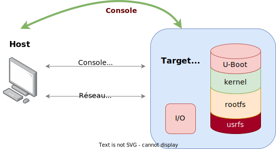

## Environnement de production sous Linux

## Environnement pour le développement du noyau Linux

## Outils de développement

- Une multitude d'outils sont disposition pour le développement de logiciel sous Linux. Dans le cadre de ce module, nous avons fait le choix d'utiliser principalement des outils libres « open source ».
    - Pour la génération du noyau Linux, des modules et des applications, nous utiliserons la chaîne d'outils de GNU
    - Pour le debugging d'applications, nous utiliserons le debugger GDB de GNU, mais afin d'obtenir une interface graphique selon l'état de l'art nous emploierons VS-Code