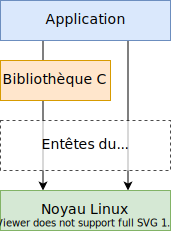
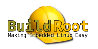

## Composantes du système Linux

<figure markdown>

</figure>

## Composants et OS de la machine de développement

La machine de développement fournit toute la chaîne d'outils de
développement permettant de générer le code exécutable pour la cible

- Compilateur, debugger,
- Outils de gestions des codes sources,
- ...

Bien qu'il soit possible de développer des applications pour Linux embarqué
sur différents types de machine (Windows, Mac OS X, ...), il est préférable
d'utiliser une machine avec Linux comme système opératif

- Meilleur support de la communauté
- L'expérience acquise sur la machine hôte sert au développement sur la cible

<figure markdown>

</figure>

## Tâches de développement sous Linux embarqué

La mise en œuvre d'application sous Linux embarqué peut être répartie en 4
tâches distinctes

1. **Développement de «Board Support Package»** :
   Tâche consistant à mettre en œuvre une distribution Linux avec son bootloader
   pour un système embarqué cible (adaptation des routines d'initialisation du
   matériel, des pilotes de périphériques, ...)
2. **Développement de logiciels noyau** :
   Tâche consistant à développer des logiciels fonctionnant dans le noyau Linux
   (développement de pile de protocoles, de pilotes de périphériques, ...)
3. **Développement d'applications système** :
   Tâche consistant à développer des applications et/ou de bibliothèques
   logicielles dans l'espace utilisateur spécifique au système embarqué cible
4. **Intégration du système** :
   Tâche consistant à intégrer et valider les différentes composantes (bootloader,
   noyau, applications, ...) pour construire le système final

## Solutions Linux embarqué

Deux chemins sont possibles pour aller vers du Linux embarqué

1. Utiliser des **solutions propriétaires** développées et maintenues par des
   fournisseurs, tels que MontaVista, Wind River ou TimeSys
    - Faciles d'accès, mais souvent coûteuses (royalities, runtime fees, ...)
    - Ces solutions viennent avec leurs propres environnements de développement
      pas toujours suffisamment flexible pour les besoins.
    - Leurs outils de développement utilisent un mélange de composants opensource et les outils propriétaires.
2. Utiliser des **solutions open-source** développées par une large communauté
    - Exigences plus élevées, mais sans redevance
    - Solutions très flexible et adaptable aux besoins
    - Tous les logiciels sont ouverts et soutenus par la communauté

**Dans le cadre de ce cours, nous allons utiliser une solution open-source.**
Avec les concepts présentés dans ce cours, un passage à des solutions de
propriétaire sera facile

## Composantes de la chaîne d'outils

<figure markdown>

</figure>

## Compilateur GCC

GCC, the GNU Compiler Collection

- Célèbre compilateur de la non moins célèbre «Free Software Fondation»
- Disponible sous licence GPL et les bibliothèques sous LGPL
- Référence: http://gcc.gnu.org/

GCC est capable de compiler

- C, C++, Objective-C, Fortran, Java, Ada et Go
- Bibliothèques pour ces langages (libstdc++, libgcj, ...)

GCC permet de générer des exécutables pour une large palette de CPU

- ARM, AVR, Blackfin, CRIS, FRV, M32, MIPS, MN20300, PowerPC, SH
- v850, i386, x86_64, IA64, Xtensa, ...

<figure markdown>

</figure>

## GNU Binutils

Binutils est une suite d'outils permettant de manipuler les fichiers objets pour
une architecture de processeur donnée,

- Disponible sous licence GPL
- Référence: http://www.gnu.org/software/binutils/

Les deux outils les plus connus

- `ld` : l'éditeur de liens GNU
- `as` : l'assembleur GNU

Il contient également

- `ar`, `ranlib` : outils pour générer et manipuler des archives (`*.a`)
- `objdump`, `objcopy`, `nm`, `readelf`, `size`, `strings`, `strip` - outils pour analyser et
   manipuler les fichiers objets
- `addr2line`, `c++filt`, `gprof` : outils de debugging en complément à GDB

<figure markdown>
{width=150}
</figure>

## Debugger GNU

GDB: The GNU Projet Debugger

- Le debugger GDB permet de voir et d'analyser ce qui se passe à l'intérieur d'un
  programme lors de son exécution ou ce que le programme faisait au moment où il
  s'est écrasé.
- Disponible sous licence GPL
- Référence : http://www.gnu.org/software/gdb/

GDB est capable debugger

- Des programmes écrits dans les langages supportés par le compilateur GCC
- Des programmes s'exécutant sur la même machine que GDB (natif)
- Des programmes s'exécutant sur des machines distantes (remote)

<figure markdown>

</figure>

## Entêtes du noyau Linux

Les applications ainsi que les bibliothèques C standard l'interface doivent
pouvoir interagir avec les services du noyau Linux.

<figure markdown>

</figure>

Les entêtes du noyau Linux fournissent

- Les appels système et leur numéro
- La définition des constantes
- Les structures de données
- ...

Pour compiler les applications et les
bibliothèques, il est indispensable de
pouvoir disposer de ces entêtes.

Elles sont généralement disponibles sous
`<linux/...>` et `<asm/...>` et quelques autres répertoires,
visible dans les sources du noyau sous le répertoire `<include/>`

## Bibliothèques C standard

Les bibliothèques C standard sont des composants indispensables au
fonctionnement d'un système Linux

- Interface entre le noyau et les applications dans l'espace utilisateur
- Suite de fonctions/services standardisés et bien connus facilitant le
  développement d'applications

Il existe tout un catalogue de fournisseur de ces bibliothèques

- Les plus connues: **glibc** de GNU et **uClibc** de CodePoet Consulting
- Autres implémentations:
    - _eglibc_ à http://www.eglibc.org/
    - _dietlibc_ à http://www.fefe.de/dietlibc/
    - _newlib_ à http://sourceware.org/newlib/
    - ...

Le choix d'un bibliothèque dépendra de :

- La fonctionnalité désirée et nécessaire
- La place mémoire disponible sur la cible

Le choix doit se faire lors de la compilation de la chaîne d'outils

## GNU glibc

Caractéristiques principales :

- Licence LGPL
- Référence http://www.gnu.org/software/libc/
- Bibliothèque C standard dérivée du «GNU Projet»
- Maintenance très active
- Disponible sur toutes les machines hôtes GNU / Linux
- Design fait pour les performances et la portabilité
- Conformité avec les standards garantie
- Taille souvent un peu grande pour les systèmes embarqués
  (_Environ 2.5 MiB en version 2.9 pour les processeurs ARM_)

## µClibc

Caractéristiques principales :

- Licence LGPL
- Référence http://www.uclibc.org/
- Bibliothèque C allégée pour les systèmes embarqués
    - Hautement configurable (fonctions peuvent être activées ou désactivées)
    - Disponible sous Linux et uClinux
    - Focus sur la taille avant les performances (_~4x plus petit que glibc pour ARM_)
    - Certains services ne sont pas disponibles ou que partiellement
      http://www.kernel.org/pub/linux/libs/uclibc/Glibc_vs_uClibc_Differences.txt
- Largement utilisée sur les systèmes embarqués
- Maintenance très active assurée par une grande communauté
- Supportée par MontaVista, TimeSys et Wind River
- Design fait pour les performances et la portabilité

## Boîte à outils

Pour fonctionner, un système Linux a besoin d'un certain
nombre de programmes et utilitaires :

- Un programme d'initialisation
- Une ligne de commande (une shell)
- Divers outils basiques pour la manipulation de fichiers et la
  configuration du système

Sur les systèmes Linux standard :

- Outils fournis par différents projets coreutils, bash, grep, sed, tar, wget, modutils
  par exemple
- Nécessite l'intégration de divers composants
- Composants pas toujours conçu pour les systèmes embarqués et disposant
  souvent de trop de fonctionnalité et pas toujours configurable à souhait

Pour les systèmes Linux embarqués, Busybox est une solution très attractive :

- Très commune dans les systèmes embarqués
- Un seul exécutable hautement configurable
- Taille raisonnable (env. < 500 KiB avec uClib et < 1 MiB avec glibc)
- Référence http://busybox.net/

<figure markdown>

</figure>

## Génération de la chaîne d'outils

La génération manuelle d'une chaîne d'outils est une tâche difficile et ardue,
qui peut prendre plusieurs jours ou semaines!

Celle-ci nécessite de :

- Apprendre énormément de détails sur énormément de composants pas toujours
  simples à configurer
- Prendre énormément de décisions (choix de bibliothèques et des versions, ...)
- Disposer des sources et entêtes du noyau
- Disposer des sources des bibliothèques C standard
- ...

Alternatives :

- Utilisation d'une chaine d'outils précompilée
    - Solution la plus simple et la plus conviviale
    - Impossible d'adapter l'outil à ses besoins spécifiques
- Utilisation d'un outil permettant de générer une distribution Linux à partir de zéro
    - Solution ne nécessitant aucun détail du processus de génération
    - Solution offrant des services de configuration (version, composants, ...)
    - Solution permettant de patches les composants

## Chaînes d'outils précompilées

**Linaro**

- Référence https://wiki.linaro.org/
- Linaro contribue à améliorer le compilateur GCC pour ARM

<figure markdown>

</figure>

**CodeSourcery**

- Référence http://www.codesourcery.com/
- Compagnie avec une grande expertise sur les chaînes d'outils libres
- Ces chaînes d'outils sont disponibles pour ARM, MIPS, PowerPC, SuperH, ...
- Egalement possible d'acheter ces outils avec du support

<figure markdown>

</figure>

**Autres distributions**

- Références http://elinux.org/Toolchains

## Outils de génération pour des distributions Linux

**Buildroot**

- Référence http://buildroot.uclibc.org/
- Système basé sur les Makefile
- Développé et maintenu par la communauté

<figure markdown>

</figure>

**Yocto Projet**

- Référence https://www.yoctoproject.org
- Système très performant et complet, mais complexe
- Développé et maintenu par la communauté

<figure markdown>

</figure>

**PTXdist**

- Référence http://www.ptxdist.org/
- Système basé sur les Makefile
- Développé et maintenu par Pengutronix

<figure markdown>

</figure>

**ELDK (Embedded Linux Development Kit)**

- Référence http://www.denx.de/wiki/ELDK-5/WebHome
- Système basé sur le projet Yocto (http://www.yoctoproject.org/)
- Développé et maintenu par la maison Denx

## Buildroot

Buildroot est outil permettant de générer une distribution à partir de zéro,
comprenant :

- Chaîne d'outils croisée
- Image du noyau Linux sous différent format
- RootFS complet sous différents types de systèmes de fichiers
- Bootloader (U-Boot, Barebox, ...)

Buildroot ne permet de générer qu'une chaîne d'outils basée sur uClib, mais
on pourra utiliser une chaîne d'outils externe si la glibc est préférée

Plus 500 applications et bibliothèques ont été intégrées dans la distribution :

- X.org, Gstreamer, Qt, Gtk, Webkit, ...

Bien adapté pour les systèmes embarqués de petite à moyenne taille :

- Pas d'aide pour la génération de packages (`.deb` ou `.ipk`)
- Nécessite une compilation complète pour les grandes modifications de
  configuration

Communauté très active avec une release tous les 3 mois

## Distributions

**Debian GNU/Linux**

- Référence http://www.debian.org/
- Disponible sur les architectures ARM, MIPS et PowerPC
- Propose une solution clef en main avec tous les logiciels nécessaires
- Offre une très grande flexibilité grâce au gestionnaire de «package», mais
  nécessite une grande capacité de stockage (>300MiB de Flash) et de mémoire
  (> 64MiB RAM)
- Le projet Emdebian (http://www.emdebian.org) travaillant sur la migration des
  distributions Debian pour les systèmes embarqués

<figure markdown>

</figure>

**Ubuntu GNU/Linux**

- Référence http://www.ubuntu.com/
- Basé sur la distribution avec les mêmes avantages
- Disponible sur ARM, mais seulement dès les processeurs Cortex A8 et plus
- Release tous les 6 mois

<figure markdown>

</figure>

**Fedora**

- Référence http://fedoraproject.org/wiki/Architectures/ARM
- Egalement disponible sur ARM, mais pas très activement

<figure markdown>

</figure>