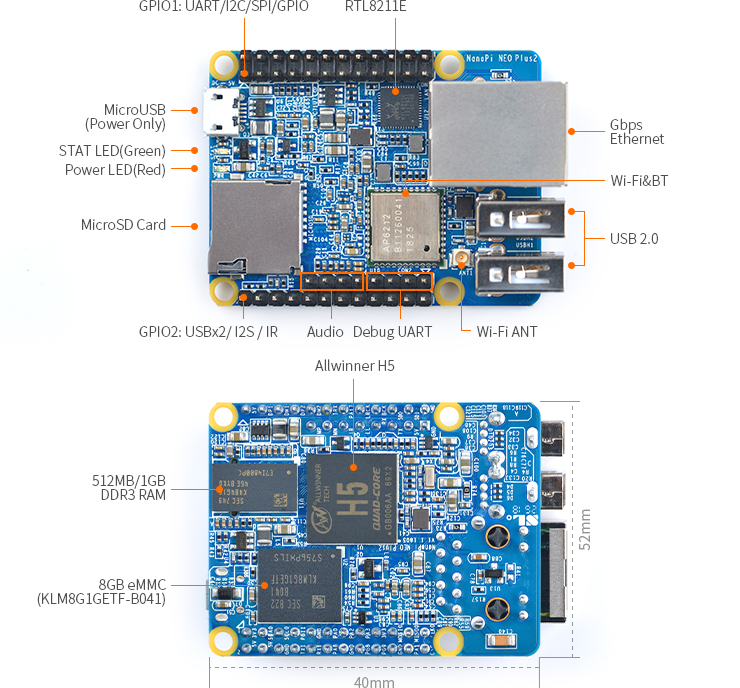
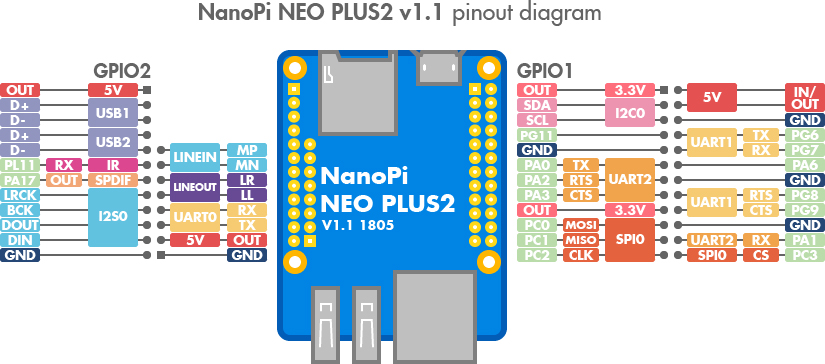
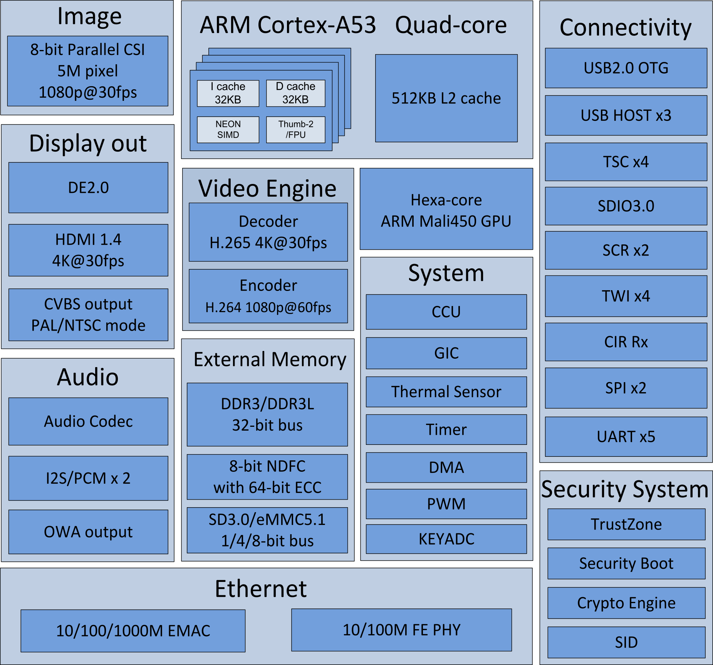

## NanoPi NEO Plus2

## NanoPi NEO Plus2 – Pinout

## NanoPi NEO Plus2 – Main Characteristics

_Source : https://linux-sunxi.org/images/a/a3/Allwinner_H5_Manual_v1.0.pdf_

- SoC: Allwinner H5, Quad-core 64-bit high-performance Cortex A53
- DDR3 RAM:1GB
- Storage: 8GB eMMC
- Network: 10/100/1000M Ethernet based on RTL8211E-VB-CG
- WiFi: 802.11b/g/n
- Bluetooth: 4.0 dual mode
- MicroSD: 1 x slot supporting system booting
- Audio Input/Output: 5 pins
- MicroUSB: power input
- Debug Serial: 4 pins
- GPIO1: 24 pins (UART, SPI, I2C and IO)
- GPIO2: 12 pins (USB, IR receiver, I2S and IO)
- Power Supply: DC 5V/2A
- PCB Dimension: 40 x 52mm
- PCB Layer: 6-Layer

<figure markdown>

</figure>

