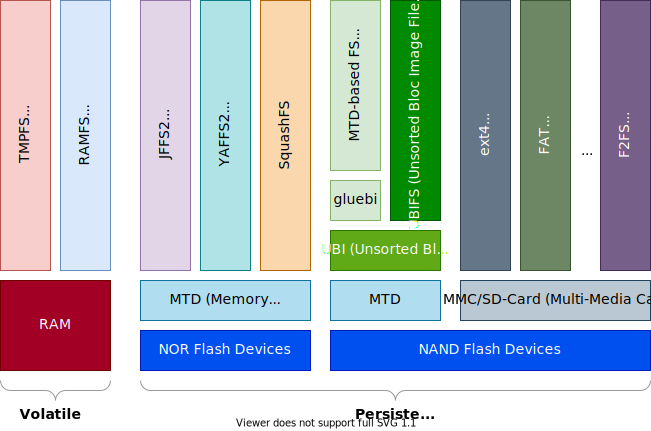
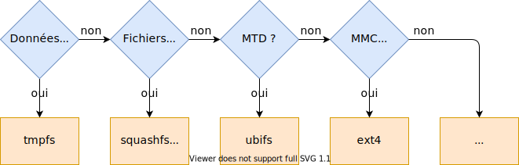

- Il existe une multitude de systèmes de fichiers. Cependant, les systèmes
  embarqués sont plutôt équipés de mémoires Flash (le plus souvent NAND) et
  de mémoires RAM.
- Ces mémoires proposent des couches d'abstraction (MTD, MMC/SD-Card),
  lesquelles permettent de partager la mémoire en plusieurs partitions.
- Chacune de ces partitions peut contenir un autre type de système de fichiers

<figure markdown>

</figure>

## Choix d'un système de fichiers

<figure markdown>

</figure>

Comparaison des différents systèmes de fichiers

- Tristan Lelong a fait [une analyse très intéressante](
  assets/sp.02.5_mas_csel_filesystem_considerations_for_embedded_devices.pdf)
  sur les systèmes de fichiers pour les systèmes embarqués
- Voir la documentation du noyau Linux pour plus de détails sur les systèmes de fichiers
  `Documentation/filesystems/`