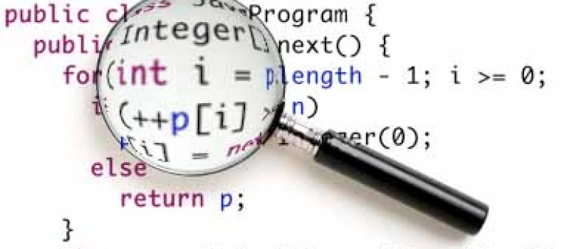

## Domaines

<figure markdown>

</figure>

## Énergie

<figure markdown>

</figure>

## Timing (réaction / variations)

<figure markdown>

</figure>

## Temps de démarrage

<figure markdown>

</figure>

## Profiling

L'analyse des performances d'un logiciel est aussi nommée _Profiling_

Lorsque l'on souhaite optimiser une application logicielle, il faut tout d'abord
savoir quelle partie optimiser

On cherche à identifier les «hot spots»

On s'intéresse principalement à connaître :

- Le temps d'exécution : _où notre programme passe le plus de temps ?_
- Le nombre d'exécutions : _quelles fonctions sont exécutées le plus souvent ?_
- L'arbre d'appel des fonctions (_call-graph_) : _quelle fonction appelle quelle fonction ?_

## Granularité

Avec quelle granularité souhaite-t-on effectuer la mesure?

Niveaux de mesure possibles :

- Application
- Méthode/fonction
- Ligne de code en langage évolué
- Instruction machine

<figure markdown>
{width=500}
</figure>

## Stratégies

Différentes stratégies peuvent être mises en place :

- Instrumentation
- Statistique

Instrumentation :

- Utilisation des outils du système d'exploitation et du compilateur
- Mesure manuelle du temps avec la lecture d'horloges haute résolution
- Mesure manuelle du temps avec un oscilloscope
- Instrumentation dans une _machine virtuelle_

Statistique :

- Le programme fonctionne sans modification
- Un outil échantillonne l'exécution du programme à intervalle régulier :
    - En utilisant les propriétés du microprocesseur
    - En échantillonnant sa pile d'appels

## Optimisation

Une fois les _hot-spots_ identifiés, plusieurs pistes peuvent être suivies pour
optimiser les performances de l'application :

- Choix d'algorithmes plus appropriés
- Emploi plus judicieux des bibliothèques à disposition
- Meilleure utilisation des options de compilation
- Adaptation du code aux propriétés du microprocesseur
- Changement du langage de programmation
- Changement de la plateforme