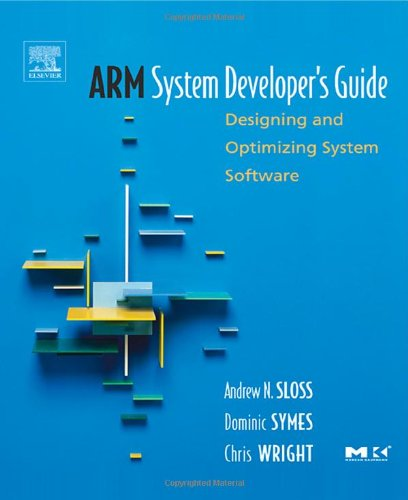
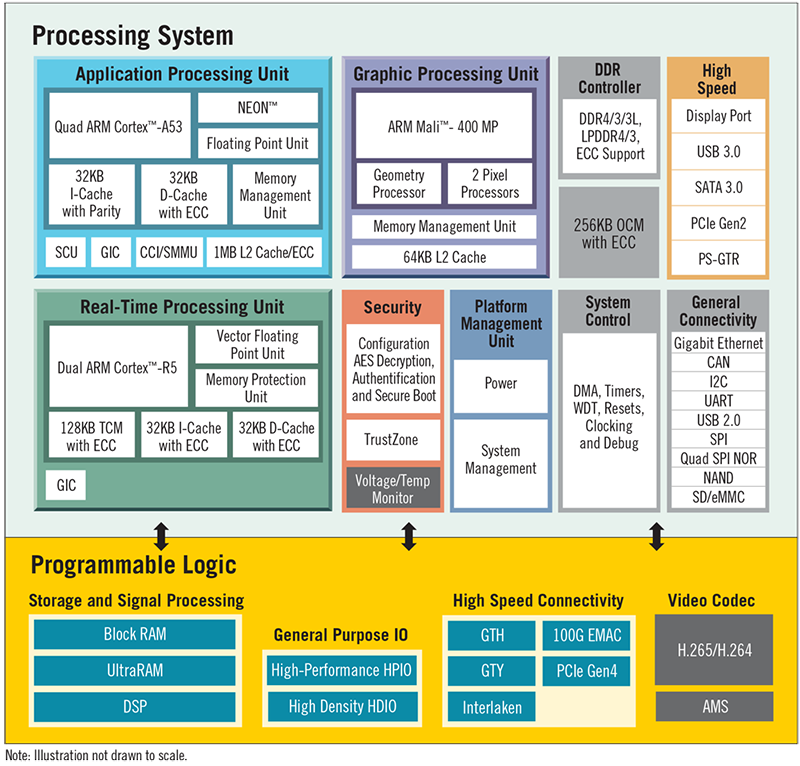
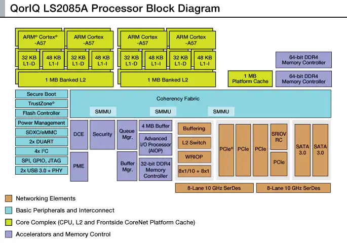

## Algorithmes et bibliothèques


Le choix des bons algorithmes et des bonnes bibliothèques mis en œuvre par
une application a un impact majeur sur le comportement et les performances
de cette dernière.

- Il est impératif que la complexité (_Big-O_) et l'évolutivité (_scalability_) des algorithmes soient
  en adéquation avec les contraintes imposées au système,
- Il faut choisir la bonne structure de données. L'emploi d'une collection de type _vecteur_ est tout
  à fait approprié pour des accès avec indices, mais peut s'avérer catastrophique si
  l'on doit faire des recherches aléatoires. Dans ce cas, un container de type _set_ ou
  _map_ serait probablement plus approprié.

Lors d'utilisation de boucles, il est également important de bien choisir le type
de boucle ainsi que l'ordre d'évaluation des conditions, par exemple :

```c
for (int i=0; i<=expr(); i++) do_something();
```

Cette implémentation peut s'avérer très gourmande suivant la complexité de
`expr()` qui est évalué à chaque itération. Voici une meilleure implémentation :

```c
for (int i=expr(); i>=0; --i) do_something();
```

Il en va de même avec les services de l'OS, des bibliothèques standard et des
appels système.

## Options du compilateur

Les compilateurs modernes offrent un grand d'options d'optimisation avec une
granularité très fine.

Ces options sont généralement regroupées en 3 ou 4 catégories, par exemple avec le
compilateur de GNU de `-O0` à `-O3`, `-O0` ne propose aucune optimisation, tandis
que `-O3` offre le niveau le plus élevé.

Les options offrant une très forte optimisation sont optimales pour les
performances, mais rendent le débogage des applications souvent très
difficile.

L'option `-O2` est très couramment utilisée.

GCC propose aussi une option `-Og`, laquelle devrait déjà offrir un bon degré
d'optimisation, mais ne pas trop péjorer le débogage.

## Optimisation - microprocesseur

Les compilateurs génèrent normalement un code extrèmement performant
pour les diverses architectures de processeurs. Cependant dans certaines
parties critiques du système il peut s'avérer très important de bien
connaître les caractéristiques du microprocesseur et les conventions d'appel de
fonction.

Par exemple avec les processeurs ARM le code généré pour des variables
de 32 bits est plus performant que celui 16 ou 8 bits.

<figure markdown>

</figure>

Les accès à la mémoire principale et à la mémoire cache ainsi que
l'utilisation du pipeline influencent également les performances du
système.

## Optimisation - microprocesseur vs SoC

Il existe actuellement une très grande variété de microprocesseurs

Il est courant de trouver des machines multi-cœurs dans des systèmes
embarqués modernes et exigeants en performances

Ces nouvelles machines disposent aussi régulièrement de coprocesseurs
et/ou contrôleurs spécialisés pour décharger la CPU, par exemple GPU,
NEON, crypto, ...

<figure markdown>
{width=800}
<caption>
http://linuxgizmos.com/16nm-zynq-soc-mixes-cortex-a53-fpga-cortex-r5/
</caption>
</figure>

<figure markdown>

<caption>
http://www.freescale.com/products/arm-processors/qoriq-arm-processors/qoriq-ls2085a-and-ls2045a-multicore-communications-processors:LS2085A
</caption>
</figure>