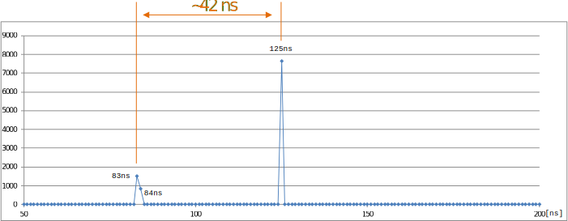

## Unix times

time est un outil Linux très simple permettant d'indiquer le temps d'exécution
d'une application.

**Exemple** :

```bash
time ./clock 1000000 > /dev/null
```

```text
real 0m 1.03s // temps total
user 0m 1.02s // temps CPU utilisé en mode user
sys 0m 0.00s // temps CPU utilisé en mode system
```

Cet outil est basé sur la méthode `times()` fournit par la bibliothèque
`times.h`.

Sa simplicité pâtit d'une résolution souvent insuffisante. Le temps retourné est
donné en nombre de cycles d'horloge système, laquelle peut varier fortement
selon les performances du microprocesseur mis en œuvre.

## Horloges (_timers_)

Linux dispose d'horloges à haute résolution. Celles-ci sont disponibles par la
bibliothèque `time.h`

| Opération          | syscall         |
|--------------------|-----------------|
| Lire l'horloge     | `clock_gettime` |
| Lire la résolution | `clock_getres`  |

Le développeur peut modifier l'application pour y ajouter des lectures de ces
horloges et ainsi mesurer le temps d'exécution de parties ciblées de code.

Avantages :

- Simple à mettre en œuvre
- Grand nombre de points de mesure possible

Inconvénients :

- Il faut connaître les parties du code à mesurer
- Impacte le comportement de l'application

## Horloges - Exemple

```c
#define _GNU_SOURCE
#include <stdio.h>
#include <time.h>

static void do_something() {}

int main() {
    struct timespec t1;
    struct timespec t2;

    clock_gettime(CLOCK_MONOTONIC, &t1);
    do_something();
    clock_gettime(CLOCK_MONOTONIC, &t2);

    // compute elapsed time in nano-seconds
    long long int delta_t = (long long)(t2.tv_sec - t1.tv_sec) * 1000000000 +
                            t2.tv_nsec - t1.tv_nsec;

    printf("elapsed time: %lld [ns]\n", delta_t);
    return 0;
}
```

## Horloges - Interface

Sous Linux la bibliothèque `<time.h>` propose 3 horloges distinctes

- `CLOCK_REALTIME` : Temps actuel synchronisé avec NTP
- `CLOCK_MONOTONIC` : Temps monotone, temps absolu depuis un point de départ non fixé
- `CLOCK_PROCESS_CPUTIME_ID` : Temps utilisé par le processus
 
Le temps est donné en nanoseconds à l'aide de la structure suivante :

```c
struct timespec {
    time_t tv_sec; // seconds
    long tv_nsec; // nanoseconds
};
```

## Horloges - Coût de la mesure

Il est important de noter que la mesure du temps a également un coût
(_overhead_). Pour obtenir ce coût, il suffit de réaliser la mesure suivante :


```c
struct timespec t1, t2;
clock_gettime(CLOCK_MONOTONIC, &t1);
clock_gettime(CLOCK_MONOTONIC, &t2);
long long overhead =
    (long long)(t2.tv_sec - t1.tv_sec) * 1000000000 + t2.tv_nsec - t1.tv_nsec;
```

Si l'on effectue cette mesure plusieurs fois on obtient les points suivants :

<figure markdown>

</figure>


Sur la base des mesures précédentes, on peut obtenir la résolution de
l'horloge :

<figure markdown>

</figure>

Dans le cas du NanoPi Neo Plus2 ~ 42 ns (réellement une horloge à 24MHz)

## Oscilloscope

L'utilisation de sorties numériques et d'un oscilloscope peut s'avérer très utile
si l'on souhaite une mesure très précise du temps

<figure markdown>

</figure>

Avantages :

- Peu d'impact sur le comportement du logiciel
- Grande précision
- Mesure de la gigue possible

Inconvénients :

- Mise en œuvre complexe
- Peu de points de mesure possible

L'utilisation de sorties numériques nécessite un accès aux ports
d'entrées/sorties du microprocesseur

2 chemins disponibles :

- Utilisation des GPIO disponibles dans le sysfs (`/sys/class/gpio/...`) :
  _Simple à mettre en œuvre, mais peut être trop lent (nécessite un accès aux
  routines du noyau)_
- Accès direct aux modules GPIO en mappant les contrôleurs en espace utilisateur
  (méthode mmap) : _Peu d'impacte sur le comportement du logiciel (que quelques cycles d'horloge),
  mais nécessite une très bonne compréhension du hardware_