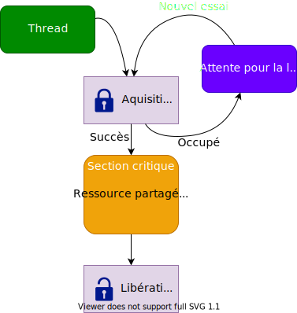

## Ressources partagées et sections critiques

Tout système temps-réel est confronté un jour ou l'autre aux problèmes
d'accès concurrents sur des ressources partagées entre plusieurs
_threads_. Il en est de même sous Linux et plus particulièrement dans son
noyau.

L'idéal est d'éviter au maximum toute variable globale ou partagée.

Si ce n'est pas possible, Linux propose 3 mécanismes principaux pour
protéger ces sections critiques

- Les _mutexes_
- Les _spinlocks_
- Les accès atomiques

<figure markdown>

</figure>

Avec l'utilisation de _mutexes_ ou de _spinlocks_, le danger de créer des _deadlocks_ est latent.

- Linux propose des outils de validation. Plus de détails sous
  `Documentation/lockdep-design.txt`
- Dans la mesure de possible on peut essayer d'utiliser des algorithmes
  libre de loquets, tel que RCU (Read Copy Update). Plus de détails sous
  http://en.wikipedia.org/wiki/Read-copy-update

## Les mutexes

L'interface `<linux/mutex.h>` propose les services reliés aux mutuxes

- Initialisation statique d'un mutex
  ``` c
  DEFINE_MUTEX (name);
  ```
- Initialisation dynamique d'un mutex
  ``` c
  void mutex_init (struct mutex* lock);
  ```
- Accès à la ressource critique. Si l'accès n'est pas autorisé, le
  _thread_ sera bloqué. **Attention**: ce service ne pas être
  interrompu, empêchant la destruction du _thread_.
  ``` c
  void mutex_lock (stuct mutex* lock);
  ```
- Accès à la ressource critique, mais interruptible par le signal fatal
  (`SIGKILL`). Une valeur non zéro est retourné si le verrou n'a pas été
  tenu.
  ``` c
  int mutex_lock_killable (stuct mutex* lock);
  ```
- Accès à la ressource critique, mais interruptible par tous les signaux
  ``` c
  int mutex_lock_interruptible (stuct mutex* lock);
  ```
- Accès à la ressource, mais sans attente (non zéro si pas disponible)
  ``` c
  int mutex_trylock (struct mutex* lock);
  ```
- Libération de la ressource critique
  ``` c
  void mutex_unlock (struct mutex* lock);
  ```

## Les spinlocks

Les _spinlocks_ permettent de protéger des sections critiques pour des
parties de code ne pouvant pas être mis en mode sommeil (in_terrupt
handlers_).

- L'utilisation de _spinlocks_ demande une extrême précaution
- Les _spinlocks_ déclenchent le mécanisme de préemption du noyau
- Les _spinlocks_ restent en attente actives jusqu'à ce que l'accès soit libre

L'interface `<linux/spinlock.h>` propose les services reliés aux `spinlocks`

- Initialisation statique d'un spinlock
  ``` c
  DEFINE_SPINLOCK (name);
  ```
- Initialisation dynamique d'un spinlock
  ``` c
  void spin_lock_init (spinlock_t* lock);
  ```
- Pour un verrouillage dans le contexte de _threads_ (interruptions
  autorisées)
  ``` c
  void spin_[un]lock (spinlock_t* lock);
  ```
- Pour un verrouillage entre _threads_ et interruptions (interruptions
  déclenchées)
  ``` c
  void spin_lock_irqsave/_unlock_irqrestore(
    spinlock_t *lock, unsigned long flags);
  ```
- Pour un verrouillage entre _threads_ et interruptions software
  (interruptions matérielles autorisées)
  ``` c
  void spin_[un]lock_bh (spinlock_t* lock);
  ```

## Les variables atomiques

Les variables atomiques peuvent être d'une grande utilité si la
ressource partagée est une valeur entière. Il important de noter que
l'opération `n++` n'est pas atomique sur tous les processeurs
(par exemple _ARM_).

L'interface `<linux/atomic.h>` propose les services reliés aux variables atomiques

- Le type `atomic_t` représente un nombre entier signé (minimum 24 bits)
- Opérations pour lire et écrire un compteur
  ``` c
  atomic_set (atomic_t* v, int i);
  int atomic_read (atomic_t *v);
  ```
- Opérations sans valeurs de retour
  ``` c
  void atomic_[inc/dec] (atomic_t* v);
  void atomic_[add/sub] (int i, atomic_t* v);
  ```
- Opérations retournant la nouvelle valeur
  ``` c
  int atomic_[inc/dec]_and_return (atomic_t* v);
  int atomic_[add/sub]_and_return (int i, atomic_t* v);
  ```
- Il existe encore d'autres opérations...

## Les opérations atomiques sur les bits

L'interface `<linux/bitops.h>` propose des opérations très efficaces pour manipuler des bits.

Sur la plupart des plateformes, ils s'appliquent sur des type _unsigned long_.

- Opérations pour poser, effacer et changer bit donné
  ``` c
  void set_bit (int nr, unsigned long * addr);
  void clear_bit (int nr, unsigned long * addr);
  void change_bit (int nr, unsigned long * addr);
  ```
- Opération pour tester un bit
  ``` c
  int test_bit (int nr, unsigned long *addr);
  ```
- Opérations pour tester et modifier (retourne la valeur avant modification)
  ``` c
  int test_and_set_bit (int nr, unsigned long *addr);
  int test_and_clear_bit (int nr, unsigned long *addr);
  int test_and_change_bit (int nr, unsigned long *addr);
  ```
