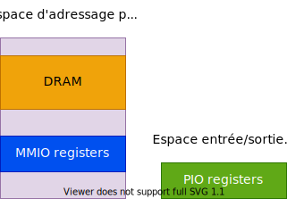
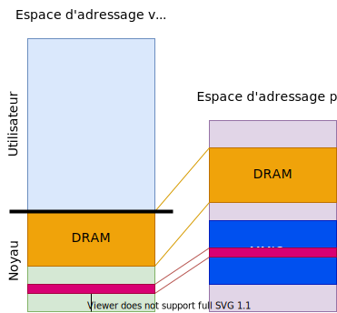

## Types d'entrées/sorties

Selon les processeurs, on distingue deux types d'entrées/sorties :

**MMIO `memory-mapped I/O` (le plus courant)**

- Une seule zone d'adresse pour la mémoire et les périphériques
  d'entrées/sorties
- Instructions usuelles pour accéder les périphériques d'entrées/sorties
- `cat /proc/iomem` permet d'obtenir les zones d'entrées/sorties
- La méthode `request_mem_region` permet d'informer le noyau sur une zone
  ``` C
  struct resource* request_mem_region (
      unsigned long start,
      unsigned long len,
  char* name);
  ```
- La méthode `release_mem_region` permet de libérer une zone 
  ``` c
  void release_mem_region (unsigned long start, unsigned long len);
  ```

**PIO - _port I/O_ (spécialement sur les machines Intel x86)**

- Différentes zones d'adresse pour la mémoire et les périphériques
  d'entrées/sorties
- Instructions spécialisées pour accéder les périphériques
  d'entrées/sorties
- `cat /proc/ioports` permet d'obtenir les zones d'entrées/sorties

<figure markdown>

</figure>

## Accès aux entrées/sorties en zone mémoire

Dans le noyau Linux, l'accès aux entrées/sorties placées en mémoire physique n'est pas possible directement. Il faut préalablement créer une zone mémoire virtuelle pour y mapper les entrées/sorties.

- L'interface `<linux/io.h>` fournit les services nécessaires
- La méthode `ioremap` permet de mapper dans la mémoire virtuelle du
- noyau les entrées/sorties souhaitées
  ``` c
  void* ioremap (unsigned long phys_addr, unsigned long size);
  ```
- La méthode `iounmap` permet de libérer cette zone mémoire
  ``` c
  void iounmap (unsigned long address);
  ```

!!! warning "Attention"
    il faut impérativement contrôler que `ioremap` retourne une valeur non `NULL` !

<figure markdown>

</figure>

Il n'est pas recommandé d'utiliser l'adresse retournée par la fonction «ioremap» comme pointeur sur les registres.

Il est plutôt conseillé d'utiliser les macros d'accès suivantes :

``` c
type_t read[b, w, l, q] (void* addr);
void write[b, w, l, q] (type value, void* addr);
```

ou :

``` c
type_t ioread[8, 16, 32, 64] (const volatile void* addr);
void iowrite[8, 16, 32, 64] (type value, volatile void* addr);
```

ou, pour des accès répétés :

``` c
void ioread[8, 16, 32, 64]_rep(
    const volatile void* addr,
    void* buffer,
    unsigned count);

void iowrite[8, 16, 32, 64]_rep(
    volatile void* addr,
    const void* buffer,
    unsigned count);
```

Il existe également une interface gérée :

``` c
void* devm_ioremap(
    struct device* dev,
    resource_size_t offset,
    resource_size_t size);

void devm_iounmap(
    struct device* dev,
    void* addr);

void* devm_ioremap_resource(
    struct device* dev,
    struct resource* res);
```

Ce service prend en charge la réservation et le mapping de la ressource physique

