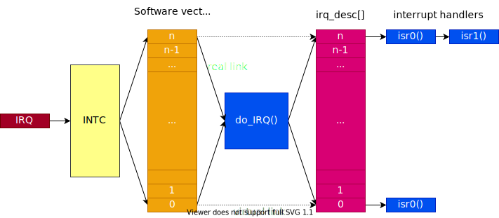

## Traitement des interruptions sous Linux

La figure ci-dessous montre schématiquement le traitement des interruptions par le noyau Linux pour les processeurs ARM

<figure markdown>

</figure>

## Installation des routines de traitement des interruptions

L'interface `<linux/interrupt.h>` propose deux fonctions pour
l'enregistrement et l'effacement des routines de traitement
d'interruptions (_interrupt handlers_)

``` c
int request_irq (
    unsigned int irq,
    irq_handler_t handler,
    unsigned long flags,
    const char *dev_name,
    void *dev_id);

void free_irq (unsigned int irq, void *dev_id);
```

- `irq` --> vecteur d'interruption (numéro)
- `handler` --> routine de traitement des interruptions
- `flags` --> fanions de gestion des interruptions
    - `IRQF_DISABLED` --> garde irqs déclenché lors de l'appel de la routine de traitement
    - `IRQF_SAMPLE_RANDOM` --> irq est utilisée pour la génération de nombres aléatoires
    - `IRQF_SHARED` --> permet de partager l'irq avec plusieurs périphériques
    - `IRQF_TIMER` --> fanion pour marquer cette interruption comme timer
    - `IRQF_TRIGGER_<xx>` --> fanion pour sélectionner le trigger (`xx`: `FALLING`, `RISING`, ...)
- `dev_name` --> nom du périphérique d'interruption
- `dev_id` --> paramètre spécifique à l'application(doit impérativement être non nul
  si l'interruption est partagée `IRQF_SHARED`)

## Routine de traitement des interruptions (interrupt handler)

La routine de traitement des interruptions prend la forme suivante

``` c
irqreturn_t short_interrupt(int irq, void *dev_id)
{
    /* do something...*/
    return IRQ_HANDLED;
}
```

- `irq` --> vecteur ayant levé l'interruption
- `dev_id` --> paramètre spécifique à l'application fournie lors de
  l'enregistrement de la routine de traitement

Si la routine a été en mesure de traiter l'interruption, `IRQ_HANDLED`
sera retourné, dans le cas contraire, la valeur de retour devra être
`IRQ_NONE`

La valeur de retour est utilisée par le noyau pour éliminer les
interruptions parasites (_spurious interrupts_)

## Etat des Interruptions

La commande `cat /proc/interrupts` fournit des informations très intéressantes sur l'état des interruptions avec le nom associé au vecteur d'interruption.

``` bash
 cat /proc/interrupts
```

``` text
       CPU0   CPU1   CPU2   CPU3
1:        0      0      0      0  GICv2  25 Level   vgic
3:      359    386    482    457  GICv2  30 Level   arch_timer
4:        0      0      0      0  GICv2  27 Level   kvm guest timer
8:    38452      0      0      0  GICv2  92 Level   sunxi-mmc
9:      461      0      0      0  GICv2  93 Level   sunxi-mmc
10:      43      0      0      0  GICv2  94 Level   sunxi-mmc
11:       0      0      0      0  GICv2 103 Level   musb-hdrc.1.auto
12:       0      0      0      0  GICv2 104 Level   ehci_hcd:usb1
13:       0      0      0      0  GICv2 105 Level   ohci_hcd:usb3
14:       0      0      0      0  GICv2 110 Level   ehci_hcd:usb2
15:       0      0      0      0  GICv2 111 Level   ohci_hcd:usb4
19:      21      0      0      0  GICv2  63 Level   1c25000.ths
22:       0      0      0      0  GICv2 114 Level   eth0
25:      84      0      0      0  GICv2  32 Level   ttyS0
26:       0      0      0      0  GICv2  72 Level   1f00000.rtc
29:       0      0      0      0  GICv2 152 Level   arm-pmu
30:       0      0      0      0  GICv2 153 Level   arm-pmu
31:       0      0      0      0  GICv2 154 Level   arm-pmu
32:       0      0      0      0  GICv2 155 Level   arm-pmu
103:      0      0      0      0  sunxi_pio_edge  38 Edge 1c0f000.mmc cd
IPI0:   713   1050  35946    629  Rescheduling interrupts
IPI1:    15    492    484    484  Function call interrupts
IPI2:     0      0      0      0  CPU stop interrupts
IPI3:     0      0      0      0  CPU stop (for crash dump) interrupts
IPI4:     0      0      0      0  Timer broadcast interrupts
IPI5:     0      0      0      0  IRQ work interrupts
IPI6:     0      0      0      0  CPU wake-up interrupts
Err:      0   
```

## Tâches usuelles d'une routine de traitement d'interruptions

Les tâches typiques d'une routine de traitement

- Quittancer la notification de l'événement sur le périphérique ayant
  levé l'interruption, afin d'éviter que les interruptions ne soient
  plus générées ou que l'interruption soit levée continuellement
  (`deadlock`)
- Lire ou écrire les données du ou vers le périphérique
- Réveiller l'éventuel thread en attente de l'évènement, afin qu'il
  puisse terminer le traitement de l'information et son opération,
  typiquement avec une waitqueue
  ``` c
  wake_up_interruptible (&queue);
  ```

## Contraintes et limitations

La programmation des routines de traitement des interruptions doit
toujours être réalisée avec beaucoup de soin. Il en va de même dans le
noyau Linux.

- Le temps de traitement dans une interruption doit être limité au
  minimum. Si le traitement est lourd et complexe, il peut être délégué
  à une _softirq_, une _workqueue_ ou depuis la version 2.6.30 à un _thread_
- Il n'est pas possible de transférer des données avec des applications
  de l'espace utilisateur
- Il n'est pas possible d'effectuer des opérations nécessitant des mises
  en sommeil

L'utilisation de fonctions pour autoriser et/ou bloquer les
interruptions (`disable_irq`/`enable_irq`) doit être évitée au maximum

## Traitement des interruptions par thread

Linux propose depuis la version 2.6.30 un mécanisme permettant de
traiter les interruptions dans une routine appelée par un thread. Ce
mécanisme permet d'avoir des traitements longs non bloquants.

``` c
int request_threaded_irq (
    unsigned int irq,
    irq_handler_t handler,
    irq_handler_t thread_fn,
    unsigned long flags,
    const char * dev_name,
    void * dev_id);
```

- `irq` --> vecteur d'interruption (numéro).
- `handler` --> routine appelée lorsque l'interruption est levée.
  Pour passer la main au _thread_, cette routine retournera la
  valeur `IRQ_WAKE_THREAD`.
- `thread_fn` --> routine de traitement appelée par un thread.
- `flags` --> fanions de gestion des interruptions.
- `dev_name` --> nom du périphérique d'interruption.
- `dev_id` --> paramètre spécifique à l'application
  (doit impérativement être non nul).

## Interface gérée

Il existe également une interface gérée :

- `devm_request_irq()`
- `devm_free_irq()`
- `devm_request_threaded_irq()`
