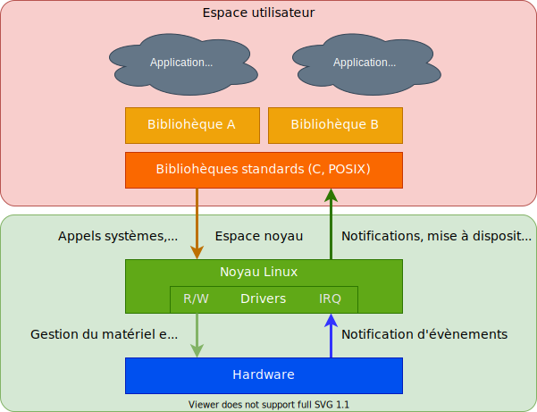

## Modes d'opération

<figure markdown>

</figure>

**Linux connaît deux modes d'opération:**

- Mode utilisateur (User Mode/Space):
    - La majorité des programmes utilisateurs travaillent dans ce mode
      (browser, éditeurs, compilateurs,... )
    - Chaque programme/application dispose d'un environnement virtuel et protégé
    - Le crash d'une application n'affecte pas les autres
    - L'accès direct au matériel n'est pas autorisé, celui-ci doit se faire par l'intermédiaire d'un pilote de périphériques
- Mode noyau (Kernel Mode/Space):
    - Le système d'exploitation travaille dans ce mode
    - Les pilotes de périphériques sont développés pour fonctionner dans ce mode et pour pouvoir accéder au matériel
    - La majorité des piles de protocoles (protocol stacks) sont réalisées pour le noyau, afin d'obtenir de meilleures performances
    - Le crash d'un logiciel dans le noyau provoque le crash de tout le système

**Interface entre espace utilisateur et espace noyau:**

- Appels système (System calls)
    - L'interface entre les 2 espaces est réalisée par l'intermédiaire appels système
    - Un appel system est une interruption logicielle, laquelle permet
      à un processus en espace utilisateur de sortir de son environnement
      protégé et d'appeler des fonctions du noyau Linux
    - Actuellement le noyau Linux offre plus de 400 appels système 
      (opérations sur les fichiers, les périphériques, le réseau, les processus, etc.)
    - Cette interface est stable. Seuls de nouveaux services sont proposés par les développeurs du noyau
- Pseudo système de fichiers (Pseudo Filesystems)
    - Les informations du système et du noyau sont mises à disposition
      des applications de l'espace utilisateur par le biais d'un pseudo système de fichiers

## Mémoire physique et mémoire virtuelle

- Tous les processus possèdent leur propre espace d'adressage virtuel
- Chaque processus fonctionne comme s'il disposait de la totalité de la mémoire

<figure markdown>

</figure>

## Organisation de la mémoire virtuelle (machine 32 bits)
**Répartition standard de la mémoire**

- 1GiB pour le noyau Linux (_kernel space_)
- 3GiB pour chaque processus (_user space_)

<figure markdown>

</figure>

**Noyau Linux**

- Code et données identiques pour tous
- Accès aux I/O et aux périphériques
- Si plus de 1GB est nécessaire pour le noyau
    - Changer le mode 1GiB/3GiB --> 2GiB/2GiB --> 3GiB/1GiB
    - Activer le support «HIGHMEM»
    - Changer pour une architecture 64bits
- Processus
    - Code et données du processus (programme, pile, ...)
      différents d'un processus à l'autre
    - Tout n'est pas alloué au lancement du processus,
      allocations dynamiques selon les besoins

## Organisation de la mémoire virtuelle (machine 64 bits)

<figure markdown>

</figure>

- Source de l'image : https://commons.wikimedia.org/wiki/File:Linux_Virtual_Memory_Layout_64bit.svg
- Référence : https://www.kernel.org/doc/Documentation/arm64/memory.txt

## Système de fichiers virtuels

<figure markdown>

</figure>

Linux met à disposition des applications fonctionnant dans l'espace
utilisateur les données du matériel et les informations du noyau et du
système par l'intermédiaire d'un système de fichiers virtuels.

Ce système de fichiers virtuels permet aussi bien d'accéder à des
informations physiques (par exemple stockées sur un disque dur ou en
mémoire flash/ram), qu'à des données d'interfaces sérielles, qu'à des
données du réseau, qu'à des informations du système stockées dans des
fichiers virtuels créés par le noyau lui-même.

A part les systèmes de fichiers permettant l'accès au matériel, trois
systèmes de fichiers virtuels sont très importants

- **procfs** --> informations sur le système d'exploitation (monté sous
  `/proc`)
- **sysfs** --> informations sur le matériel et les périphériques (monté
  sous `/sys`)
- **debugfs** -> informations utiles au développement (à monter
  généralement soi-même: `mount -t debugfs none /sys/kernel/debug`)