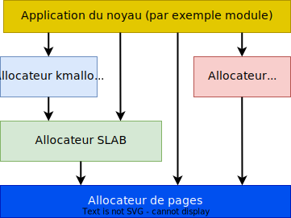

## Gestion de la mémoire dynamique par le noyau Linux

Il est courant que les modules noyaux doivent faire appel à des
allocations dynamiques de la mémoire pour la création d'objets ou de
structures de données.

Linux dispose d'une infrastructure très puissante pour couvrir ces
besoins. Cette infrastructure est répartie sur trois niveaux.

- Les allocateurs `kmalloc` et `vmalloc` offrant des services de base
  aux applications fonctionnant dans le noyau. De ces deux allocateurs,
  on préférera généralement utiliser `kmalloc` pour ses performances.
- Les allocateurs _SLAB_ permettent de créer de caches, lesquels
  contiennent des objets de même taille (voir `/proc/slabinfo`).
  _Il existe différentes implémentations de ces allocateurs et
  peuvent être choisies lors de la configuration du noyau_
- Les allocateurs de pages permettent d'allouer de grandes zones mémoires,
  bien que dépendant de l'architecture, usuellement des blocs de 4KiB.

<figure markdown>

</figure>

## Allocateur kmalloc

**`kmalloc` est l'allocateur de mémoire d'usage général pour les modules du noyau Linux**

- Il permet d'allouer des objets jusqu'à 128 MiB
- Pour les petites tailles, il s'appuie sur les caches génériques _SLAB_, nommés
  `kmalloc-XXX` ou `size-xxx` (voir `/proc/slabinfo`)
- Pour de plus grandes tailles, il utilise sur l'allocateur de pages
- `kmalloc` garantit que la zone allouée est physiquement contigüe

**Signification des drapeaux (flags)**

- `GFP_KERNEL` : allocation mémoire standard
- `GFP_ATOMIC`: permet d'allouer de la mémoire dans du code ne pouvant
  être interrompu (_interrupt handler_ ou sections critiques)
- `GFP_DMA`: permet d'allouer de la mémoire pouvant être utilisée pour des
  transferts DMA, on préférera cependant les services de l'interface
  `<linux/dma-mapping.h>`, par exemple `dma_alloc_coherent()`
- Plus de détails dans `<linux/gfp.h>`

**`kmalloc` doit être utilisé comme l'allocateur principal à moins qu'il
existe une bonne raison d'utiliser un autre**

Fonctions pour l'allocation de mémoire dans `<linux/slab.h>` :

- `void* kmalloc (size_t size, gfp_t flags)` --> alloue `size` octets et retourne le
  pointeur sur le bloc de données (adresse virtuelle)
- `void* kzalloc (size_t size, gfp_t flags)` --> alloue et initialise à zéro le bloc
- `void* kcalloc (size_t n, size_t size, gfp_t flags)` --> alloue de la mémoire pour 
  `n` éléments de taille `size` et initialise à zéro le contenu
- `void* krealloc (const void* p, size_t new_size, gfp_t flags)` --> change la
  taille du bloc pointé par `p` pour la taille `new_size`. Le bloc est réalloué
  et son contenu copié.

Libération de mémoire :

  - `void kfree (const void* objp)` -> libère la mémoire allouée

Exemple :

``` c
char* buffer = kzalloc (1000, GFP_KERNEL);
if (buffer == NULL) /* error handling... */;
// ... do some work
kfree (buffer);
buffer = 0;
```

Pour la réalisation de pilotes de périphériques, il existe également des
services avec une libération automatique des blocs lorsque le module ou
le périphérique est extrait.

- `void* devm_kmalloc (struct device* dev, size_t size, gfp_t flags);`
- `void* devm_kzalloc (struct device* dev, size_t size, gfp_t flags);`
- `void* devm_kcalloc (struct device* dev, size_t n, size_t size, gfp_t flags);`

Pour une libération immédiate du bloc mémoire

- `void devm_kfree (struct device* dev, const void* objp);`
