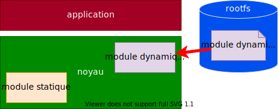

## Introduction

**La fonctionnalité du noyau Linux peut en tout temps être adaptée, modifiée ou étendue**

Des applications nécessitant un accès au matériel ou devant traiter une très grande quantité d'information en provenance d'interfaces réseau (piles de protocoles) seront assez naturellement conçues pour fonctionner dans l'espace noyau en collaboration avec les threads du noyau Linux. Dans ce cas on parle de modules noyau ou d'objets noyau (kernel objects).

**Linux propose deux techniques pour lier ces modules avec le noyau**

- Statique
    - Le module est compilé et linké statiquement avec l'image du noyau v Le module est chargé avec le noyau lors du démarrage
- Dynamique
    - Le module est compilé séparément du noyau, mais en utilisant la version courante du noyau (current running kernel)
    - Le module est chargé par des applications utilisateur en fonction des besoins
    - Ces modules/objets noyau ont l'extension `*.ko`

<figure markdown>

</figure>

## Avantages des modules noyaux

**Il existe de nombreux avantages à développer des modules noyaux**

- Développement plus aisé et plus rapide : _Pas nécessaire de redémarrer
  le noyau Linux après une modification du module, les modules peuvent être
  chargés, testés, déchargés, régénérés_
- Maîtrise de la taille du noyau Linux : _En ne chargeant que les modules
  utiles, on peut plus facilement garder la taille
  de l'image du noyau Linux au minimum_
- Chargement de pilotes de périphériques que si le système les reconnaît :
  _Si le système ne connaît pas quels périphériques sont attachés au
  système avant son démarrage ou si les périphériques ne sont
  systématiquement utilisés par les applications, alors ceux-ci ne seront
  pas chargés dans le noyau Linux_
- Diminution du temps de démarrage des cibles : _Aucun temps n'est perdu
  à initialiser des périphériques ou des fonctions du noyau
  si elles ne sont pas utilisées_
- Pas de modification des sources de la distribution : 
  _Ils ne nécessitent pas (en principe) de modification des sources du
  noyau Linux et de son dépôt (git repository) car les modules peuvent
  être développés à l'extérieur de l'arborescence du noyau Linux_

## Limitations des modules noyaux

**Le développement de module sous Linux souffre de quelques limitations:**

- Le module doit impérativement être développé en C (ou récemment en Rust).
  C++ n'est pas supporté (voir http://vger.kernel.org/lkml/#s15-3).
- Le module doit impérativement être développé sous licence en général GPL
  (GNU Public Licence)
- La bibliothèque standard C n'est pas disponible dans le noyau.
  D'autres méthodes doivent être utilisées. Les fichiers propres 
  au noyau sont placés dans le répertoire `<linux/>`
- L'usage des nombres en virgule flottante n'est pas supporté si le μP
  ne dispose pas d'un coprocesseur mathématique
- Le débogage des modules est nettement plus complexe

!!! warning "Attention"
    - Une fois chargé dans le noyau, le module a plein contrôle sur
      l'ensemble du système avec tous les privilèges
    - Une erreur de programmation dans un module peut causer le crash de
      tout le système

## Squelette d'un module

``` C
// skeleton.c
#include <linux/module.h>  // needed by all modules
#include <linux/init.h>    // needed for macros
#include <linux/kernel.h>  // needed for debugging

static int __init skeleton_init(void)
{
    pr_info ("Linux module skeleton loaded\n");
    return 0;
}

static void __exit skeleton_exit(void)
{
    pr_info ("Linux module skeleton unloaded\n");
}

module_init (skeleton_init);
module_exit (skeleton_exit);

MODULE_AUTHOR ("Jacques Supcik <jacques.supcik@hefr.ch>");
MODULE_DESCRIPTION ("Module skeleton");
MODULE_LICENSE ("GPL");
```

## Explications du module

**Initialisation**

- La fonction `skeleton_init` est appelée lorsque le module est chargé
  dans le noyau. Elle retourne un code d'erreur (0 pour succès, une
  valeur négative, par exemple: `EACCES`, en cas d'erreur). Liste des
  codes d'erreurs:
  ```C
  #include <linux/errno.h>
  ```
  Elle est éliminée après l'initialisation du module (macro `__init`).
- La macro `module_init` permet de déclarer le nom de la fonction d'initialisation.

**Nettoyage**

- La fonction «skeleton_exit» est appelée lorsque le module est désinstallé.
  Si le module est compilé statiquement avec le noyau, la fonction est écartée
  (macro `__exit`).
- La macro `module_exit` permet de déclarer le nom de la fonction d'initialisation.

**Métadonnées**

- Les macros `MODULE_AUTHOR`, `MODULE_DESCRIPTION` et `MODULE_LICENSE` permettent
  de déclarer des informations sur le module et le type de licence utilisé
  (généralement GPL).
