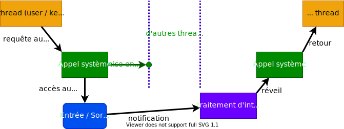

Dans les applications temps-réel il existe une multitude de raisons pour mettre en sommeil un processus ou un _thread_.

La plus courante est l'attente de données d'un périphérique d'entrées/sorties.

<figure markdown>

</figure>

## Les waitqueues

Les _waitqueues_ permettent de mettre en sommeil un processus ou un _thread_ et de le réveiller lors de l'arrivée de l'événement.

L'interface` <linux/wait.h>` propose les services reliés aux _waitqueues_

- Initialisation statique d'une `waitqueue`
  ``` c
  DECLARE_WAIT_QUEUE_HEAD(queue);
  ```
- Initialisation dynamique d'une waitqueue
  ``` c
  void init_waitqueue_head (wait_queue_head_t* queue);
  ```
  
Quelques macros pour mettre en sommeil un _thread_

- Opération pour mettre en sommeil le _thread_ jusqu'à la queue soit
  notifiée et que la condition `C` soit vraie. **Attention**: ce service ne
  peut pas être interrompu, empêchant la destruction du processus en
  espace utilisateur.
  ``` c
  wait_event (queue, condition);
  ```
- Idem, mais peut être interrompu par le signal `SIGKILL`.
  Si le _thread_ a été interrompu, la valeur `-ERESTARTSYS` est retournée.
  ``` c
  int wait_event_killable (queue, condition);
  ```
- Idem, mais peut être interrompu par n'importe quel signal.
  Si le _thread_ a été interrompu, la valeur `-ERESTARTSYS` est retournée.
  ``` c
  int wait_event_interruptible (queue, condition);
  ```
- Opération pour mettre en sommeil le _thread_ jusqu'à la _queue_ soit notifiée
  et que la condition `C` soit vraie ou bien que le temps soit écoulé.
  La valeur `0` est retournée si le temps est écoulé. (_timeout_ en _jiffies_, 1 - 10ms)
  ``` c
  int wait_event_timeout (queue, condition, timeout);
  ```
- Idem, mais peut être interrompu par n'importe quel signal.
  La valeur `0` est retournée si le temps est écoulé, si le _thread_ a
  été interrompu, la valeur `-ERESTARSYS` est retournée, sinon une valeur positive.
  ``` c
  int wait_event_interruptible_timeout (queue, condition, timeout);
  ```

Quelques macros pour réveiller le _thread_

- Opération pour réveiller tous les processus dans la _queue_
  ``` c
  wake_up(&queue);
  ```
- Opération pour réveiller que les processus ininterruptibles de la _queue_.
  ``` c
  wake_up_interruptible (&queue);
  ```

D'autres opérations sont disponibles dans l'interface.
