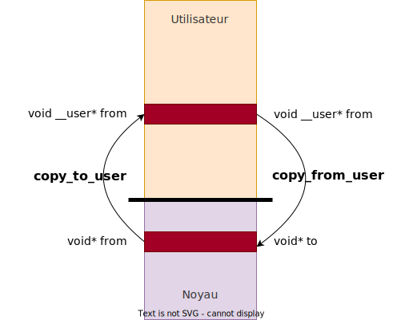

## Structure d'un pilote orienté caractère

Un pilote de périphériques orienté caractère est constitué de deux parties
essentielles :

- Le **pilote** (driver) : code permettant de piloter un ou plusieurs
  périphériques du même type
- Le **périphérique** (device) : instance du pilote (l'objet) permettant à
une application d'échanger des données avec un périphérique au travers
du système de fichiers virtuels

<figure markdown>

</figure>

## Etapes d'implémentation

L'implémentation d'un pilote orienté caractère peut être décomposer en
5 étapes principales :

1. Implémentation des opérations sur les fichiers (handler) correspondantes aux
   appels système qu'une application en espace utilisateur pourra utiliser
1. Définition de la structure `struct file_operations` (appelée `fops`) permettant
   d'associer les opérations à leur implémentation dans le pilote
1. Réservation du numéro de pilote (numéro majeur et numéro mineur) permettant
   d'identifier le pilote et le périphérique dans le noyau
1. Association des opérations sur le fichier au numéro de pilote dans le noyau Linux
1. Intégration du code du pilote de périphérique dans le squelette d'un module noyau

## Opérations

La structure `struct file_operations` est générique à tous les fichiers
traités par le noyau Linux. Elle contient énormément d'opérations, mais il n'est
pas nécessaire de toutes les implémenter pour un pilote orienté caractère.

Le tableau ci-dessous présente cinq opérations principales :

| Opérations sur les fichiers (Espace noyau) | Appels système (Espace utilisateur) |
| ------------------------------------------ | ----------------------------------- |
| .open                                      | open                                |
| .release                                   | close                               |
| .write                                     | write                               |
| .read                                      | read                                |
| .llseek                                    | lseek                               |

Le tableau ci-dessous présente trois opérations optionnelles :

| Opérations sur les fichiers (Espace noyau) | Appels système (Espace utilisateur) |
| ------------------------------------------ | ----------------------------------- |
| .mmap                                      | mmap                                |
| .poll                                      | select, poll, epoll                 |
| .unlocked_ioctl                            | ioctl                               |

## Opérations

### Open

```C
int (*open) (struct inode* i, struct file* f);
```

La fonction  `open` est appelée quand l'application en espace
utilisateur ouvre le fichier correspondant au périphérique

- `i` pointe sur la structure `struct inode` qui représentent de façon unique un
  fichier dans le noyau Linux (que ce soit un fichier régulier, un répertoire, un lien
  symbolique, un pilote de périphérique orienté caractère ou bloc, etc.)
- `f` pointe sur la structure de fichier `struct file` qui est créée à chaque fois
  qu'un fichier est ouvert. Il peut exister plusieurs structures de fichiers attachées au
  même _inode_.
    - Elle contient des informations telles que la position actuelle dans le fichier ou
      le mode d'ouverture
    - Elle contient également un pointeur `void * private_data` que l'on peut
      utiliser librement. Cet attribut est passé à toutes les autres opérations sur les
      fichiers

### Release

```C
int (*release) (struct inode* i, struct file* f);
```
La fonction `release` est
appelée quand l'application en espace utilisateur ferme le fichier

### Read

```c
ssize_t (*read) (struct file* f, char* __user buf, size_t count, loff_t* off);
```

La fonction `read` est appelée quand l'application en espace utilisateur
utilise la méthode `read()` sur le fichier correspondant au périphérique

- Elle permet de lire les données du périphérique.
- Elle copie au maximum `count` octets du périphérique dans le tampon `buf` en espace
  utilisateur. Une fois l'opération terminée, elle met à jour la position off du fichier et
  retourne le nombre d'octets lus.
- `f` est le pointeur sur la structure de fichier qui a été passé lors de l'opération open()

### Write

```c
ssize_t (*write) (struct file* f, const char* __user buf, size_t count, loff_t* off);
```

La fonction `write` est appelée quand l'application en espace utilisateur
utilise la méthode `write()` sur le fichier correspondant au périphérique

- Elle permet d'écrire des données dans le périphérique.
- Elle copie `count` octets du tampon `buf` en espace utilisateur dans le périphérique.
  Une fois l'opération terminée, elle met à jour la position `off` du fichier et retourne le
  nombre d'octets copiés.
- `f` est le pointeur sur la structure de fichier qui a été passé lors de l'opération `open()`

## Echange de données (read & write)

L'échange de données entre l'application en espace utilisateur et le pilote de
périphérique en espace noyau n'est généralement pas autorisé avec un accès
direct basé sur la déréférenciation du pointeur buf. Pour garder le code portable
sur différentes architectures, on préférera utiliser les services du noyau disponible
dans l'interface `<linux/uaccess.h>`.

Pour copier une seule valeur :

- `int get_user (v, p)` permet de copier dans la variable `v`
  du noyau le contenu pointé par `p` en espace utilisateur.
- `int put_user (v, p)` permet de copier le contenu de
  la variable `v` du noyau vers l'espace utilisateur pointé par `p`
- Ces méthodes retournent zéro (0) en cas de succès
  ou `-EFAULT` en cas d'erreur

Pour copier une grande quantité de données :

```c
unsigned long copy_to_user (void __user* to, const void* from, unsigned long n);
unsigned long copy_from_user (void* to, const void __user* from, unsigned long n);
```

- Ces méthodes retournent le nombre d'octets n'ayant pu
  être copiés. Zéro (0) indique que toutes les données ont
  bien été copiées.

<figure markdown>

</figure>

## Opération mmap

```c
int (*mmap)(struct file *f, struct vm_area_struct *vma)
```


La fonction `mmap` permet de mapper dans l'espace utilisateur une zone mémoire ou les registres
d'un périphérique. Elle est appelée quand l'application en espace utilisateur
utilise la méthode `mmap()`.

- `f` est le pointeur sur la structure de fichier qui a été passé lors de l'opération `open()`
- `vma` est un pointeur sur la structure de la mémoire virtuelle d'un processus
  
Pour mapper en la zone souhaitée on utilisera la fonction `remap_pfn_range`
disponible dans l'interface `<linux/mm.h>`

```c
int remap_pfn_range (
    struct vm_area_struct *vma, // pointeur reçu lors l'appel de mmap
    unsigned long virt_addr,    // adresse virtuelle utilisateur de départ
    unsigned long pfn,          // numéro de page de l'adresse physique de départ
    unsigned long size,         // taille de la zone à mapper
    pgprot_t pprot);            // permissions sur la page
```

Le numéro de page de l'adresse physique de départ se calcule comme suit

```c
pfn = <PHY_ADDR> >> PAGE_SHIFT; 
```

## Définition de la structure de fichier

La structure `struct file_operations` permettant de définir les opérations
supportées par le pilote de périphérique est disponible depuis l'interface
`<linux/fs.h>`. Les opérations sont déclarées comme pointeurs de fonction.

4 Pour définir les opérations du pilote, il suffit de fournir seulement les méthodes
qui ont été implémentées.

```C
static struct file_operations skeleton_fops = {
    .owner   = THIS_MODULE,
    .open    = skeleton_open,
    .read    = skeleton_read,
    .write   = skeleton_write,
    .release = skeleton_release,
};
```

L'attribut `owner` doit impérativement être initialisé à l'aide de la macro
`THIS_MODULE`.

## Le numéro de pilote

Le type `dev_t` permettant de définir le numéro de pilote est disponible dans
l'interface `<linux/kdev_t.h>`.

- Le numéro de pilote est constitué
    - d'un numéro majeur (12 bits) et
    - d'un numéro mineur (20 bits)
- La macro `MKDEV (int major, int minor)` permet d'initialiser la variable
  contenant le numéro de pilote
- Les macros `MAJOR(dev_t dev)` et `MINOR(dev_t dev)` permettent d'extraire
  le numéro majeur et respectivement le numéro mineur de cette variable

En espace utilisateur, on peut obtenir la valeur du numéro majeur à l'aide
de la commande :

```text
$ cat /proc/devices
Character devices:
  1 mem
  2 pty
  3 ttyp
  4 /dev/vc/0
  4 tty
  4 ttyS
  5 /dev/tty
  5 /dev/console
```

## Réservation statique du numéro de pilote

Une fois défini, le numéro de pilote doit être enregistré dans le noyau à l'aide
de la méthode

```c
int register_chrdev_region (
    dev_t from,
    unsinged count,
    const char* name);
```

- `from` spécifie le numéro de pilote (numéro majeur et 1er numéro mineur)
- `count` indique le nombre de numéros mineurs consécutifs du pilote
- `name` indique le nom du pilote de périphérique
- La fonction retourne 0 si la réservation s'est effectuée avec succès


## Réservation dynamique du numéro de pilote

Linux offre également le service alloc_chrdev_region permettant d'allouer
dynamiquement les numéros de pilote

```c
int alloc_chrdev_region (
    dev_t* dev,
    unsinged baseminor,
    unsinged count,
    const char* name);
```

- `dev` paramètre de retour avec la 1er numéro assigné au pilote
- `baseminor` spécifie le 1er numéro mineur du pilote
- `count` indique le nombre de numéros mineurs requis par le pilote
- `name` indique le nom du pilote de périphérique
- La fonction retourne 0 si la réservation s'est effectuée avec succès

**Ce service est à préférer, car il permet d'éviter tout conflit avec d'autres pilotes**

## Enregistrement du pilote

Un pilote orienté caractère est représenté dans le noyau à l'aide de la structure
`struct cdev` laquelle est disponible dans l'interface `<linux/cdev.h>`

- Cette structure doit être déclarée globalement dans le module
  `static struct cdev skeleton_cdev;`
- Elle doit ensuite être initialisée à l'aide de la méthode `cdev_init`
  ```c
  cdev_init (&skeleton_cdev, &skeleton_fops);
  ```
- Une fois initialisé, l'attribut owner doit être assigné à `THIS_MODULE`

Le pilote doit ensuite être enregistré dans le noyau

```c
int cdev_add (stuct cdev *p, dev_t dev, unsigned count);
```

- `p` pointeur sur la structure du pilote
- `dev` numéro du pilote
- `count` indique le nombre de périphériques
- La fonction retourne 0 si la réservation s'est effectuée avec succès

**Après enregistrement, le noyau connaît l'association entre le numéro du pilote
(numéro majeur et numéro mineur) et les opérations de fichier attachées à ce
pilote. Le pilote est finalement prêt à être opéré depuis l'espace utilisateur.**

## Libération du pilote

La libération d'un pilote se fait en deux étapes

- Elimination du pilote dans le noyau
  ```c
  void cdev_del (struct cdev* p);
  ```
- Libération des numéros de pilote
  ```c
  void unregister_chrdev_region (dev_t from, unsigned count);
  ```

## Fichier d'accès

La création du fichier d'accès dans le répertoire `/dev` n'est pas automatique.
Celle-ci doit être effectuée en utilisant la commande `mknod` en mode `root`, par exemple :

```shell
$ mknod /dev/mymodule c 511 0
```

- `c` : character device
- `511` : major number
- `0` : minor number

Si beaucoup de périphériques doivent être créés, l'utilisation de la commande
ci-dessus n'est que très peu efficace. Dès la version 2.6.13, le noyau Linux a
introduit un nouvel utilitaire `udev` pour la gestion des périphériques. Sous
les systèmes équipés de _BusyBox_, `udev` est remplacé par une version plus
simple, `mdev`.