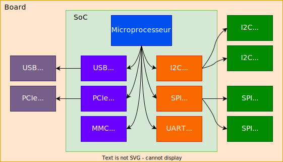

## Introduction

Sur les systèmes à microprocesseurs, certains bus permettent de découvrir dynamiquement
les périphériques qui y sont connectés, par exemple le PCIe ou l'USB, ce qui permet
d'éviter de connaître à l'avance leur présence et leurs caractéristiques.

<figure markdown>

</figure>

Cependant, beaucoup d'autres bus du microprocesseur, tels que I^2^C ou SPI, n'ont pas cette
capacité. Il est donc primordiale que le système, le noyau Linux, soit informé
de la description du matériel à l'avance.

Jusqu'au début des années 2010, le noyau Linux contenait dans son code une
description du matériel disponible sur le système.

Dès 2011, d'abord pour les microprocesseurs PowerPC, le noyau Linux ne contient plus de
description du matériel. Celle-ci lui est fournie par un fichier binaire, nommé le
_Device Tree Blob_ (DTB), lequel est passé comme argument au noyau Linux
lors de son lancement. Ce fichier contient toutes les informations sur le
matériel disponible sur le système. Une fois le noyau Linux lancé, on peut
obtenir cette description des périphériques sous `/proc/device-tree` ou
sous `/sys/firmware/devicetree/base`.

## Exemple de la syntaxe du DT

Le _Device Tree_ (DT) est un arbre de nœuds modélisant la hiérarchie des
périphériques d'un système allant des périphériques internes au
processeur aux périphériques de la carte.

Chaque nœud contient un certain nombre de propriétés décrivant le
périphérique, par exemple les adresses, les interruptions, les horloges, etc.

Lors du lancement, une version compilée, le _Device Tree Blob_ (DTB),
est passée au noyau Linux pour instancier toutes les descriptions des
périphériques sous `/proc/device-tree`

<figure markdown>

</figure>

```text
ths: thermal-sensor@1c25000 {
    compatible = "allwinner,sun50i-h5-ths";
    reg = <0x01c25000 0x400>;
    interrupts = <GIC_SPI 31 IRQ_TYPE_LEVEL_HIGH>;
    resets = <&ccu RST_BUS_THS>;
    clocks = <&ccu CLK_BUS_THS>, <&ccu CLK_THS>;
    clock-names = "bus", "mod";
    nvmem-cells = <&ths_calibration>;
    nvmem-cell-names = "calibration";
    #thermal-sensor-cells = <1>;
};
```

## Modification et/ou extension du DT

Pour les microprocesseur ARMv7 et ARMv8, les descriptions des différentes cartes
supportées par le noyau Linux sont stockées dans l'arborescence des sources
du noyau sous `arch/arm/boot/dts` et `arch/arm64/boot/dts`

Si le système nécessite des modifications ou des extensions par rapport au
DT _standard_ fourni par le noyau Linux, plusieurs solutions sont à disposition
du développeur :

- Un nouveau DT peut être ajouté dans l'arborescence du noyau Linux
- Un patch peut être appliqué au DT _standard_
- Un nouveau DT hors de l'arborescence du noyau peut être créé

Si l'on fait le choix d'un nouveau DT, alors il est possible de :

- Ecrire un DT complètement neuf
- Ecrire un nouveau DT en utilisant les descriptions mises à disposition
- Inclure le DT _standard_ et apporter les modifications/extensions nécessaires

## Génération du DTB

Selon le choix effectué pour la création du DT pour le système, différentes
variantes sont à disposition pour la génération du DTB

- Si le DT est placé dans l'arborescence du noyau, il suffit de choisir le nouveau DT
  lors de la configuration du noyau. Ce choix se laisse facilement configurer avec
  _Buildroot_.
- Si le DT est placé dans l'arborescence de Buildroot, par exemple sous `board/<name>`,
  il suffit de configurer _Buildroot_ afin qu'il génère le nouveau DTB.
- Si le DT est placé en dehors des 2 arborescences précédentes, il faudra alors
  développer son propre _Makefile_.

<figure markdown>

<caption>Arborescence du noyau</caption>
</figure>

Exemple :

<figure markdown>

<caption>Arborescence de Buildroot</caption>
</figure>

## String de compatibilité

Le lien entre le pilote traitant un périphérique dans le noyau Linux et la
description dans le _Device Tree_ est garanti par le _string_ de compatibilité,
mot clef `.compatible`

```c
static const struct of_device_id of_ths_match[] = {
    { .compatible = "allwinner,sun50i-a64-ths", .data = &sun50i_a64_ths },
    { .compatible = "allwinner,sun50i-h5-ths",  .data = &sun50i_h5_ths },
    { .compatible = "allwinner,sun50i-h6-ths",  .data = &sun50i_h6_ths },
    { /* sentinel */ },
};
MODULE_DEVICE_TABLE(of, of_ths_match);
```

L'attribut `.of_match_table` de la structure [`struct device_driver`](https://elixir.bootlin.com/linux/v5.15.148/source/include/linux/device/driver.h#L95)
contient la liste des _strings_ compatibles avec le pilote.

```c
static struct platform_driver ths_driver = {
    .probe = sun8i_ths_probe,
    .remove = sun8i_ths_remove,
    .driver = {
        .name = "sun8i-thermal",
        .of_match_table = of_ths_match,
    },
};
```

Cette compatibilité est contrôlée lors de l'instanciation du pilote.

## Références

- [Device Tree for Dummies](https://bootlin.com/pub/conferences/2013/elce/petazzoni-device-treedummies/petazzoni-device-tree-dummies.pdf)
- [Power.orgTM Standard for Embedded Power Architecture Platform Requirements (ePAPR)](http://www.power.org/resources/downloads/Power_ePAPR_APPROVED_v1.0.pdf)
- [DeviceTree.org website](http://www.devicetree.org)
- Device Tree documentation in the kernel sources, `Documentation/devicetree`
- [The Device Tree kernel mailing list](http://dir.gmane.org/gmane.linux.drivers.devicetree)
- [Device Tree Reference](https://elinux.org/Device_Tree_Reference)
- [Device Tree Usage](https://elinux.org/Device_Tree_Usage)

 