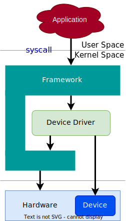
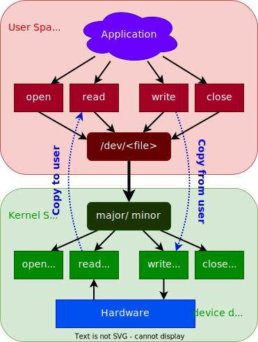

## Types de pilote

Sous Linux pour accéder aux ressources matérielles, il est impératif de
développer un pilote de périphérique (_device driver_)

Linux distingue deux types principaux de pilotes de périphériques

- Pilotes orientés caractère (**char device driver**), visible sous `/dev`
    - Accès séquentiel des données (octet par octet)
    - Accès à des périphériques simples (port série, ...)
- Pilotes orientés bloc (**block device driver**), visible sous `/dev`
    - Accès aléatoire des données (par bloc)
    - Accès aux disques

Cette liste peut être complétée par deux types supplémentaires

- Pilotes réseau (**network device driver**), visible avec `ifconfig`
    - Accès aux interfaces réseau (Ethernet, ...)
    - Accès aux piles de protocoles
- Pilotes orientés mémoire (**uio device driver**)
    - Accès aux périphériques très simples avec accès aux registres
      mémoires (**memory mapped devices**)
    - Accès depuis l'espace utilisateur (uio = user space I/O)

## Device Model

Le _Device Model_ proposé par le noyau Linux permet de maximaliser la
réutilisation du code entre les différentes architectures et plateformes
hardware

3 structures importantes :

- `struct device` : périphérique dans le système et généralement associé
  à un bus. Il est découvert de différentes manières (hot-plug, pilote
  de périphérique (driver), initialisation)
- `struct device_driver` : entité logicielle associée au périphérique et
  permettant d'effectuer des opérations sur ce dernier
- `struct bus_type` : canal de communication entre le microprocesseur et le
  périphérique d'entrée/sortie (quelques bus: I2C, SPI, USB, PCI,...)

<figure markdown>

</figure>

## Interface utilisateur

L'accès aux pilotes de périphériques se fait par l'intermédiaire de _fichiers
virtuels_.

**Espace utilisateur**

- Le fichier, situé dans le répertoire `/dev`, permet d'interagir avec
  le pilote chargé dans le noyau Linux à l'aide des opérations standard
  sur les fichiers

**Espace noyau**

- Pour connaître, le pilote en charge de traiter les requêtes de
  l'application en espace utilisateur, le noyau utilise un numéro de
  périphérique (_device number_) associé au nom du fichier. Celui-ci est
  composé d'un numéro **majeur** associé au pilote (le code) et d'un numéro
  **mineur** associé au périphérique (instance du pilote)
- Pour chaque opération en espace utilisateur, le pilote de périphérique
  implémente une méthode correspondante (handler) dans le noyau

<figure markdown>

</figure>

## Répertoire des pilotes de périphériques

Tous les pilotes orientés caractère ou bloc sont accessibles pour les utilisateurs
par l'intermédiaire de fichiers virtuels situés dans le répertoire `/dev`

``` text
$ ls -l /dev
brw------- 1 root root 179, 33 Jan 1 00:00 mmcblk0p1
brw------- 1 root root 179, 34 Jan 1 00:00 mmcblk0p2
crw------- 1 root root 10, 61 Jan 1 00:00 network_latency
crw------- 1 root root 10, 60 Jan 1 00:00 network_throughput
crw-rw-rw- 1 root root 1, 3 Jan 1 00:00 null
crw-rw-rw- 1 root root 5, 2 Jan 1 00:00 ptmx
```

- Les fanions `b` et `c` indiquent le type de pilote (`b` --> block, `c` --> character)
- `1`, `5`, `10` et `179` sont les _major numbers_
- Les numéros majeurs permettent d'identifier les différentes pilotes de
  périphériques à l'intérieur du noyau Linux (le code)
- `2`, `3`, `33`, `34`, `60` et `61` sont les _minor numbers_
- Les numéros mineurs représentent une instance d'un pilote correspondant
à un périphérique donné (les données)

## Interfaces de configuration et de gestion

Afin de pouvoir effectuer des opérations de configuration, de gestion et/ou de
maintenance sur un périphérique, les pilotes de périphériques nécessitent la
mise en œuvre d'une interface supplémentaire

**Linux propose 3 interfaces :**

- **ioctl** --> input/output control
    - interface du pilote mis à disposition au niveau du fichier d'accès
      accessible sous `/dev`
    - utilisée pour la configuration des pilotes de périphériques
- **procfs** --> process filesystem
    - fichiers d'état (configuration) accessible sous `/proc`
    - utilisée principalement pour la configuration et le monitoring du noyau Linux
- **sysfs** --> system filesystem
    - fichiers de configuration et de gestion accessible sous `/sys`
    - utilisée principalement pour la configuration et la gestion des modules
      noyaux et des pilotes de périphériques