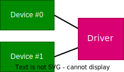

## Principe

_sysfs_ (_system filesystem_), accessible sous `/sys`, est un système de fichiers
virtuels créés pour rendre le débogage de pilotes de périphériques plus
simples. Aujourd'hui, _sysfs_ va bien au-delà et est utilisé pour représenter
l'architecture et l'état d'un système dans l'espace utilisateur.

_sysfs_ permet de représenter des objets du noyau Linux, leurs attributs et leurs
relations les uns envers les autres, comme suit

| Interne au noyau       | Espace utilisateur |
|------------------------|--------------------|
| Objets du noyau        | Répertoires        |
| Attributs des objets   | Fichiers           |
| Relations entre objets | Liens symboliques  |

Des outils très simple, tels que `ls`, `cat` ou `echo`, offrent un moyen pour
accéder aux informations stockées dans le _sysfs_ sous forme ascii, par exemple :

```shell
cat /sys/class/tty/ttyS0/dev
```

retourne le device number de la première interface série du NanoPi

_sysfs_ est construit sous forme d'arborescence :

``` text
/sys/
|-- block
|-- bus
|-- class
|-- dev
|-- devices
|-- firmware
|-- fs
|-- kernel
|-- module
|-- power
```

Ceci permet de voir le système sous différents points de vue, par exemple

- Depuis les périphériques existants dans le système `/sys/devices`
- Depuis la structure du bus système `/sys/bus`
- Depuis les pilotes disponibles `/sys/module`
- Depuis différentes "classes" de périphériques `/sys/class`

La documentation est disponible dans les sources du noyau sous
[Documentation/filesystems/sysfs.txt](https://www.kernel.org/doc/Documentation/filesystems/sysfs.txt)

L'interface [`<linux/device.h>`](https://elixir.bootlin.com/linux/v5.15.148/source/include/linux/device.h)
fournit des services facilitant la représentation
et la gestion des pilotes et de leurs périphériques dans le _sysfs_

<figure markdown>

</figure>

- La structure [`struct device_driver`](https://elixir.bootlin.com/linux/v5.15.148/source/include/linux/device/driver.h#L95)
  et les fonctions [`driver_register`](https://elixir.bootlin.com/linux/v5.15.148/source/include/linux/device/driver.h#L124) et
  [`driver_unregister`](https://elixir.bootlin.com/linux/v5.15.148/source/include/linux/device/driver.h#L125)
  permettent de créer et d'instancier un pilote de périphérique
  dans le _sysfs_. Le pilote et ses attributs seront ainsi visible sous `/sys/module`.
- La structure [`struct device`](https://elixir.bootlin.com/linux/v5.15.148/source/include/linux/device.h#L473)
  et les fonctions [`device_register`](https://elixir.bootlin.com/linux/v5.15.148/source/include/linux/device.h#L820) et
  [`device_unregister`](https://elixir.bootlin.com/linux/v5.15.148/source/include/linux/device.h#L821)
  permettent de créer et d'instancier un périphérique dans le
  _sysfs_. Le périphérique et ses attributs seront ainsi visible sous `/sys/devices`.

Cependant, avant de commencer le développement d'un pilote, il est important de
savoir dans quel bus le pilote doit être inséré (I^2^C, PCI, USB, ...) et, le cas échéant,
utiliser les structures et services spécifiques fournis par ces bus.

## Attributs du pilote (driver)

La structure [`struct driver_attribute`](https://elixir.bootlin.com/linux/v5.15.148/source/include/linux/device/driver.h#L134)
permet de spécifier des méthodes
d'accès (lecture et/ou écriture) pour la échange d'information avec le pilote
d'un périphérique.

```c
struct driver_attribute {
    struct attribute attr;
    ssize_t (*show) (struct device_driver *drv, char *buf);
    ssize_t (*store) (struct device_driver *drv, const char *buf, size_t count);
};
```

- Il est impératif de créer/instancier, pour chaque attribut du pilote, une telle
structure avec des méthodes d'accès propre.
- Les valeurs de l'attribut sont passées sous forme _ascii_ par l'intermédiaire de
l'argument `buf`.

Les macro [`DRIVER_ATTR_xx`](https://elixir.bootlin.com/linux/v5.15.148/source/include/linux/device.h#L125)
permettent d'instancier très simplement cette structure

```c
DRIVER_ATTR_RW(name);
DRIVER_ATTR_RO(name);
DRIVER_ATTR_WO(name);
```

## Installation des méthodes d'accès (driver)

Pour installer les méthodes d'accès d'un attribut du pilote dans _sysfs_, on
utilisera la fonction [`driver_create_file`](https://elixir.bootlin.com/linux/v5.15.148/source/include/linux/device/driver.h#L148)

```c
int driver_create_file (struct device_driver *drv,
                        struct driver_attribute *attr);
```

Pour éliminer une entrée dans _sysfs_, on utilisera la méthode [`driver_remove_file`](https://elixir.bootlin.com/linux/v5.15.148/source/include/linux/device/driver.h#L150)

```c
void driver_remove_file (struct device_driver *drv,
                         struct driver_attribute *attr);
```
## Attributs d'un périphérique (device)

La structure [`struct device_attribute`](https://elixir.bootlin.com/linux/v5.15.148/source/include/linux/device.h#L99)
permet de spécifier des méthodes
d'accès (lecture et/ou écriture) pour l'échange d'information avec le
périphérique.

```c
struct device_attribute {
    struct attribute attr;
    ssize_t (*show)  (struct device *dev, struct device_attribute *attr,
                      char *buf);
    ssize_t (*store) (struct device *dev, struct device_attribute *attr,
                      const char *buf, size_t count);
};
```

- Il est impératif de créer/instancier, pour chaque attribut d'un périphérique, une
telle structure avec des méthodes d'accès propre.

- Les valeurs de l'attribut sont passées sous forme _ascii_ par l'intermédiaire de
l'argument `buf`.

La macro [`DEVICE_ATTR`](https://elixir.bootlin.com/linux/v5.15.148/source/include/linux/device.h#L125)
permet d'instancier très simplement cette structure

```c
DEVICE_ATTR (name, mode, show, store);
```

## Installation des méthodes d'accès (device)

Pour installer les méthodes d'accès d'un attribut du périphérique dans _sysfs_,
on utilisera la fonction [`device_create_file`](hhttps://elixir.bootlin.com/linux/v5.15.148/source/include/linux/device.h#L153)

```c
int device_create_file (struct device *dev,
                        struct device_attribute *attr);
```

Pour éliminer une entrée dans _sysfs_, on utilisera la méthode [`device_remove_file`](https://elixir.bootlin.com/linux/v5.15.148/source/include/linux/device.h#L155)

```c
void device_remove_file (struct device *dev,
                         struct device_attribute *attr);
```

## Création d'un device sous le répertoire class

Les attributs d'un pilote (driver) ou d'un périphérique (device) peuvent être
accessible sous différents répertoires de l'arborscence _sysfs_. La bibliothèque
[`platform_device`](https://elixir.bootlin.com/linux/v5.15.148/source/include/linux/platform_device.h) permet de créer assez facilement une interface pour y
accéder.

Les méthodes ci-dessous définissent une [`class`](https://elixir.bootlin.com/linux/v5.15.148/source/include/linux/device/class.h#L54)
à laquelle on pourra ensuite
attacher les fichiers d'accès aux attributs d'un device.

- Création d'une nouvelle `class` avec la macro [`class_create`](https://elixir.bootlin.com/linux/v5.15.148/source/include/linux/device/class.h#L273)
  ```c
  struct class* class_create (struct module *owner, // THIS_MODULE
                              const char *name);
  ```
- Destruction de la `class` avec la méthode [`class_destroy`](https://elixir.bootlin.com/linux/v5.15.148/source/include/linux/device/class.h#L255)
  ```c
  void class_destroy (struct class * cls);
  ```
- Création d'un `device` avec la méthode [`device_create`](https://elixir.bootlin.com/linux/v5.15.148/source/include/linux/device.h#L898)
  ```c
  struct device* device_create (struct class *class,
                                struct device *parent,
                                dev_t devt,
                                const char *fmt, ...);
  ```
- Destruction du `device` avec la méthode [`device_destroy`](https://elixir.bootlin.com/linux/v5.15.148/source/include/linux/device.h#L904)
  ```c
  void device_destroy (struct class *class, dev_t devt);
  ```
