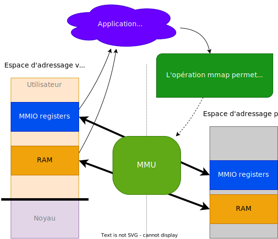

## Concept des pilotes orientés mémoire (uio-driver)

Le développement de pilotes sous Linux est relativement complexe et
nécessite de bonnes connaissances du noyau

Il souffre également de beaucoup de restrictions

Les pilotes orientés mémoire permettent de mapper dans l'espace virtuel
du processus d'application les registres et zones mémoire nécessaires au
pilotage du périphérique

- Ce mapping est réalisé par l'appel de l'opération `mmap`
- Le fichier `/dev/mem` offre ce service par défaut
- Il est possible d'implémenter ce service avec un son propre pilote

<figure markdown>

</figure>

## Avantages et inconvénients

Les pilotes orientés mémoire (uio-driver) offrent une alternative intéressante lors
de migration d'applications et de leurs pilotes d'un OS propriétaire vers Linux ou
lorsque l'interface avec les périphériques à gérer est simple

**Avantages:**

- Pas (ou peu) d'adaptations en cas de mise à jour du noyau Linux
- Choix du langage de programmation
- Accès à toutes les librairies (par exemple calcul en virgule flottante autorisé)
- Accès aux registres plus efficace (pas d'appel système)
- Pas de problèmes de licences liés à Linux (GPL)

**Désavantages:**

- Pas de support pour le traitement des interruptions
- Fonctionnalité des pilotes est limitée au développement d'application en mode user
- Séparation en _kernel space_ et _user space_ est abandonnée
- Système peut devenir plus complexe (mauvaise abstraction / API)

## Implémentation du pilote dans l'espace utilisateur

L'implémentation d'un pilote de périphériques orientés mémoire s'implémente à
l'aide de 5 opérations (`#include <sys/mman.h>`)

- Ouverture du fichier correspondant au pilote (`int fd = open (...)`)
- Appel de l'opération mmap afin de placer dans la mémoire virtuelle du processus les
  registres du périphérique
  ``` c
  void* mmap (
     void* addr,    // généralement NULL, adresse de départ en mémoire virtuelle
     size_t length, // taille de la zone à placer en mémoire virtuelle
     int prot,      // droits d'accès à la mémoire: read, write, execute
     int flags,     // visibilité de la page pour d'autres processus: shared, private
     int fd,        // descripteur du fichier correspondant au pilote
     off_t offset); // offset des registres en mémoire
  ```
- Opérations sur le périphérique à l'aide de l'adresse virtuelle retournée par
  l'opération `mmap`
- Après utilisation, appel de l'opération munmap pour libérer l'espace mémoire
  (`munmap (...)`)
- Fermeture du fichier (`close (...)`)