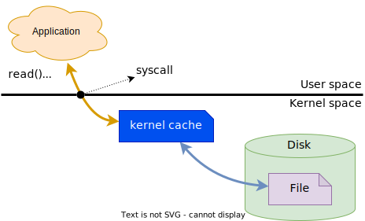
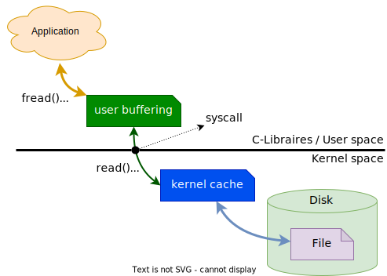

## File I/O : Fichiers ordinaires

Propriétés :

- _File I/O_ propose une interface au niveau du noyau Linux pour la gestion de
  fichiers ordinaires et spéciaux.
- Pour les fichiers ordinaires, le noyau implémente un cache des données par
  blocs de 4KiB usuellement.
- Le nombre de fichiers qu'un processus peut manipuler est limité à 1024 par
  défaut. Celui-ci peut cependant être augmenté à l'aide de la commande
 `ulimit -n`


<figure markdown>

</figure>

## Opérations

Linux propose une large palette de services pour traiter avec les fichiers
ordinaires

| Opération                                     | syscall        |
|-----------------------------------------------|----------------|
| Ouverture d'un fichier                        | `open`         |
| Création d'un fichier                         | `creat`        |
| Lecture du contenu d'un fichier               | `read`         |
| Écriture de données dans un fichier           | `write`        |
| Positionnement dans le fichier                | `lseek`        |
| Troncation d'un fichier                       | `ftruncate`    |
| Mise en mémoire d'un fichier                  | `mmap`         |
| Lecture/écriture et positionnement combinés   | `pread/pwrite` |
| Lecture des métadonnées (status) d'un fichier | `fstat`        |
| Synchronisation des données avec le disque    | `fsync`        |
| Fermeture d'un fichier                        | `close`        |

## Ouverture d'un fichier

L'ouverture d'un fichier est obtenue à l'aide de l'appel système `open()`

```c
#include <sys/types.h>
#include <sys/stat.h>
#include <fcntl.h>
int open (const char* pathname, int flags);
```

Exemple

```c
int fd = open ("/home/myusername/myfile", O_RDONLY);
if (fd == -1)
    /* error*/
```

**Comportement**

La fonction `open()` associe le fichier spécifié par l'argument `pathname` au
descripteur `fd`, lequel est retourné en cas de succès.

**Arguments**

- L'argument `pathname` spécifie le chemin et le nom du fichier à ouvrir. Le chemin
  peut être absolu ou relatif.
- L'argument `flags` spécifie le mode d'accès au fichier, soit:
    - `O_RDONLY`: en mode lecture
    - `O_WRONLY`: en mode écriture
    - `O_RDWR`: en mode lecture et écriture
- En mode écriture, l'utilisateur peut spécifier si les nouvelles données doivent être
  ajoutées au contenu existant ou si celles-ci doivent le remplacer
    - `O_APPEND`: ajouter les données au contenu existant
    - `O_TRUNC`: remplacer les données du fichier
- Par exemple
    `int fd = open ("/home/myusername/myfile", O_WRONLY | O_APPEND);`

## Création d'un fichier ordinaire 

La création d'un fichier ordinaire est obtenue à l'aide de l'appel système
`creat()` ou la fonction `open()`

```c
#include <sys/types.h>
#include <sys/stat.h>
#include <fcntl.h>
int creat (const char* pathname, mode_t mode);
int open (const char* pathname, int flags, mode_t mode);
```

Exemple

```c
int fd = creat ("/home/myusername/myfile", 0664);
```
ou
```c
int fd = open ("/home/myusername/myfile", O_WRONLY | O_CREAT | O_TRUNC, 0664);
if (fd == -1)
    /* error*/
```

**Comportement**

- Ces deux appels sont équivalents. Ils permettent de créer un nouveau fichier. Si
  le fichier est déjà existant, le contenu de celui-ci sera simplement effacé.
- Il faut noter que si le fichier existe déjà, le mode du nouveau fichier ne sera pas
  adapté au mode spécifié lors de l'appel de la fonction.

**Arguments**

- L'argument `pathname` spécifie le chemin et le nom du fichier à créer. Le chemin
  peut être absolu ou relatif.
- L'argument `flags` spécifie le mode d'accès au fichier, en principe:
    - `O_WRONLY | O_CREAT | O_TRUNC`
- L'argument `mode` spécifie les droits d'accès au fichier. Ce mode peut être passé
  sous forme octale ou sous forme symbolique en utilisant les constantes
  suivantes:


| Permission | Owner   | Group   | Other   |
|------------|---------|---------|---------|
| all        | S_IRWXU | S_IRWXG | S_IRWXO |
| read       | S_IRUSR | S_IRGRP | S_IROTH |
| write      | S_IWUSR | S_IWGRP | S_IWOTH |
| execute    | S_IXUSR | S_IXGRP | S_IXOTH |

Il est important de noter que les droits du fichier est déterminé avec un **et**
logique entre le mode spécifié lors de la création du fichier et le complément à un (inverse)
du masque de création de fichiers attribué à l'utilisateur (valeur _umask_). Ce
dernier peut être obtenu avec la commande `umask`

## Lecture d'un fichier

La lecture d'un fichier est obtenue à l'aide de l'appel système `read()`

```c
#include <unistd.h>
ssize_t read (int fd, void *buf, size_t len);
```

Exemple

```c
char buf[100];
size_t len = sizeof(buf);
ssize_t nr = read (fd, buf, len);
if (nr == -1)
    /* error*/
```

**Comportement**

- La fonction `read()` permet de lire au maximum `len` octets du fichier et de les
stocker dans `buf`. En cas d'erreur, la fonction retourne `-1`. La position du fichier
est avancée du nombre d'octets lus, permettant ainsi de lire les octets restants.

**Valeur de retour**

- Si la valeur de retour est égale à `len` tout est en ordre
- Si la valeur de retour est égale à `0`, cela indique la fin du fichier (_EOF_) et qu'il ne
  reste plus rien à lire
- Si la valeur de retour est inférieure à `len`, mais supérieure à `0`, le nombre
  d'octets lus est stocké dans `buf`. Plusieurs causes peuvent être à l'origine de
  cette situation. Pour en connaître la raison, il suffit d'exécuter une lecture
  supplémentaire.
- Si la valeur de retour est égale à `-1`, cela indique qu'une erreur est survenue.
  Dans ce cas, si `errno` est mis à `EINTR`, cela indique qu'un signal a été levé et
  qu'il faut réeffectuer une lecture, sinon une erreur sévère est survenue et il faut,
  par conséquent, stopper la lecture du fichier.

**Lecture complète d'un fichier**

```c
char buf[100];
while (1) {
    ssize_t nr = read(fd, buf, sizeof(buf));
    if (nr == 0) break;  // --> all data have been read
    if (nr == -1) {
        if (errno == EINTR) continue;  // --> continue reading
        char estr[100] = {
            [0] = 0,
        };
        strerror_r(errno, estr, sizeof(estr) - 1);
        fprintf(stderr, "ERROR: %s\n", estr);
        break;  // --> error: stop reading
    }
    /* process read data */
}
```

## Écriture d'un fichier

L'écriture de données dans un fichier s'effectue à l'aide de l'appel système
`write()`

```c
#include <unistd.h>
ssize_t write (int fd, const void* buf, size_t len);
```

Exemple

```c
const char* buf = "data to be written";
size_t len = strlen(buf)
ssize_t count = write (fd, buf, len);
if (count == -1)
    /* error, check errno */
else if (count != len)
    /* severe error, but errno not set */
```

**Comportement**

- La fonction `write()` permet de stocker dans le fichier les `len` octets contenus
  dans `buf`. En cas d'erreur, la fonction retourne `-1`. La position du fichier est
  avancée du nombre d'octets écrits, permettant ainsi d'ajouter les octets
  supplémentaires.
- Si la valeur retournée `count` est différente de `len`, cela signifie qu'une erreur
  sévère est survenue.

## Synchronisation des données avec le disque

La synchronisation des données d'un fichier ordinaire contenues dans la
mémoire cache s'effectue de façon asynchrone. Linux propose plusieurs
services pour forcer cette synchronisation. Cette dernière peut s'effectuer
avec l'appel système `fsync()`.

```c
#include <unistd.h>
int fsync (int fd);
```

**Exemple**

```c
int ret = fsync(fd);
if (ret == -1)
    /* error, check errno */
```

**Comportement**

- La fonction `fsync()` demande au noyau de copier toutes les données restantes
(contenue du fichier et métadonnées associées au fichier) sur le disque.

## Positionnement dans un fichier

Usuellement, l'accès à un fichier s'effectue de manière linéaire. Cependant,
certaines applications requièrent de pouvoir se déplacer librement dans le
fichier pour accéder aux données souhaitées. Ce positionnement s'effectue
avec l'appel système `lseek()`

```c
#include <unistd.h>
off_t lseek (int fd, off_t offset, int whence);
```

**Exemple**

```c
off_t ret = lseek (fd, 1150, SEEK_SET);
if (ret == -1)
    /* error, check errno */
```

**Comportement**

- La fonction `lseek()` déplace de `offset` octets la position du pointeur d'accès
  aux données dans le fichier. Ce déplacement s'effectue en relation avec l'origine
  `whence` (début, position courante ou fin). La nouvelle position est retournée. En
  case d'erreur, on obtient `-1`.

**Arguments**

- L'argument `offset` spécifie le décalage du pointeur par rapport à une origine.
  Ce décalage peut être positif ou négatif.
- L'argument `whence` spécifie l'origine du pointeur pour le calcul de la nouvelle
  position. Celui-ci peut prendre les valeurs suivantes:
    - `SEEK_SET`: le pointeur d'origine est placé au début du fichier
    - `SEEK_CUR`: le pointeur d'origine est placé à la position courante/actuelle
    - `SEEK_END`: le pointeur d'origine est placé à la fin du fichier

**Exemples**

- pour obtenir la position courante
  ```c
  off_t pos = lseek(fd, 0, SEEK_CUR);
  ```
- pour placer le pointeur au début du fichier
  ```c
  off_t pos = lseek(fd, 0, SEEK_SET);
  ```
- pour placer le pointeur à la fin du fichier
  ```c
  off_t pos = lseek(fd, 0, SEEK_END);
  ```

## Troncation d'un fichier

La troncation d'un fichier est obtenue à l'aide de l'appel système
`ftruncate()`

```c
#include <sys/types.h>
#include <unistd.h>
int ftruncate (int fd, off_t length);
```

**Exemple**

```c
int ret = ftruncate (fd, 1150);
if (ret == -1)
    /* error, check errno */
```

**Comportement**

- La fonction `ftruncate()` tronque le fichier à `length` octets.
- Si le fichier était plus long, les données supplémentaires sont perdues.
- Si le fichier était plus court, il est étendu, et la portion supplémentaire est remplie
  d'octets nuls.

## Lecture/écriture et positionnement combinés

Linux offre des services de lecture et d'écriture avec positionnement, en
combinant les fonctions `read` et `write` avec `lseek`. Ces opérations
s'effectuent avec les appels système `pread` et `pwrite`

```c
#define _XOPEN_SOURCE 500
#include <unistd.h>
ssize_t pwrite (int fd, const void* buf, size_t count, off_t pos);
ssize_t pread (int fd, void* buf, size_t count, off_t pos);
```

**Exemple**

```c
ssize_t count = pwrite (fd, buf, len, 0);
if (count == -1)
    /* error, check errno */

ssize_t nr = pread (fd, buf, len, 0);
if (nr == -1)
    /* error, check errno */
```
**Comportement**

- La première fonction `pwrite()` permet de stocker dans au début du fichier (à la
  position `0`) les `len` octets contenus dans `buf`.
- La deuxième fonction `pread()` permet de lire `len` premiers octets du fichier (de la
  position `0`) et de les stocker dans `buf`. 

## Lecture des métadonnées (statut) d'un fichier 

Linux offre divers services pour obtenir les métadonnées d'un fichier. Ces
opérations peuvent s'effectuer avec les appels système `stat`, `fstat` et `lstat`

```c
#include <unistd.h>
int stat (const char* path, struct stat* buf);
int fstat (int fd, struct stat* buf);
int lstat (const char* path, struct stat* buf);
```

**Exemple**

```c
struct stat status;
int ret = fstat (fd, &status);
if (ret == -1)
    /* error, check errno */
```

**Comportement**

- L'appel de la fonction `fstat` retourne les informations liées au fichier dans la
  structure `stat`. En cas d'erreur, la fonction retourne `-1`.
- La fonction `stat` retourne les mêmes informations que la fonction `fstat`, mais
  utilise le nom du fichier et non pas le descripteur.
- Si le fichier est un lien symbolique, la fonction `lstat` retourne les métadonnées
  du fichier symbolique et non pas celles du fichier cible

**Arguments**

La structure `struct stat` fournit les informations suivantes:

```c
struct stat {
    dev_t     st_dev;      // ID of device containing file
    ino_t     st_ino;      // inode number
    mode_t    st_mode;     // protection
    nlink_t   st_nlink;    // number of hard links
    uid_t     st_uid;      // user ID of owner
    gid_t     st_gid;      // group ID of owner
    dev_t     st_rdev;     // device ID (if special file)
    off_t     st_size;     // total size, in bytes
    blksize_t st_blksize;  // blocksize for file system I/O
    blkcnt_t  st_blocks;   // number of 512B blocks allocated
    time_t    st_atime;    // time of last access
    time_t    st_mtime;    // time of last modification
    time_t    st_ctime;    // time of last status change
};
```

**Commande Linux**

Il est possible d'obtenir ces informations en utilisant la commande

```bash
stat <filename>
```

## Fermeture d'un fichier ordinaire 

La fermeture d'un fichier ordinaire s'effectue à l'aide de l'appel système
`close()`

```c
int close (int fd);
```

**Exemple**

```c
int ret = close (fd);
if (ret == -1)
    /* error, check errno */
```

**Comportement**

- La fonction `close()` permet de fermer le fichier et de libérer les ressources liées
  à son ouverture et de le dissocier du processus.
- Il est important de noter que la fermeture du fichier ne garantit pas que toutes les
  données contenues dans la mémoire cache du noyau seront copiées sur le
  disque. Ce processus est totalement asynchrone sous Linux.

## Standard I/O : Fichiers ordinaires

Hormis l'accès direct aux fonctions du noyau Linux, C/C++ proposent d'autres
services pour le traitement des fichiers. Ces services sont fournis par les
bibliothèques standard (C: `stdio.h` / C++: `cstdio` ou `iostream`).

Ces bibliothèques implémentent des _caches_ supplémentaires au niveau des
processus dans l'espace utilisateurs (_user space_), évitant ainsi de nombreux
appels système (moins de changements de contexte entre espaces utilisateur
(processus) et le noyau Linux).

<figure markdown>

</figure>

## Standard I/O : Fonctions principales

La bibliothèque standard C `<stdio.h>` propose toute une série de méthodes
pour l'accès aux fichiers au format _ASCII_ ou binaire.

```c
/* functions to open, close, rename and remove files */
FILE* fopen (const char* path, const char* mode);
int fclose (FILE* stream);
int rename (const char* oldpath, const char* newpath);
int remove (const char* path);

/* functions to read/write binary files */
size_t fread (void* buf, size_t size, size_t nr, FILE* stream);
size_t fwrite (void* buf, size_t size, size_t nr, FILE* stream);

/* functions to read/write text files */
int fgetc (FILE* stream);
int ungetc(int c, FILE* stream);
char* fgets (char* str, int size, FILE* stream);
int fputc (int c, FILE* stream);
int fputs (const char* str, FILE* stream);

/* auxiliary functions */
int fseek (FILE* stream, long offset, int whence);
int fflush (FILE* stream);
int ferror (FILE* stream);
int feof (FILE* stream);
```

## Utilisation

L'utilisation des bibliothèques _Standard I/O_ est recommandée lors de
manipulation de fichiers avec de petites quantités de données à la fois (_ASCII_
ou binaire) ou accès aux données orienté caractère ou ligne.

Elles offrent:

- Diminution des appels système
- Amélioration des performances (accès aux entrées/sorties par blocs)