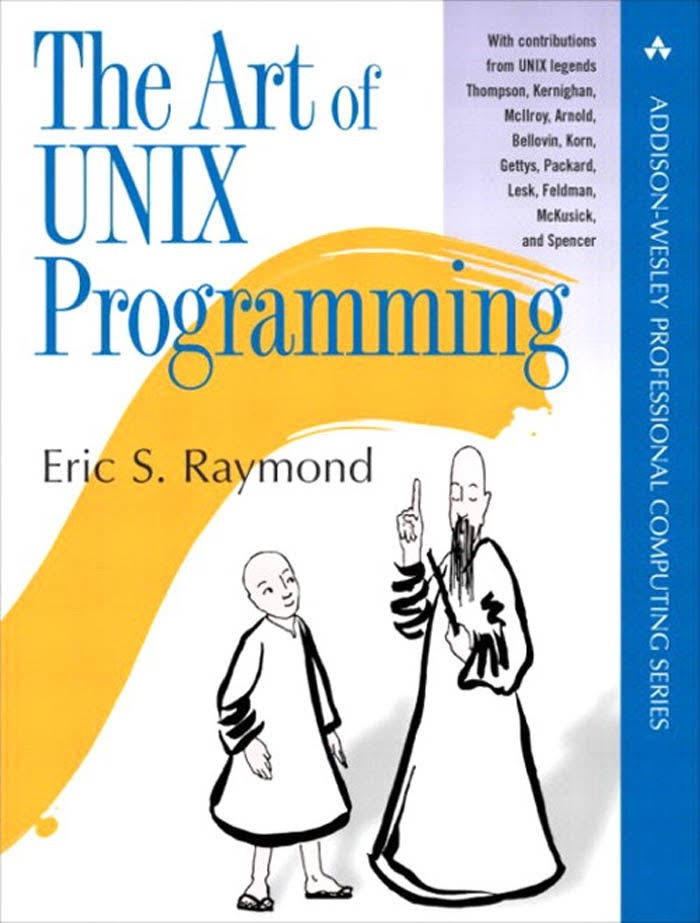
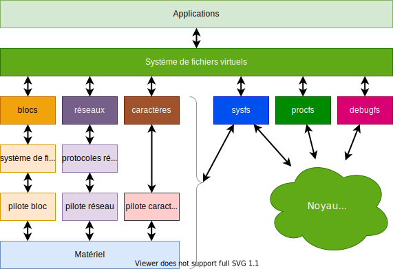

## Programmation système - Introduction 

Qu'est-ce que la programmation système?

- La programmation système se fait en espace utilisateur, mais à un niveau très
  bas, très proche des interfaces proposées par le noyau
- Elle offre des fonctionnalités à des applications plus évoluées afin de leur
  permettre d'effectuer leurs tâches
- Les programmes système offrent des services que le système lui-même n'offre
  pas ou pas encore

Quelles compétences faut-il avoir pour concevoir des programmes système?

- Pour développer des programmes système, il faut maîtriser les interfaces offertes
  par le noyau (system programming API), les librairies (y compris la librairie
  standard) et les outils de développement (compilateur, debugger, ...)

Qu'offre la connaissance de la programmation système?

- La connaissance de la programmation système offre une meilleure vue
  d'ensemble du système Linux, même si on ne l'utilise pas chaque jour

## La philosophie Unix

{width=30%}

La philosophie Unix/Linux est fondée sur 4 paradigmes

- KISS (Keep It Simple and Stupid)
- Faire une chose et le faire bien
- Tout est fichier
- Les données sont du texte

## KISS: Faire une chose et le faire bien

Les grands programmes monolithiques sont difficiles à comprendre et souvent
très complexes à maintenir. Ils souffrent souvent d'effets de bord les rendant
moins robustes et moins fiables.

Il est plus judicieux de concevoir des applications basées sur de petits
programmes simples, nettement plus facile a maintenir et plus évolutifs.

Le système d'exploitation Linux offre divers outils et services pour autoriser
de tels designs.

Exemples:

File redirection:

```bash
cat readfile > savefile
ls -l > savefile
grep "text" < filelist.txt
```

Pipes:

```bash
cat long_file.txt | wc
find -name "*" | xargs grep hallo
```

## Tout est fichier - Les données sont du texte

Under Linux everything is a file!

- Sous Linux, un fichier est beaucoup plus que de simples données stockées sur un
  disque (disque dur magnétique, flash disk, disque réseau, ...)
- Sur les systèmes embarqués, hormis l'accès aux données stockées dans des fichiers
  ordinaires, il est important de pouvoir accéder de manière simple et efficace aux
  autres ressources du système (périphériques, noyau, réseau, ...)

Linux implémente un système de fichiers virtuels permettant de représenter

- Des fichiers ordinaires (stockage de données sur disque)
- Des périphériques d'entrées/sorties (devfs: `/dev`)
- Des données (status/configuration) du noyau Linux (_procfs_: `/proc`)
- Des données (status/configuration) des pilotes (_sysfs_: `/sys`)
- Des données de débogage du noyau (_debugfs_: _/sys/kernel/debug_)
- Des périphériques réseau (_network interfaces_)

Les données sont du texte

- La plupart des données stockées dans les fichiers spéciaux (_procfs_, _sysfs_, _debugfs_,...)
  sont du texte
- Ce format permet d'être manipulé très aisément à l'aide d'outils tels que echo et cat
- Les fichiers de configuration sont également stockés sous forme de fichier texte

## Système de fichiers virtuels (Rappel)

<figure markdown>

</figure>

## Accès aux fichiers

Seuls quatre services/opérations sont nécessaires pour accéder en lecture et
en écriture à des fichiers

```c
int fd = open (...);
```

```c
read (fd, ...);
```

```c
write (fd, ...);
```

```c
close (fd);
```

Il existe naturellement bien d'autres opérations...

## Interfaces avec le système de fichiers virtuels

Linux propose diverses interfaces pour accéder au système de fichiers virtuels

-  File I/O
-  Standard I/O (ou Buffered I/O)
-  File and Directory Management
-  Surveillance de changements dans le système de fichiers
-  Multiplexage des entrées/sorties

Comportement des services

- Bien que les services proposés par ces interfaces sont disponibles pour tous
  les types de fichiers, ils peuvent se comporter légèrement différemment sur
  des fichiers ordinaires que sur des fichiers spéciaux.
