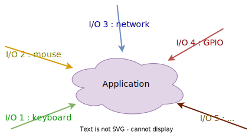
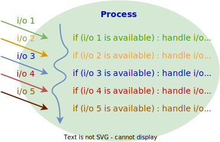
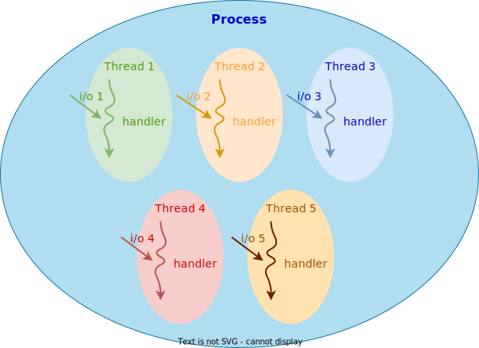
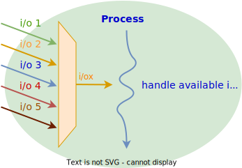

## Introduction

Il est usuel que des applications doivent attendre sur des périphériques
d'entrées/sorties, tels que clavier, souris, interface de communication, etc.

Ces périphériques sont représentés dans l'application par un descripteur de
fichier, lequel offre généralement un accès au périphérique par un des appels
système `read` ou `write`

<figure markdown>

</figure>

Mécanismes à disposition :

- Utilisation des services non bloquants
- Implémentation d'un _thread_ par entrée/sortie
- Utilisation de services offrant un multiplexage des entrées/sorties

## Mécanismes - Services non bloquants

Un chemin possible pour solutionner cette problématique est l'utilisation de
services non bloquants pour scruter chaque entrée/sortie séquentiellement.

Ces services permettent de tester le périphérique si son accès est possible ou
pas. Si l'accès est disponible, alors l'entrée/sortie est traitée.

<figure markdown>

</figure>

**Carences**

- Usage excessif du processeur pour la scrutation
- Complexité du logiciel 

## Mécanismes - Multi-threading

Une deuxième voie possible consiste à utiliser les services bloquants et à
créer un _thread_ par entrée/sortie

Cette technique permet d'éviter que l'indisponibilité d'une entrée/sortie
bloque le traitement des autres

<figure markdown>

</figure>

**Carences** :

- Nombre de _threads_ nécessaires pour réaliser l'application
- Complexité du logiciel pour synchroniser les différentes données
- Complexité lors du _debugging_ du logiciel

## Mécanismes - Multiplexage des entrées/sorties

Les systèmes Unix, et plus particulièrement Linux, proposent des services
autorisant le multiplexage des entrées/sorties. Ces services permettent de
sélectionner un catalogue d'entrées/sorties à traiter et de le passer au noyau.
Ce dernier informe le processus sur ceux disponibles pour traitement.

<figure markdown>

</figure>

Linux propose 3 services :

- `select()` (compatible avec les systèmes UNIX)
- `poll()` (pas traité ici)
- `epoll()` (Linux spécifique)

## select - Service

Linux propose avec l'appel système `select()` une interface simple pour le
multiplexage d'entrées/sorties.

```c
#include <sys/select.h>
#include <sys/time.h>
int select (int n,
            fd_set *readfds,
            fd_set *writefds,
            fd_set *exceptfds,
            struct timeval *timeout);
FD_CLR(int fd, fd_set *set);
FD_SET(int fd, fd_set *set);
FD_ISSET(int fd, fd_set *set);
FD_ZERO(fd_set *set)
```
**Comportement**

- La fonction `select()` permet d'attendre jusqu'à ce qu'un des descripteurs de
  fichiers soit prêt pour effectuer l'opération de lecture ou d'écriture souhaitée. En
  cas de succès, la fonction retourne le nombre de descripteurs de fichiers
  disponibles.
- Linux man page: https://man.cx/select(2)

**Arguments**

- L'argument `n` spécifie le numéro du plus grand descripteur de fichiers plus un.
- Les arguments `readfds`, `writefds` et `exceptfds` contiennent la liste des
  descripteurs de fichiers en lecture, écriture respectivement exception sur
  lesquels la méthode `select()` doit attendre.
  En retour, ces arguments indiquent les descripteurs disponibles pour le service
  demandé.
- L'argument `timeout` permet d'attendre sur un événement avec un temps limite.
  Si `timeout` est non `NULL`, la `struct timeval` permet de spécifier le temps en
  microsecondes, par exemple pour attendre 10 seconds au maximum:
  ```c
  struct timeval timeout;
  timeout.tv_sec = 10;
  timeout.tv_usec = 0;
  ```

**Macros**

- `FD_ZERO` initialise la liste des descripteurs de fichiers
- `FD_CLR` enlève un descripteur de fichiers de la liste
- `FD_SET` ajoute un descripteur de fichiers dans la liste
- `FD_ISSET` teste si un descripteur de fichiers est contenu dans liste

## select - Exemple 

```c
fd_set fd_in, fd_out;
FD_ZERO(&fd_in);
FD_ZERO(&fd_out);

// monitor fd1 for input events and fd2 for output events
FD_SET(fd1, &fd_in);
FD_SET(fd2, &fd_out);

// find out which fd has the largest numeric value
int largest_fd = (fd1 > fd2) ? fd1 : fd2;

// wait up to 5 seconds
struct timeval tv = {
    .tv_sec  = 5,
    .tv_usec = 0,
};

// wait for events
int ret = select(largest_fd + 1, &fd_in, &fd_out, NULL, &tv);

// check if select actually succeed
if (ret == ‐1) {
    // report error and abort
} else if (ret == 0) {
    // timeout; no event detected
} else {
    if (FD_ISSET(fd1, &fd_in)) {
        // input event on sock1
    }
    if (FD_ISSET(fd2, &fd_out)) {
        // output event on sock2
    }
}
```

## Service epoll

Le service `epoll` a été introduit sur Linux pour pallier les carences du
service `select()` et pour offrir une interface performante lorsqu'un grand
nombre de descripteurs de fichiers doit être traité.

| operation                      | syscall         |
|--------------------------------|-----------------|
| Création d'un contexte `epoll` | `epoll_create1` |
| Contrôle du contexte `epoll`   | `epoll_ctl`     |
| Attente sur des événements     | `epoll_wait`    |

## Création d'un contexte epoll

La création d'un contexte `epoll` est obtenue à l'aide de l'appel système
`epoll_creat1()`

```c
#include <sys/epoll.h>
int epoll_create1(int flags);
```

**Exemple**

```c
int epfd = epoll_create1(0);
if (epfd == -1)
    /* error*/
```

**Comportement**

- La fonction `epoll_create1()` permet de créer un nouveau contexte `epool`
  pour le multiplexage des entrées/sorties. Les erreurs pouvant survenir lors de la
  création d'un contexte epoll sont `EINVAL`, `EMFILE`, `ENFILE` ou `ENOMEM`. 

## Contrôle d'un contexte epoll

Le contrôle d'un contexte `epoll` est obtenu à l'aide de l'appel système
`epoll_ctl()`

```c
#include <sys/epoll.h>
int epoll_ctl(int epfd, int op, int fd, struct epoll_event *event);
```

**Exemple**

```c
struct epoll_event event = {
    .events = EPOLLIN | EPOLLOUT,
    .data.fd = fd,
};
int ret = epoll_ctl(epfd, EPOLL_CTL_ADD, fd, &event);
if (ret == -1)
    /* error*/
```

**Comportement**

- La fonction `epoll_ctl()` permet d'ajouter ou de retirer un descripteur de
  fichiers au contexte `epool`. Il est également possible de modifier les
  événements que l'on souhaite surveiller pour un descripteur de fichiers donné.

**Arguments**

- L'argument `epfd` spécifie le contexte `epoll` à contrôler
- L'argument `op` indique l'opération que l'on souhaite exécuter avec le contexte
  `epoll` pour le descripteur de fichiers `fd`.
    - `EPOLL_CTL_ADD` ajouter un nouveau descripteur de fichiers
    - `EPOLL_CTL_DEL` retirer un descripteur de fichiers
    - `EPOLL_CTL_MOD` modifier les événements à surveiller
- L'argument eve`nt, à l'aide de la struct epoll_event, permet de spécifier
  les événements (attribut `events`) que l'on souhaite surveiller pour le descripteur
  de fichiers `fd`. Cette même structure permet également d'attacher un paramètre
  supplémentaire (attribut `data`) pour identifier le descripteur de fichiers ayant
  levé un événement.
  ```c
  struct epoll_event {
      __u32 events;
      union {
          void *ptr;
          int fd;
          __u32 u32;
          __u64 u64;
      } data;
  };
  ```
- Les événements principaux que l'on peut surveiller sont
    - `EPOLLERR` une condition d'erreur a été levée
    - `EPOLLIN` un fichier virtuel est disponible lecture
    - `EPOLLOUT` un ifchier virtuel est disponible en écriture
    - `EPOLLPRI` des données prioritaires « out-of-band » sont diponibles


## epoll - Attente sur la levée d'événements

L'attente sur des événements pour un contexte `epoll` est réalisée à l'aide de
l'appel système `epoll_wait()`

```c
#include <sys/epoll.h>
int epoll_wait(int epfd, struct epoll_event *events,
               int maxevents, int timeout);
```

**Exemple**

```c
struct epoll_event events[2];
int nr = epoll_wait(epfd, events, 2, -1);
if (nr == -1)
    /* error*/
for (int i=0; i<nr; i++) {
    printf ("event=%ld on fd=%d\n", events[i].events, events[i].data.fd);
    // operation on events[i].data.fd can be performed without blocking...
}
```

**Comportement**

- La fonction `epoll_wait()` permet d'attendre jusqu'à ce que un ou plusieurs
  événements soient levés pour les descripteurs de fichiers attachés au contexte
  `epoll`. 

**Arguments**

- L'argument `epfd` spécifie le contexte `epoll` à surveiller
- L'argument `events` spécifie l'adresse d'un tableau pour stocker la liste
  d'événements ayant été levés et pouvant être traités. Si le nombre d'événements
  levés dépasse la taille du tableau, des appels successifs au service `epoll_wait`
  fournissent les événements restants.
- L'argument `maxevents` indique la taille maximale du tableau
- L'argument `timeout` spécifie l'intervalle de temps maximal en millisecondes à
  attendre sur un événement. Si la valeur de `timeout` est `-1`, la fonction ne
  retournera que si un événement a été levé.
