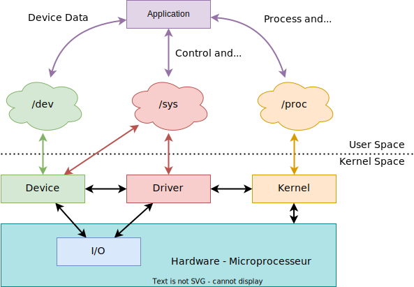

## Introduction aux fichiers spéciaux

Les fichiers jouent un grand rôle sous Linux (_Everything is a file!_)

Les fichiers spéciaux offrent l'accès aux :

- Données des périphériques d'entrées/sorties
    - Accès séquentiel aux données des périphériques (binaire ou ascii)
    - Fichiers d'accès placés sous `/dev` (_devfs_)
    - Configuration du pilote et du périphérique
- Informations des périphériques, de leur pilote et des modules noyau
    - Accès séquentiel aux données (ascii)
    - Fichiers d'accès placés sous l'arborescence `/sys` (`sysfs`)
    - Configuration et monitoring des pilotes de périphériques et des modules noyau
- Informations des processus et du noyau Linux
    - Accès séquentiel aux données (ascii)
    - Fichiers d'accès placés sous l'arborescence `/proc` (_procfs_)
    - Configuration et monitoring des processus et du noyau Linux

La majorité des opérations utilisées sur les fichiers ordinaires peuvent
s'appliquer aux fichiers spéciaux

## Fichies spéciaux - Architecture générale - Rappel

**Everything is a file!**

<figure markdown>

</figure>

## devfs - Opérations sur les fichiers `/dev`

devfs est un système de fichiers virtuels offrant l'accès aux données des
périphériques. Cet accès est géré par des pilotes de périphériques.

Ces pilotes offrent normalement qu'un accès séquentiel aux données, c'est à dire,
ces dernières ne peuvent être lues ou écrites que dans un flux continu sans
saut aléatoire.

Opérations principales supportées par _File-I/O_

- Ouverture du fichier (accès au périphérique) --> `open`
- Lecture continue du contenu du fichier (périphérique) --> `read`
- Ecriture continue dans le fichier (périphérique) --> `write`
- Lecture des métadonnées du fichier (périphérique) --> `stat`
- Fermeture du fichier (libération du périphérique) --> `close`

Les méthodes citées ci-dessus sont à celles appliquées sur les fichiers
ordinaux et peuvent être utilisées de façon identique.

Il est cependant à remarquer que la méthode open n'autorise pas la création
de fichiers d'accès aux périphériques. Cette opération est à exécuter avec
d'autres services du noyau Linux lors de l'installation du pilote de
périphérique.

## devfs - Lecture/écriture non bloquante

Contrairement aux fichiers ordinaires, il est très courant qu'un périphérique
ne puisse accéder immédiatement à la requête souhaitée (lecture ou écriture).
L'exécution de l'application est alors suspendue pendant certain temps; par exemple
sur une interface série en mode lecture, cette situation peut arriver si aucune
donnée n'a été reçue.

Linux offre deux possibilités d'accès:

- Accès bloquant
- Accès non bloquant

A l'ouverture du fichier d'accès (open), il est possible de choisir le type
d'accès. Si l'on souhaite un accès non bloquant, il suffit d'ajouter avec un OU
logique le fanion O_NONBLOCK au flags usuels.

Si l'accès non bloquant a été choisi, les méthodes read et write retourneront
le statut -1 avec errno à EAGAIN si le périphérique n'est pas accessible. Il
suffira alors simplement de resoumettre un peu plus tard la requête.

En cas d'accès bloquant, le processus sera tout simplement suspendu
jusqu'à ce que le périphérique soit disponible.

## devfs - Lecture/écriture non bloquante - exemple

```c hl_lines="8-9"
char buf[100];
ssize_t nr;
while (1) {
    nr = read(fd, buf, sizeof(buf));
    if (nr >= 0) break;
    if (errno == EINTR) 
        continue;  // --> read again
    if (errno == EAGAIN) 
        break;    // --> resubmit later
    perror("ERROR");
    break;  // --> error: stop reading
}
if (nr > 0)
    // à process read data
```


## sysfs - Opérations sur les fichiers `/sys`

_sysfs_ est un système de fichiers virtuels créé pour faciliter la configuration et
le monitoring de pilotes de périphériques. Des outils, tels que `cat` ou `echo`,
permettent d'accéder simplement aux informations stockées dans le sysfs.

L'échange d'information avec les fichiers sous sysfs se fait sous forme ascii.

Opérations principales supportées par _File-I/O_ :

- Ouverture du fichier (accès à l'attribut) --> `open`
- Lecture continue du contenu du fichier (attribut) --> `read` / `pread`
- Ecriture continue dans le fichier (attribut) --> `write` / `pwrite`
- Positionnement dans le fichier (attribut) -> `lseek`
- Lecture des métadonnées du fichier (attribut) -> `stat`
- Fermeture du fichier (libération de l'attribut) -> `close`

Les méthodes citées ci-dessus sont à celles appliquées sur les fichiers
ordinaires et peuvent être utilisées de façon identique. Il est cependant à
remarquer que la méthode open n'autorise pas la création de nouveaux
fichiers.

La taille des données pouvant être échangées ne peut pas dépasser la taille
maximale d'un page mémoire soit `PAGE_SIZE` bytes (généralement 4KiB).

## procfs - Interface utilisateurs

_procfs_ est un système de fichiers virtuels créé pour faciliter l'accès aux données
et information du noyau Linux ainsi que sur l'état des processus. La majorité
des fichiers se trouvant dans son arborescence sont au format texte et peuvent
ainsi être accédés à l'aide d'outils tels que echo et cat.

Pour chaque processus Linux, _procfs_ crée un répertoire avec le numéro du
processus correspondant au _PID_ (_Process ID_). Les différentes informations
relatives à l'état du processus sont contenues dans des fichiers séparés, par exemple :

```text
/proc/<PID>/
    |-- cwd     -> path/symlink to current working directory
    |-- exe     -> path/symlink to original executable file
    |-- root    -> path/symlink to the root path as seen by the process
    |-- cmdline -> command that launched the process
    |-- status  -> basic information about the process
    |-- task    -> directory with all threads in the process
    |-- fd      -> directory with all open file descriptors
    |-- maps    -> information about mapped files and blocks (heap, stack…)
    |-- limits  -> information process' resource limits
    |-- ...
```

`/proc/self` permet d'accéder aux informations de son propre processus

Les informations liées au noyau Linux seulement sont fournies par _procfs_
directement à la racine du système de fichiers virtuels, par exemple :

```text
/proc/
    |-- cmdline    -> command that launched the Linux kernel (boot options)
    |-- cpuinfo    -> information about CPU and vendor
    |-- devices    -> list of device drivers (character or block)
    |-- modules    -> list of loaded modules
    |-- meminfo    -> information about memory usage
    |-- version    -> information about Linux kernel version
    |-- interrupts -> information about number of interrupts per CPU and I/O
    |-- iomem      -> information about I/O memory map
    |-- net        -> directory with information about network
```

Les méthodes que celles appliquées sur les fichiers ordinaires peuvent être
utilisées sur ces fichiers. Cependant, pour faciliter l'accès à ces informations, il
existe naturellement toute une série d'utilitaires, p.e.x. : `ps`, `uname`, `dmesg`, ...

Plus de détails sous http://man7.org/linux/man-pages/man5/proc.5.html