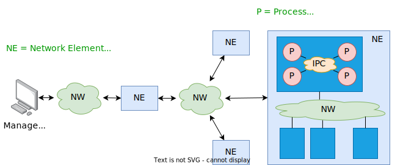
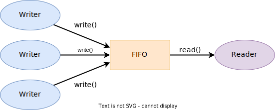
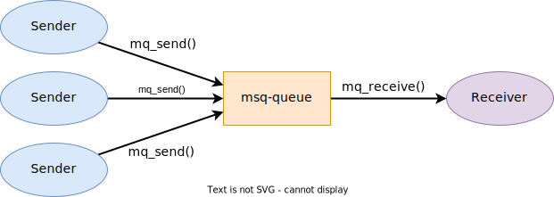

## Introduction

Dans tous systèmes embarqués, l'échange d'information est essentiel entre
différents systèmes et processus formant le logiciel de ces systèmes

On peut schématiquement distinguer 4 niveaux de communication :

1. Communication entre stations de gestion et équipements
1. Communication entre équipements mis en réseau
1. Communication entre éléments d'un même équipement
1. Communication entre processus d'un même élément

<figure markdown>

</figure>

## IPC - Inter-Process Communication

Dans ce dernier cas, on parle de communication interprocessus
(Inter-Process Communication - IPC), laquelle comprend 2 catégories
principales de mécanismes

- Mécanismes d'échange d'information ou de données
    - Fichiers (_Files_)
    - Mémoires partagées (_Shared Memories_)
    - Tubes nommés ou non (_FIFO_, _Pipes_)
    - Files d'attente de messages (_Messages Queues_)
    - Sockets (_Unix_ ou _Internet_)
    - Protocoles de communication/gestion
      (_D-Bus_, _SOAP_, _SNMP_, _REST_, _RPC_, _gRPC_, _XML-RPC_, etc.)
- Mécanismes de synchronisation
    - Signaux
    - Sémaphores
    - Verrous (locks)

Il est intéressant de noter que les mécanismes d'échange d'information
servent souvent également de mécanisme de synchronisation.

## Pipes

Les [pipes](https://man7.org/linux/man-pages/man2/pipe.2.html) implémentent un canal de communication unidirectionnel entre 2
processus.

Ce canal est accessible par l'intermédiaire de 2 descripteurs de fichiers
virtuels. Le premier descripteur (`fd[0]`) sert à la lecture, tandis que le
deuxième (`fd[1]`) sert à l'écriture

<figure markdown>

</figure>

Le canal est de type _byte stream_, c'est à dire sans concept de trames délimitant
le début et la fin d'un message.

Pour la mise en œuvre des _pipes_, Linux propose les services suivants

| Service             | syscall |
|---------------------|---------|
| Création d'un pipe  | `pipe`  |
| Lecture de données  | `read`  |
| Ecriture de données | `write` |
| Fermeture de pipe   | `close` |

## Création d'un pipe

Pour créer un _pipe_, Linux propose l'appel système `pipe()`.

```c
#include <unistd.h>
int pipe (int fd[2]);
```

**Exemple**

```c
int fd[2];
int err = pipe(fd); // create unidirectional pipe
if (err == -1)
    /* error*/
pid_t pid = fork();
if (pid == 0) { // child
    close(fd[0]); // close unused read descriptor
    write (fd[1], msg, sizeof(msg));
} else { // parent
    close(fd[1]); // close unused write descriptor
    int len = read (fd[0], msg, sizeof(msg));
}
```

**Comportement**

- La fonction `pipe()` crée un _pipe_ et retourne deux descripteurs, le 1^er^ `fd[0]` pour
la réception de données et le 2^e^ `fd[1]` pour l'envoi de données.

## FIFO - Named Pipes

Les _FIFO_ (_named pipes_) implémentent un canal de communication
unidirectionnel généralement entre un processus récepteur et un ou plusieurs
processus émetteur.

Le _FIFO_ est un fichier spécial situé dans le système de fichiers virtuels. Il peut
être accédé par les opérations utilisées sur les fichiers ordinaires, pour autant
de disposer des droits d'accès nécessaires.

<figure markdown>

</figure>

Le canal est de type _byte stream_, c'est à dire sans concept de trames délimitant
le début et la fin d'un message

## FIFO - Opérations

Avant de pouvoir utiliser un FIFO, celui-ci doit être créé soit avant le
lancement des applications le mettant en œuvre soit par les applications
elles-mêmes.

- Création d'un FIFO à l'aide de [commandes utilisateur](https://man7.org/linux/man-pages/man1/mkfifo.1.html)
  ```bash
  mkfifo [--mode=MODE] FIFO_NAME
  ```
- Création d'un FIFO [par l'application](https://man7.org/linux/man-pages/man3/mkfifo.3.html)
  ```c
  #include <sys/types.h>
  #include <sys/stat.h>
  int mkfifo(const char* pathname, mode_t mode);
  ```

Pour accéder au FIFO, Linux propose les services utilisés pour les fichiers
ordinaux

| Service               | syscall  |
|-----------------------|----------|
| Ouverture du FIFO     | `open`   |
| Lecture du FIFO       | `read`   |
| Ecriture dans le FIFO | `write`  |
| Fermeture du FIFO     | `close`  |
| Destruction du FIFO   | `unlink` |

## Message Queues

Les files d'attente de messages ([_message queues_](https://man7.org/linux/man-pages/man7/mq_overview.7.html)) offrent un canal de
communication unidirectionnel généralement entre un processus récepteur et
un ou plusieurs processus émetteurs.

Contrairement aux _pipes_ et aux _FIFO_, les files d'attente de messages sont de
type _datagramme_, c'est à dire chaque message ou paquet est stocké de façon
indépendante dans la file d'attente.

La taille maximale d'un message ainsi que le nombre de messages pouvant
être stockés dans la file d'attente sont déterminés lors de sa création.

<figure markdown>

</figure>

## Message Queues - Opérations

Pour accéder aux services des files d'attente de messages, Linux propose
une série de méthodes spécifiques avec la bibliothèque `<mqueue.h>`.

| Opération                                  | syscall      |
|--------------------------------------------|--------------|
| Ouverture et création d'une file d'attente | `mq_open`    |
| Lecture d'un message d'une file            | `mq_receive` |
| Ecriture d'un message dans une file        | `mq_send`    |
| Fermeture d'une file d'attente             | `mq_close`   |
| Destruction d'une file d'attente           | `mq_unlink`  |
| Lecture des attributs d'une file d'attente | `mq_getattr` |

La [`struct mq_attr`](https://man7.org/linux/man-pages/man3/mq_getattr.3.html) permet de décrire les caractérisques d'une file d'attente

```c
struct mq_attr {
    long mq_flags;   // flags: 0 or O_NONBLOCK
    long mq_maxmsg;  // maximum number of messages on queue
    long mq_msgsize; // maximum message size in bytes
    long mq_curmsgs; // number of messages currently in queue
};
```

## Sockets

Les [sockets](https://man7.org/linux/man-pages/man7/socket.7.html) ont été conçus par l'université de Berkeley au début des années
1980. Ils proposent un ensemble de services normalisés pour l'échange
d'information entre processus locaux ou distants.

Le socket fournit une _prise_ permettant aux différents processus d'une
application ou d'un système d'envoyer et de recevoir des données. Cette prise
est très polyvalente et permet d'interfacer une large palette de protocole, dont
le plus fréquemment utilisé TCP/IP.

Les sockets proposent deux grands modes pour le transfert de données :

- `SOCK_STREAM` : bidirectionnel, sûr/fiable, flux de données
- `SOCK_DGRAM` : bidirectionnel, pas sûr/fiable, paquet de données

| Opération                               | syscall                    |
|-----------------------------------------|----------------------------|
| Création d'un socket                    | `socket`                   |
| Liaison du socket à une adresse donnée  | `bind`                     |
| Connexion du socket à un socket distant | `connect`                  |
| Ecoute sur de nouvelles connexions      | `listen`                   |
| Acception d'une nouvelle connexion      | `accept`                   |
| Envoi de données                        | `write`, `send`, `sendto`  |
| Réception de données                    | `read`, `recv`, `recvfrom` |
| Fermeture du socket                     | `close`                    |

## Socketpair

socketpair offre un service bidirectionnel très intéressant pour l'échange de
données entre deux processus.

```c
#include <sys/types.h>
#include <sys/socket.h>
int socketpair (int domain, int type, int protocol, int fd[2]);
```

**Exemple**

```c
int fd[2];
int err = socketpair(AF_UNIX, SOCK_STREAM, 0, fd);
if (err == -1)
    /* error*/
```

**Comportement**

- La fonction `socketpair()` crée un canal de communication bidirectionnelle
  sous la forme d'un [socket Unix](https://man7.org/linux/man-pages/man7/unix.7.html) (le seul supporté par Linux) et retourne deux
  descripteurs, le 1^er^ `fd[0]` pour un processus et le 2^e^ `fd[1]` pour le deuxième
  processus. Ces descripteurs permettent d'émettre des données avec la méthode
  `write()` et d'en recevoir avec la méthode `read()`.
