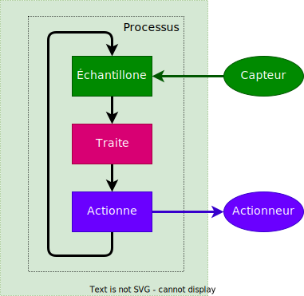
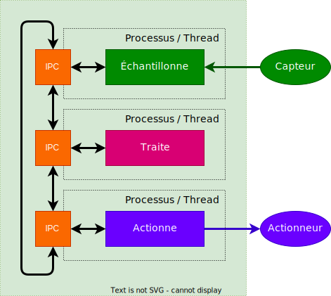

## Multiprocessing - Introduction / Problème

Il est usuel pour un système embarqué de devoir traiter plusieurs tâches
à la fois.

Un schéma classique est d'implémenter un seul processus réalisant toutes
les tâches de manière séquentielle, par exemple, l'échantillonnage d'un capteur,
puis le traitement des données reçues et finalement l'envoi des consignes sur
un actionneur.

Cette technique souffre d'inconvénients, par exemple de petites modifications
du logiciel peut impacter lourdement le comportement du système complet.

<figure markdown>

</figure>

## Solution

Un des chemins possibles pour pallier à ces inconvénients est
l'utilisation de processus ou de _threads_ propres à chaque tâche.

L'échange de données entre les différentes tâches est alors assuré par
une couche de communication entre processus / _threads_ (_IPC_ - _Inter
Process Communication_).

L'adaptation d'un des processus / _threads_ n'aura ainsi plus ou peu
d'impact sur les autres.

<figure markdown>

</figure>