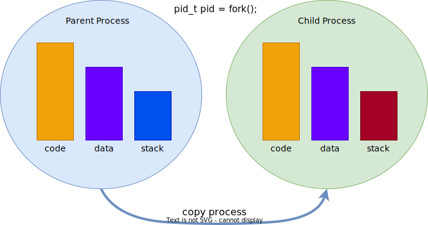
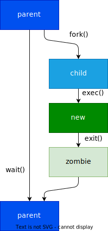

## Processus - Modèle

Les processus sont des entités de calcul/traitement indépendantes
disposant d'un processeur virtuel et d'un espace adressable propre

Chaque processus est défini par :

- `PID` : Process identifier
- `PGID` : Process Group Identifier
- `PPID` : Parent Process Identifier
- 
Quelques attributs supplémentaires :

- `SID` : Session Identifier
- `UID` : User Identifier
- `GID` : Group Identifier
- Working directory
- File descriptor table
- ...

Le processus `init` a le `pid` 1
Le processus `idle` a le `pid` 0

<figure markdown>

</figure>

## Processus - Etats

Les états principaux d'un processus:

- **Running**: le processus utilise le processeur et ses ressources
- **Blocked**: le processus est bloqué en attente sur un événement
- **Runnable**: le processus est prêt, mais attend que le microprocesseur soit libéré

<figure markdown>

</figure>

**Les transitions possibles**

1. L'ordonnanceur passe la main à un autre processus
2. L'ordonnanceur donne la main au processus
3. Le processus est bloqué en attende d'un événement, par exemple des entrées/sorties
4. L'événement sur lequel le processus était en attente est survenu

## Etats sous Linux

L'état d'un processus sous Linux est défini légèrement différemment

- **Running** : Linux ne fait pas de distinction entre l'état runnable
  (ready) et l'état running
- **Interruptible** : le processus est dans l'état bloqué, en attente
  d'un événement, par exemple la levée d'une entrée/sortie, la
  disponibilité d'une ressource ou un signal d'un autre processus
- **Unterruptible** : le processus est également dans l'état bloqué, en
  attente d'un événement. Ce processus ne peut cependant pas être
  interrompu par un signal
- **Stopped** : L'exécution du processus a été stoppée et ne pourra être
  réactivée que par une action d'un autre processus
- **Zombie** : Le processus est terminé, mais en attente que le
  processus parent lise son statut/état

<figure markdown>

</figure>


L'état d'un processus peut être obtenu en lisant les différents attributs
disponibles sous le `procfs`, par exemple :

```bash
$ cat /proc/205/status
```

```text
Name:           scsi_eh_32
State:          S (sleeping)
Tgid:           205
Ngid:           0
Pid:            205
PPid:           2
TracerPid:      0
Uid:            0       0       0       0
Gid:            0       0       0       0
FDSize:         32
Groups:
Threads:        1
SigQ:           0/32117
SigPnd:         0000000000000000
ShdPnd:         0000000000000000
SigBlk:         0000000000000000
SigIgn:         ffffffffffffffff
SigCgt:         0000000000000000
CapInh:         0000000000000000
CapPrm:         0000001fffffffff
CapEff:         0000001fffffffff
CapBnd:         0000001fffffffff
Seccomp:        0
Cpus_allowed:                ff
Cpus_allowed_list:           0-7
Mems_allowed:                1
Mems_allowed_list:           0
voluntary_ctxt_switches:     2
nonvoluntary_ctxt_switches:  0%
```

Avec la command `ps`, Linux offre un service plus convivial pour obtenir la
liste des processus et leur état, par exemple :

```bash
ps aux | head
```

```text
USER       PID %CPU %MEM    VSZ   RSS TTY      STAT START   TIME COMMAND
root         1  0.0  0.0   4588  2584 ?        Ss   18:04   0:01 /sbin/init
root         2  0.0  0.0      0     0 ?        S    18:04   0:00 [kthreadd]
root         3  0.0  0.0      0     0 ?        S    18:04   0:00 [ksoftirqd/0]
root         4  0.0  0.0      0     0 ?        S    18:04   0:00 [kworker/0:0]
root         5  0.0  0.0      0     0 ?        S<   18:04   0:00 [kworker/0:0H]
root         7  0.0  0.0      0     0 ?        S    18:04   0:00 [rcu_sched]
root         8  0.0  0.0      0     0 ?        S    18:04   0:00 [rcu_bh]
root         9  0.0  0.0      0     0 ?        S    18:04   0:01 [migration/0]
root        10  0.0  0.0      0     0 ?        S    18:04   0:00 [watchdog/0]
```

ou

```bash
ps -p 205 o user,pid,%cpu,%mem,vsz,rss,tty,stat,start,cmd
```

```text
USER       PID %CPU %MEM    VSZ   RSS TT       STAT  STARTED CMD
root       205  0.0  0.0      0     0 ?        S    18:05:03 [scsi_eh_32]
```

**PROCESS STATE CODES**

```text
Here are the different values that the s, stat and state output specifiers 
(header "STAT" or "S") will display to describe the state of a process:
  D  uninterruptible sleep (usually IO)
  R  running or runnable (on run queue)
  S  interruptible sleep (waiting for an event to complete)
  T  stopped, either by a job control signal or because it is being traced
  W  paging (not valid since the 2.6.xx kernel)
  X  dead (should never be seen)
  Z  defunct ("zombie") process, terminated but not reaped by its parent

For BSD formats and when the stat keyword is used, additional characters
may be displayed:
  <  high-priority (not nice to other users)
  N  low-priority (nice to other users)
  L  has pages locked into memory (for real-time and custom IO)
  s  is a session leader
  l  is multi-threaded (using CLONE_THREAD, like NPTL pthreads do)
  +  is in the foreground process group.
```

## Opérations

Linux offre une longue liste de services pour la gestion des processus, ici
quelques services intéressants :

| Opération                                       | Syscall           |
|-------------------------------------------------|-------------------|
| Clonage d'un processus                          | `fork`            |
| Terminaison d'un processus                      | `exit`            |
| Attente sur la terminaison d'un processus       | `waitpid`, `wait` |
| Exécution d'un nouveau programme                | `exec...`         |
| Lecture de son propre identificateur            | `getpid`          |
| Lecture de l'identificateur du processus parent | `getppid`         |

## Clonage

Le clonage d'un processus, c'est à dire. la création d'une copie strictement
idententique d'un processus est obtenue à l'aide de l'appel système `fork()`

```c
#include <sys/types.h>
#include <unistd.h>
int fork(void);
```

**Exemple**

```c
pid_t pid = fork();
if (pid == 0)
    /* code de l'enfant */
else if (pid > 0)
    /* code du parent */
else
    /* error */
```

<figure markdown>

</figure>

**Comportement**

- La fonction `fork()` retourne deux fois, une première
  fois dans le code du processus parent et une deuxième
  dans celui du processus enfant.
- Dans le code du parent, si `pid` est plus grand que zéro,
  il indique le `pid` de l'enfant. Si le `pid` est plus petit que `0`,
  il indique une erreur.
- Dans le code de l'enfant, la valeur du `pid` est toujours égale à zéro (`0`). 

## Copy on Write

Lors du clonage d'un processus, le noyau Linux crée un nouvel espace virtuel
pour le nouveau processus (processus enfant).

A quelques exceptions près (voir les [man pages](https://man7.org/linux/man-pages/man2/clone.2.html)), toutes les données sont
copiées dans le nouveau processus.

Sous Linux, la copie des données se fait _à la volée_, c'est à dire les données du
processus parent dans copiées dans l'espace du processus enfant que
lorsque celles-ci sont modifiées par l'un ou l'autre des deux processus.

<figure markdown>

</figure>

## Terminaison

La destruction d'un processus arrive lorsque celui-ci exécute l'appel système
`exit()`. Elle se produit également lorsque le processus sort de la routine
`main()`.

```c
#include <stdlib.h>
void exit(int status);
```

**Exemple**

```c
if(error)
    exit (ERROR_CODE);
else
    exit (0);
```

**Comportement**

- La fonction `exit()` termine le processus courant et retourne au processus
  parent en lui passant la valeur de `status & 0377`.
- La valeur `0` indique que le processus s'est terminé avec succès, tandis qu'une
  valeur différente de zéro indique une erreur.
- Les fichiers sont _flushées_ et fermés, puis toutes les ressources sont libérées.
- Tant que le processus parent ne lit pas la raison pour laquelle le processus
  enfant a été détruit (à l'aide du service `wait()` ou `waitpid()` ), ce dernier se
  trouve dans l'état _zombie_.

## Attente d'un changement d'état

Après la création de processus enfant, le processus parent a la possibilité
d'attendre sur un changement d'état de ses processus enfant à l'aide des
appels systèmes `wait()` et `waitpid()`. Seuls les changements d'état
_terminated_, _stopped_ et _resumed_ sont considérés par ces services.

```c
#include <sys/types.h>
#include <sys/wait.h>
pid_t wait(int *status);
pid_t waitpid(pid_t pid, int *status, int options);
```

**Exemple**

```c
while (1) {
    int status = 0;
    pid_t pid = waitpid (-1, &status, 0);
    if (pid < 0) break; // error or no more child
        // treat child process status...
}
```

**Comportement**

- La fonction `waitpid()` bloque le processus parent jusqu'à ce qu'un enfant
  change d'état.
- L'appel `wait(&status)` est équivalent à `waitpid (-1, &status, 0)`;

## Exécution d'un nouveau programme

L'exécution d'un nouveau programme, est obtenue à l'aide des appels
système `exec()`. Ceux-ci se déclinent en plusieurs variantes.

```c
#include <unistd.h>
int execl(const char *path, const char *arg, ...);
int execv(const char *path, char *const argv[]);
```

**Exemple**

```c
int err = execl("/bin/ls", "ls", "-r", "-l", NULL);
```

ou

```c
char *args[] = {"ls", "-r", "-l", NULL };
int err = execv("/bin/ls", args);
```

<figure markdown>

</figure>

**Comportement**

- La série de fonctions `exec()` lance l'application passée
  en premier paramètre et ne retourne jamais sauf en cas
  d'erreur.
- La liste d'arguments doit impérativement être terminée
  par `NULL`

## Utilisateur et Groupe

Chaque processus est associé a un utilisateur et à un groupe. Ces derniers
sont identifiés par une valeur numérique. Il est important de noter que sous
Linux, ces identifiants dictent les opérations que le processus sera autorisé à
effectuer.

Pour obtenir ces identifiants, Linux propose entre autres les services
suivants:

| Service                                               | syscall   |
|-------------------------------------------------------|-----------|
| Lecture/écriture de l'identificateur de l'utilisateur | `geteuid` |
| Lecture de l'identificateur du groupe                 | `getegid` |

Il est possible d'obtenir une représentation textuelle de ces valeurs. Pour cela
il suffit de lire les fichiers `/etc/passwd` et respectivement `/etc/group`. Plus
simplement, Linux propose les services suivants:

- Conversion du nom de groupe : `struct group *getgrgid(gid_t gid);`
- Conversion du nom d'utilisateur : `struct passwd *getpwuid(uid_t uid);`

## Session et groupe de processus

Chaque processus est membre d'un groupe de processus, identifié par un `pgid`.

Le groupe de processus permet à des processus de contrôle d'envoyer des
signaux à tous les processus du groupe.

La _session_ est une collection de groupes de processus. Elle est
généralement le résultat du _login_ d'un utilisateur. Un terminal de
contrôle est généralement associé à une session.

Quelques services:

- Lecture du `pgid` : `pid_t getpgid(0);`
- Lecture du `sid` : `pid_t getsid(0);`
- Création du nouveau groupe de processus : `int setpgid(0, 0);`
- Création d'une nouvelle session : `int setsid(0);`

<figure markdown>

</figure>