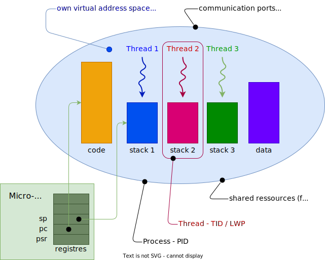

## Threads - Modèle

Les threads sont également une abstraction très populaire dans la
programmation moderne

Ils offrent une exécution parallèle de plusieurs co-routines à
l'intérieur d'un même espace adressable.

Chaque thread est défini par :

- `PID` : _Process identifier_
- `TID` : _Thread identifier_

Dans cet espace virtuel fourni par le processus parent, chaque thread
dispose de sa propre pile (stack)

Au niveau du noyau Linux, chaque thread est vue comme un processus léger
(_light weight process_ - _LWP_)

<figure markdown>

</figure>

## Avantages et inconvénients

**Avantages**

- Nécessitent moins de ressources
- Changement de contexte plus simple et plus rapide
- Communication entre thread moins compliquée
- Variables globales accessibles par tous les threads

**Inconvénients**

- Protection des actions critiques plus complexe
- Protection des sections critiques plus complexe
- Variables globales accessibles par tous les threads
- --> **Race conditions**

Grâce à la bibliothèque pthread de POSIX, Linux offre une longue liste de
services pour la gestion des threads, ici quelques services intéressants :

| service                                | syscall                  |
|----------------------------------------|--------------------------|
| Création d'un thread                   | `pthread_create`         |
| Suppression d'un thread                | `pthread_cancel`         |
| Terminaison d'un thread                | `pthread_exit`           |
| Attente sur la terminaison d'un thread | `pthread_join`           |
| Envoi d'un signal à un thread          | `pthread_kill`           |
| Gestion de l'état de suppression       | `pthread_setcancelstate` |
| Gestion du type de suppression         | `pthread_setcanceltype`  |
| Ajout de méthodes de nettoyage         | `pthread_cleanup_push`   |
| Suppression de méthodes de nettoyage   | `pthread_cleanup_pop`    |

Commandes pour afficher la liste des threads :

```bash
ps -eLf
ps H -o user,ppid,pid,tid,stat,cmd,comm,wchan
```

## Synchronization

La bibliothèque pthread propose également des services de synchronisation
et de gestion de sections critiques entre threads d'un même processus, ici
quelques services intéressants :

| service pour les mutex  | syscall                 |
|-------------------------|-------------------------|
| Création d'un mutex     | `pthread_mutex_init`    |
| Destruction d'une mutex | `pthread_mutex_destroy` |
| Prise d'une mutex       | `pthread_mutex_lock`    |
| Libération d'une mutex  | `pthread_mutex_unlock`  |

| service pour Variables conditionnelles | syscall                |
|----------------------------------------|------------------------|
| Création d'une variable                | `pthread_cond_init`    |
| Destruction d'une variable             | `pthread_cond_destroy` |
| Attente d'une condition                | `pthread_cond_wait`    |
| Signalisation d'une condition          | `pthread_cond_signal`  |

Il est bien évident que les autres mécanismes de communications proposés
aux processus sont également disponibles au niveau des threads, par exemple les
sémaphores, les _sockets_, etc.