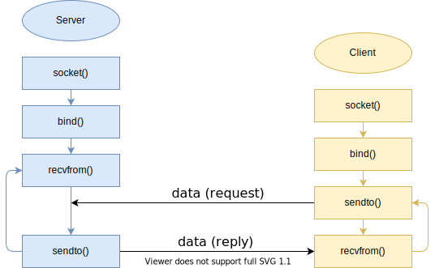

## Signaux

Numéro | Nom               | Description
-------|-------------------|--------------------------------------------------------
1      | SIGHUP            | Instruction (HANG UP) - Fin de session
2      | SIGINT            | Interruption
3      | SIGQUIT           | Instruction (QUIT)
4      | SIGILL            | Instruction illégale
5      | SIGTRAP           | Trace trap
6      | SIGABRT           | (ANSI) Instruction (ABORT)
6      | SIGIOT            | (BSD) IOT Trap
7      | SIGBUS            | Bus error
8      | SIGFPE            | Floating-point exception - Exception arithmétique
9      | SIGKILL           | Instruction (KILL) - termine le processus immédiatement
10     | SIGUSR1           | Signal utilisateur 1
11     | SIGSEGV           | Violation de mémoire
12     | SIGUSR2           | Signal utilisateur 2
13     | SIGPIPE           | Broken PIPE - Erreur PIPE sans lecteur
14     | SIGALRM           | Alarme horloge
15     | SIGTERM           | Signal de terminaison
16     | SIGSTKFLT         | Stack Fault
17     | SIGCHLD ou SIGCLD | modification du statut d'un processus fils
18     | SIGCONT           | Demande de reprise du processus
19     | SIGSTOP           | Demande de suspension imbloquable
20     | SIGTSTP           | Demande de suspension depuis le clavier
21     | SIGTTIN           | lecture terminal en arrière-plan
22     | SIGTTOU           | écriture terminal en arrière-plan
23     | SIGURG            | évènement urgent sur socket
24     | SIGXCPU           | temps maximum CPU écoulé
25     | SIGXFSZ           | taille maximale de fichier atteinte
26     | SIGVTALRM         | alarme horloge virtuelle
27     | SIGPROF           | Profiling alarm clock
28     | SIGWINCH          | changement de taille de fenêtre
29     | SIGPOLL           | (System V) occurence d'un évènement attendu
29     | SIGIO             | (BSD) I/O possible actuellement
30     | SIGPWR            | Power failure restart
31     | SIGSYS            | Erreur d'appel système

## Daemon (sans `fork`)

??? example "main.c"
    ```c
    {include "./assets/daemon/appl/main.c" !}
    ```

??? example "Makefile"
    ```Makefile
    {include "./assets/daemon/appl/Makefile" !}
    ```

## Daemon (complet, avec `fork`)

??? example "daemon.c"
    ```c
    {include "./assets/daemon/daemon/daemon.c" !}
    ```

??? example "Makefile"
    ```Makefile
    {include "./assets/daemon/daemon/Makefile" !}
    ```


## Threads

??? example "main.c"
    ```c
    {include "./assets/threads/main.c" !}
    ```

??? example "Makefile"
    ```Makefile
    {include "./assets/threads/Makefile" !}
    ```

## Berkeley Sockets

### Protocole orienté connexion (TCP)

<figure markdown>

<figcaption>Appels systèmes "Socket" pour un protocole orienté connexion (TCP)</figcaption>
</figure>

### Protocole sans connexion (UDP)


<figure markdown>

<figcaption>Appels systèmes "Socket" pour un protocole sans connexion (UDP)</figcaption>
</figure>