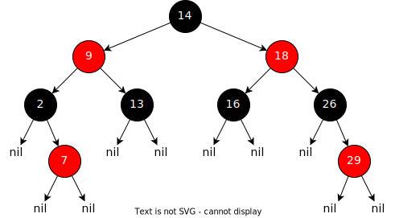

## Introduction

Linux implémente un double ordonnanceur, soit un ordonnanceur pour les
processus normaux et un ordonnanceur pour les processus temps réel.

Les processus normaux sont des processus/applications exigeant un partage
équitable du processeur et de ses ressources, soit la majorité des processus
d'une machine Linux standard (desktop ou server).

Les processus temps réel sont des processus/daemons avec de grandes
contraintes temporelles et/ou d'accès aux périphériques. De tels processus
sont courants dans les systèmes embarqués où les exigences sont fortes.

L'ordonnanceur de Linux est préemptif. Il implémente 40 niveaux de priorités
pour les processus normaux et 100 priorités pour les processus temps réel.

## CFS - Completely Fair Scheduler

L'ordonnanceur pour les processus normaux a énormément évolué. Depuis la
version 2.6.23, Linux implémente un nouvel ordonnanceur appelé _CFS_ -
_Completely Fair Scheduler_.

Les caractéristiques de cet ordonnanceurs sont

- Répartition équitable des ressources du processeur en garantissant une proportion
  identique du temps processeur à chaque processus, par exemple pour un système à N
  processus, chaque processus recevra 1/N du temps processeur
- Implémente un arbre bicolore (red-black tree) pour la
  recherche du prochain processus à faire tourner.

<figure markdown>

</figure>

- Les 40 priorités (-20 à 19) de cet ordonnanceur, appelées
  _nice level_ permettent d'attribuer une plus ou
  moins grande proportion du temps CPU aux
  différents processus. La priorité -20 représente
  la priorité la plus haute et 19 la plus basse. Par
  défaut un processus obtient la priorité 0.
- 2 _policies_ peuvent être choisies lors de la création d'un processus
    - `SCHED_NORMAL` : processus pour une exécution standard en round-robin
    - `SCHED_BATCH` : processus pour une exécution de type _batch_

## Realtime Scheduler

L'ordonnanceur temps réels est prioritaire sur l'ordonnanceur CFS.

Les caractéristiques de cet ordonnanceurs sont :

- Répartition des ressources du processeur selon un schéma basé strictement sur
  le niveau de priorité des processus, c'est à dire un processus d'une certaine priorité ne
  peut être interrompu que par un processus de plus haute priorité.
- Cet ordonnanceur dispose de 100 priorités (0 à 99). La priorité 0 est la plus
  basse et 99 la plus haute. La priorité 0 est réservée aux processus normaux et
  gérée par l'ordonnanceur CFS.
- 2 stratégies peuvent être choisies lors de la création d'un processus
    - `SCHED_FIFO` (_first in first out_) :
      Un processus de cette catégorie ne peut être interrompu que par un
      processus de plus haute priorité. Si un tel processus appelle un appel
      système bloquant, l'ordonnanceur le retire de la liste des processus
      _runnable_. Lorsqu'il devient à nouveau _runnable_, il est placé en fin de
      queue.
    - `SCHED_RR` (_round-robin_) :
      Les processus de cette catégorie sont similaires aux processus FIFO, à
      l'exception qu'une fenêtre de temps leur est assignée. Lorsque celle-ci est
      écoulée, le processus est replacé en fin de queue.

## Opérations

Pour gérer les processus temps réel et leur niveau de priorité, Linux propose
divers services.

| Opérations                                   | syscall                 |
|----------------------------------------------|-------------------------|
| Obtention de la _policy_ d'un processus      | `sched_getscheduler`    |
| Affection d'une _policy_ à un processus      | `sched_setscheduler`    |
| Lecture de l'intervalle  _round-robin_       | `sched_rr_get_interval` |
| Passation du processeur à un autre processus | `sched_yield`           |

## Gestion de la _policy_ d'un processus

Linux propose deux services pour la gestion de la _policy_ d'un processus,
soit l'appel système [`sched_getscheduler()`](https://man7.org/linux/man-pages/man3/sched_getscheduler.3p.html)
et [`sched_setscheduler()`](https://man7.org/linux/man-pages/man3/sched_setscheduler.3p.html).

```c
#include <sched.h>
int sched_getscheduler(pid_t pid);
int sched_setscheduler(pid_t pid, int policy, const struct sched_param *sp);
```

**Exemple**

```c
struct sched_param sp = {.sched_priority = 50, };
int ret = sched_setscheduler (0, SCHED_RR, &sp);
if (ret == -1)
    /* error */
```

**Comportement**

- La fonction `sched_setscheduler()` permet de contrôler la _policy_ de
  l'ordonnanceur attaché un processus, soit le type d'ordonnancement et le niveau de
  priorité. L'argument `pid` indique l'identifiant du processus (la valeur 0 indique le
  processus courant). Le 2^e^ argument `policy` permet de spécifier le type d'ordonnanceur
  (`SCHED_FIFO` ou `SCHED_RR`). L'attribut `sched_priority` de la `struct
  sched_param` permet de fixer le niveau de priorité du processus.
- Pour utiliser ce service, le processus doit disposer des privilèges suffisants.

## CFS - Operations

Pour gérer les priorités des processus normaux de l'ordonnanceur CFS, Linux
propose [divers services](https://man7.org/linux/man-pages/man7/sched.7.html).

| Opérations                        | syscall        |
|-----------------------------------|----------------|
| Gestion des priorités _nice_      | `nice`         |
| Lecture du niveau de priorité     | `getpriority`  |
| Affectation du niveau de priorité | `setpriority)` |

## CFS - Gestion des priorités _nice_

Un processus placé dans la catégorie des processus normaux peut gérer son
taux d'affectation du microprocesseur à l'aide de [l'appel système](https://man7.org/linux/man-pages/man2/nice.2.html)
[`nice()`](https://man7.org/linux/man-pages/man3/nice.3p.html).

```c
#include <unistd.h>
int nice(int inc);
```

**Exemple**

```
errno = 0;
int prio = nice(1); // increase by 1 nice level
if (prio == -1 && errno != 0)
    /* error */
```

**Comportement**

- La fonction `nice()` permet de diminuer (`inc` positif) ou d'augmenter (`inc`
  négatif) le niveau de priorité du processus courant et retourne le nouveau niveau
  de priorité du processus. Si `inc` est `0`, la fonction retourne le niveau de priorité
  actuel du processus.
- Pour augmenter (`inc` négatif) son niveau de priorité, le processus doit
  impérativement disposer des privilèges root.
- Depuis la ligne de commande, il est possible de lancer une application avec un
  niveau de priorité défini, par exemple :
  ``` bash
  nice -n -20 ./my_appl
  ```


## CFS - Gestion du niveau de priorité

Linux propose deux services pour la gestion du niveau de priorité d'un
processus, soit l'appel système [`getpriority()`](https://man7.org/linux/man-pages/man3/getpriority.3p.html)
et [`setpriority()`](https://man7.org/linux/man-pages/man3/setpriority.3p.html).

```c
#include <sys/time.h>
#include <sys/resource.h>
int getpriority(int which, int who);
int setpriority(int which, int who, int prio)
```

**Exemple**

```c
errno = 0;
int ret = setpriority(PRIO_PROCESS, getpid(), 2); // nice level = 2
if (ret == -1)
    /* error */
```

**Comportement**

- La fonction `setpriority()` permet de contrôler le niveau de priorité d'un
  processus (`which` = `PRIO_PROCESS`), d'un groupe de processus (`which` =
  `PRIO_PGRP`) ou d'un utilisateur (`which` = `PRIO_USER`). L'identifiant du
  processus, groupe de processus ou utilisateur est spécifié avec l'argument `who`.
  Le paramètre `prio` indique le niveau de priorité nice (`-20` à `19`).
- Pour augmenter son niveau de priorité, le processus doit disposer des privilèges
  suffisants.

## Processor Affinity

Par défaut, Linux implémente un mécanisme de _load balancing_ pour la
gestion des CPU de processeurs multicoeurs. Cependant, il arrive que pour
des applications il soit utile et nécessaire d'attribuer un ou plusieurs CPU à
un processus ou groupe de processus. A cet effet, Linux propose une série
de macros et services.

| Opérations                          | syscall                                                                               |
|-------------------------------------|---------------------------------------------------------------------------------------|
| Lecture de l'affectation d'un CPU   | [`sched_getaffinity`](https://man7.org/linux/man-pages/man2/sched_setaffinity.2.html) |
| Affectation d'un CPU à un processus | `sched_setaffinity`                                                                   |


Les methodes ci-dessous permettent de définir un ensemble de CPU à
affecter à un processus

```c
#define _GNU_SOURCE
#include <sched.h>
void CPU_SET(unsinged long cpu, cpu_set_t *set);
void CPU_CLR(unsinged long cpu, cpu_set_t *set);
int CPU_ISSET(unsinged long cpu, cpu_set_t *set);
void CPU_ZERO(cpu_set_t *set);
```

## Processor Affinity - Affection d'un CPU ou groupe de CPU

Un CPU ou groupe de CPU peut être assigné à processus par l'intermédiaire
de l'appel système `sched_setaffinity`.

```c
#define _GNU_SOURCE
#include <sched.h>
int sched_setaffinity(pid_t pid, size_t setsize, const cpu_set_t *set);
```

**Exemple**

```c
cpu_set_t set;
CPU_ZERO(&set);
CPU_SET(1, &set);
int ret = sched_setaffinity(0, sizeof(set), &set);
if (ret == -1)
    /* error */
```

**Comportement**

- La fonction `sched_setaffinity()` permet d'assigner un ou plusieurs CPU
  (dans notre cas le CPU 1) à un processus. L'argument `pid` indique l'identifiant du
  processus (la valeur `0` indique le processus courant).
