## Bienvenue

- Module : MA-CSEL1
- Titre : MA-CSEL1 - Construction de Systèmes Embarqués sous Linux
- Intervenant
    - Jacques Supcik (HEIA-FR / ISC)
- 18 étudiants inscrits
    - 10 étudiants CS
    - 6 étudiants TIC
    - 2 étudiants TIN
    - 5 plein temps
    - 13 temps partiel

## Communication

e-mail : jacques.supcik@hefr.ch
Telegram/Discord : TBD

## Programme des cours

- Horaire : 14:35 - 17:00
- Salle de classe : HEIA-FR / C00.16

| Semaine  | Date      | Thème |
|:---------|:----------|:------|
| 8/SP-1   | 25.2.2022 | Environnement Linux embarqué 1 |
| 9/SP-2   | 4.3.2022  | Environnement Linux embarqué 2 |
| 10/SP-3  | 11.3.2022 | Programmation noyau Linux 1    |
| 11/SP-4  | 18.3.2022 | Programmation noyau Linux 2    |
| 12/SP-5  | 25.3.2022 | Programmation noyau Linux 3    |
| 13/SP-6  | 1.4.2022  | Programmation noyau Linux 4    |
| 14/SP-7  | 8.4.2022  | Programmation système Linux 1  |
| 15/SP-8  | 15.4.2022 | Vendredi Saint                 |
| 16       |           | Pâques                         |
| 17/SP-9  | 29.4.2022 | Programmation système Linux 2  |
| 18/SP-10 | 6.5.2022  | Programmation système Linux 3  |
| 19/SP-11 | 13.5.2022 | Programmation système Linux 4  |
| 20/SP-12 | 20.5.2022 | Optimisation système Linux 1   |
| 21/SP-13 | 27.5.2022 | Optimisation système Linux 2   |
| 22/SP-14 | 3.6.2022  | Mini projet intégré 1          |
| 23       | 10.6.2022 | Mini projet intégré 2          |

## Déroulement des cours

### Déroulement

- Travail personnel de préparation avant le cours
- Cours combiné: théorie et travail pratique
- Travail personnel après le cours
- Rédaction d'un rapport

### Participation et collaboration

- Ne pas hésiter à participer et rendre le cours plus interactif et plus intéressant
- Ne pas hésiter à poser des questions
- Ne pas hésiter à partager vos propres expériences
- Ne pas hésiter à aider vos collègues
- Ne pas hésiter à expliquer ce que vous avez compris à vos collègues
- Ne pas hésiter à notifier des bugs au(x) professeur(s)
- Ne pas hésiter à regarder des solutions sur Internet

## Objectifs du module

Au terme de ce module, les étudiant-e-s seront capable de :

- Choisir l'architecture (HW et SW) pour des systèmes embarqués pour Linux
- Mettre en place un environnement de développement pour Linux
- Choisir et configurer un boot-loader pour une cible donnée
- Choisir et configurer un système de fichiers pour Linux
- Choisir et configurer une distribution Linux pour une cible donnée
- Concevoir et développer des device drivers complexes sous Linux embarqué
- Concevoir et développer des applications sous Linux embarqué

## Contenu du module

### Environnement Linux embarqué

- Architecture générale de systèmes embarqués pour Linux
- Environnements de développement
- Outils de développement
- Création, génération et débogage d'applications
- Survol des boot-loaders
- Survol et configuration des systèmes de fichiers
- Survol des distributions Linux embarqué

### Programmation noyaux Linux

- Programmation de modules noyau
- Développement et débogage d'un module noyaux
- Types de pilotes de périphériques
- Développement et débogage d'un pilote de périphériques
- Traitement des interruptions 
- Paramétrage et configuration d'un pilotes de périphériques

### Programmation système Linux

- Interface noyaux (system calls et bibliothèques)
- File I/O
- Gestion des processus et threads
- Communication inter processus (IPC, signaux, …)
- Mémoire virtuelle et accès aux périphériques par UIO
- Unix domain sockets
- IPC system V
- Caractéristiques de l'ordonnanceur
- Mesure de performance (profiling)
- Aspects temps-réel (processus/thread)

### Mini-projet

- Mise en œuvre des concepts étudiés durant les 6 premières semaines

## Rapport de laboratoire

### Rapport

- Rapports de laboratoire par groupe de 2 étudiants, à rendre
    - 30.10.2020 : Environnement Linux embarqué et programmation noyau Linux 
    - 11.12.2020 : Programmation système Linux et optimisation système Linux
    - 08.01.2021 : Mini projet intégré
- Format : fichier PDF avec les annexes dans un fichier .tar
- Langue : français, allemand ou anglais

### Contenu (indicatif)

- En-tête (logos, établissement, titre, auteur, lieu et date, …)
- Par journée de cours (sujet / thème) entre 1 et 4 pages
    - Résumé du laboratoire
    - Réponse aux questions
    - Synthèse sur ce qui a été appris/exercé
        - Non acquis
        - Acquis, mais à exercer
        - Parfaitement acquis
    - Remarques et choses à retenir
    - Feedback personnel sur le laboratoire
- Annexes (références/littérature, code source/patches dans fichier tar)

## Evaluation

### Examen théorique

- Sous forme d'examen oral
    - Deux thèmes tirés au sort
    - 20’ de préparation (un résumé de 5 feuilles A4 recto-verso autorisé)
    - 20’ de présentation au rétroprojecteur sur transparents avec questions des professeurs (le résumé n’est plus autorisé)
- Experts: le professeur du module + un professeur du domaine

### Note finale du cours

- Examen théorique oral 65%
- Le rapport de laboratoire 35%

## Littérature

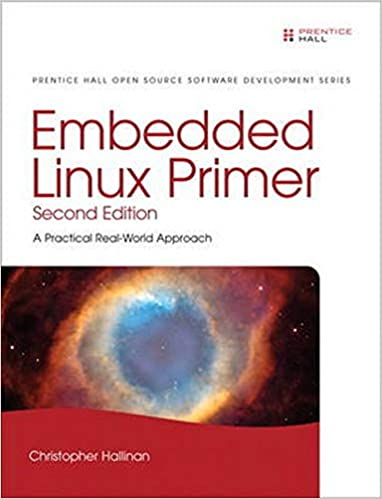{align=right width="200" class="shadow"}
### Embedded Linux Primer, Second Edition
_A Practical Real-World Approach_ 
By Christopher Hallinan 
November, 2010, 656 pages 
ISBN-10: 0137017839 | ISBN-13: 978-0137017836

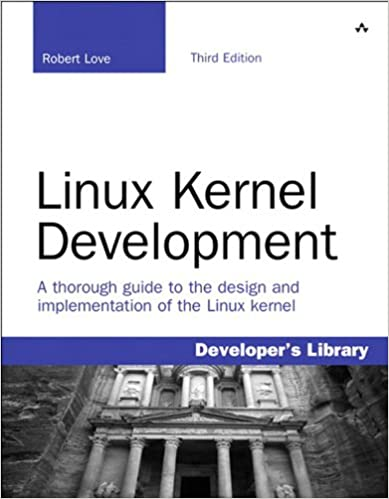{align=right width="200" class="shadow"}
### Linux Kernel Development
_A thorough guide to the design and implementation of the Linux kernel_ 
By Robert Love 
July, 2010, 440 pages 
ISBN-10: 0672329468 | ISBN-13: 978-0672329463

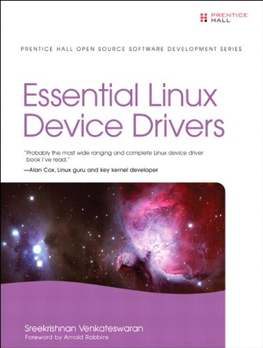{align=right width="200" class="shadow"}
### Essentials Linux Device Drivers
_Probably the most wide ranging and complete Linux device driver book…_ 
By Sreekrishnan Venkateswaran 
April, 2008, 744 pages 
ISBN-10: 0132396556 | ISBN-13: 978-0132396554

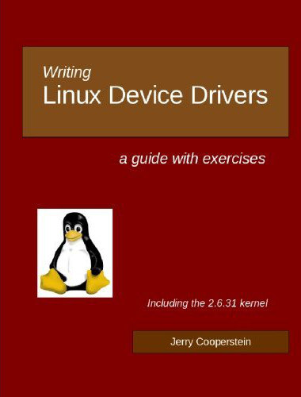{align=right width="200" class="shadow"}
### Writing Linux Device Drivers
A guide with exercices 
By Jerry Cooperstein 
September, 2009, 394 pages 
ISBN-10: 1448672384 | ISBN-13: 978-1448672387

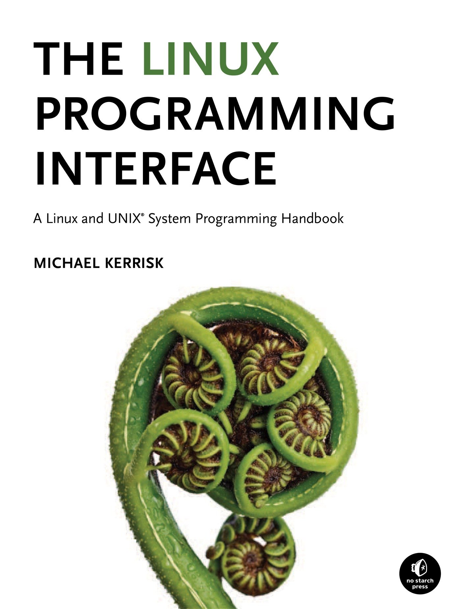{align=right width="200" class="shadow"}
### The Linux Programming Interface
A Linux and UNIX System Programming Handbook 
By Michael Kerrisk 
October, 2010, 1552 pages 
ISBN-10: 1593272200 | ISBN-13: 978-1593272203

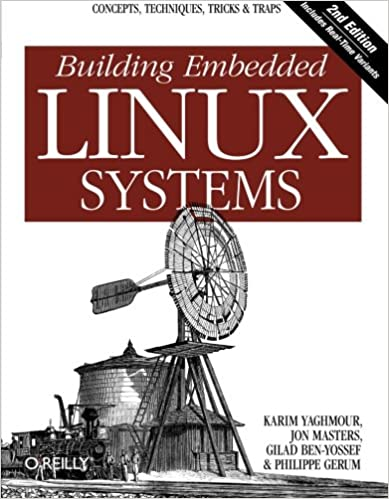{align=right width="200" class="shadow"}
### Building Embedded Linux Systems, Second Edition
Concepts, techniques, tricks, and traps 
By Philippe Gerum, Karim Yaghmour, Jon Masters, Gilad Ben-Yossef 
August 2008, 462 pages 
ISBN 10: 0-596-52968-6 | ISBN 13: 9780596529680

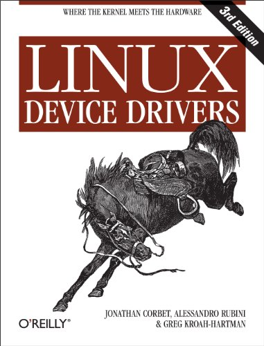{align=right width="200" class="shadow"}
### Linux Device Drivers, Third Edition 
By Jonathan Corbet, Alessandro Rubini, Greg Kroah-Hartman 
February 2005, 636 pages 
ISBN 10: 0-596-00590-3 | ISBN 13: 9780596005900 
http://lwn.net/Kernel/LDD3/ (as PDF)

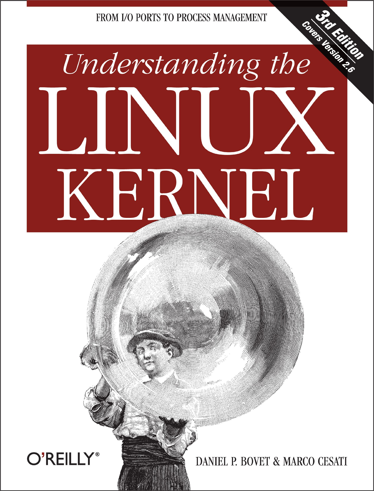{align=right width="200" class="shadow"}
### Understanding the Linux Kernel, Third Edition
By Daniel P. Bovet & Marco Cesati 
November 2005, 944 pages 
ISBN 10: 0-596-00565-2 0-596-00590-3 | ISBN 13: 978-0596005658 

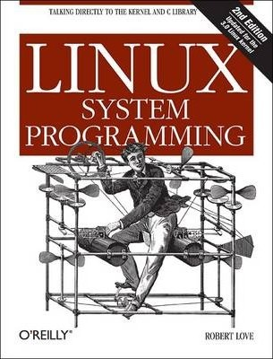{align=right width="200" class="shadow"}
### Linux System Programming
Talking Directly to the Kernel and C Library 
By Robert Love 
September 2007, 388 pages 
ISBN 10: 0-596-00958-5 | ISBN 13: 9780596009588

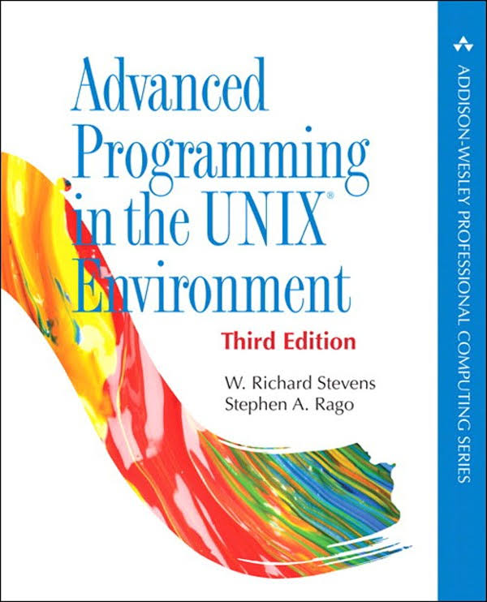{align=right width="200" class="shadow"}
### Advanced Programming in the UNIX Environment 
By W. R. Stevens, Stephen A. Rago 
January 1992, 768 pages 
ISBN-10: 0201563177  | ISBN-13: 978-0201563177

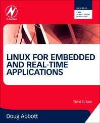{align=right width="200" class="shadow"}
### Linux for Embedded and Real-time Applications
By Doug Abboot 
March, 2003, 254 pages 
ISBN-10: 0750675462  | ISBN-13: 978-0750675468

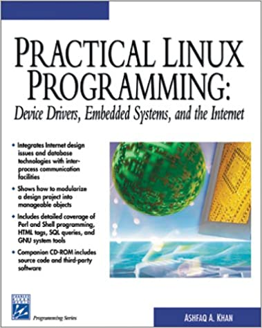{align=right width="200" class="shadow"}
### Practical Linux Programming
Device Drivers, Embedded Systems, and the Internet 
By Ashfaq A. Khan 
February, 2002, 420 pages 
ISBN-10: 1584500964 | ISBN-13: 978-1584500964

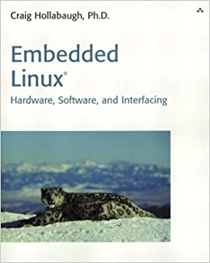{align=right width="200" class="shadow"}
### Embedded Linux
Hardware, Software, and Interfacing 
By Craig Hollabaugh 
March 2002, 432 pages 
ISBN-10: 0672322269 | ISBN-13: 978-0672322266

## Liens utiles

### Noyau Linux

- [Linux documentation](http://www.tldp.org)
- [Linux weekly news](http://lwn.net)
- [Linux kernel mailing list (FAQ)](http://www.tux.org/lkml/)
- [Kernel Newbies (glossaire, articles, présentations, …)](http://kernelnewbies.org)

### Projet ARM

- [ARM Linux project](http://www.arm.linux.org.uk)

### Consultants et fabricants 
- [Denx software Engineering (U-Boot / ELDK)](http://www.denx.de)
- [bootlin (Experts Linux embarqué)](http://bootlin.com)

!!! note "Archives 2021/2022"
    - [01 Introduction](assets/sp.01.1_mas_csel_introduction.pdf)