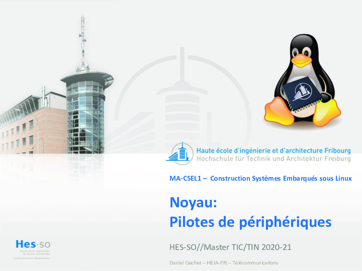

# Pilotes de périphériques / Leçon

<a markdown href="../assets/sp.04.1_mas_csel_noyau_pilotes.pdf" target="_blank">
{style="border-style: dashed;"}
</a>

## Documentation

- [Free-Electrons : Block device driver](assets/sp.04.3_mas_csel_block_drivers.pdf)
- [Free-Electrons : Network device driver](assets/sp.04.4_mas_csel_network_drivers.pdf)
- [Free-Electrons : Serial device driver](assets/sp.04.5_mas_csel_serial_drivers.pdf)

!!! note "Archives 2021/2022"
    - [Exercices](assets/sp.04.2_mas_csel_noyau_pilotes_exercices.pdf)
